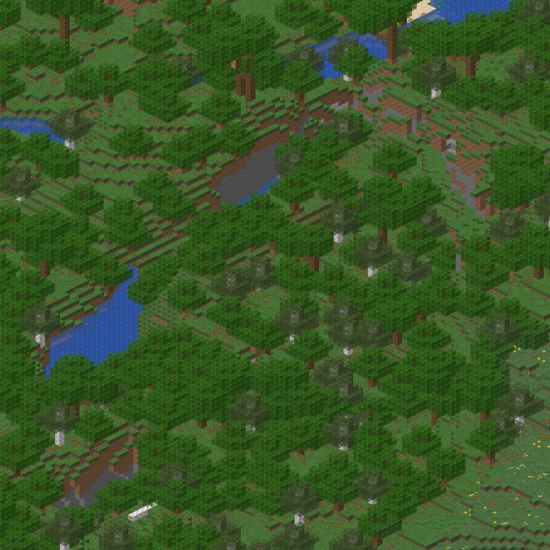
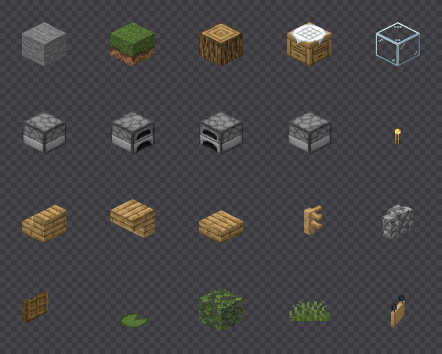
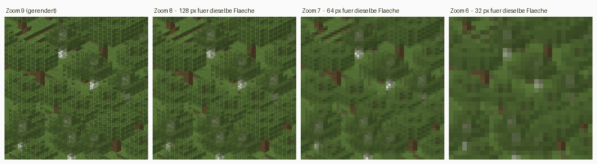
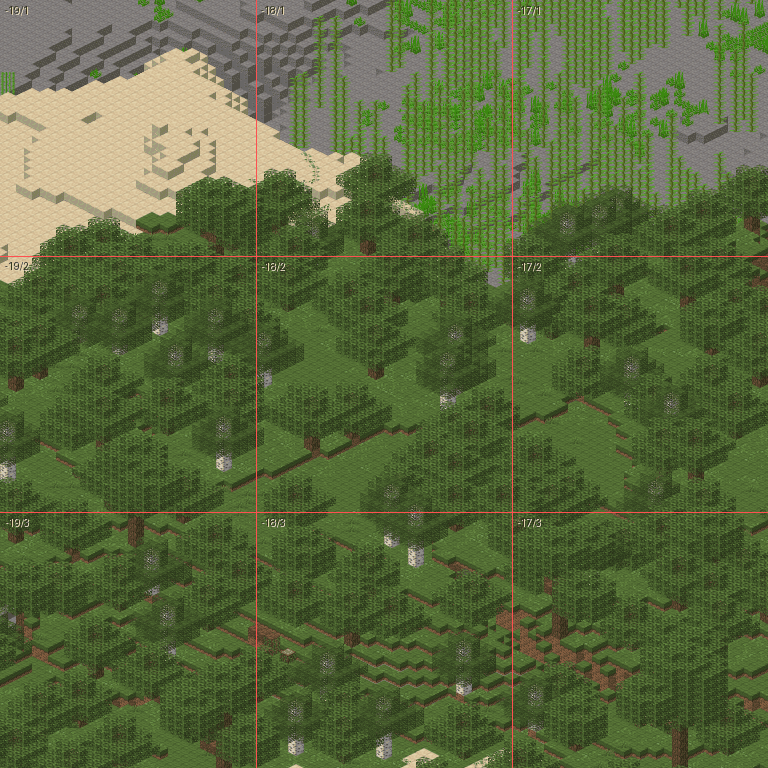
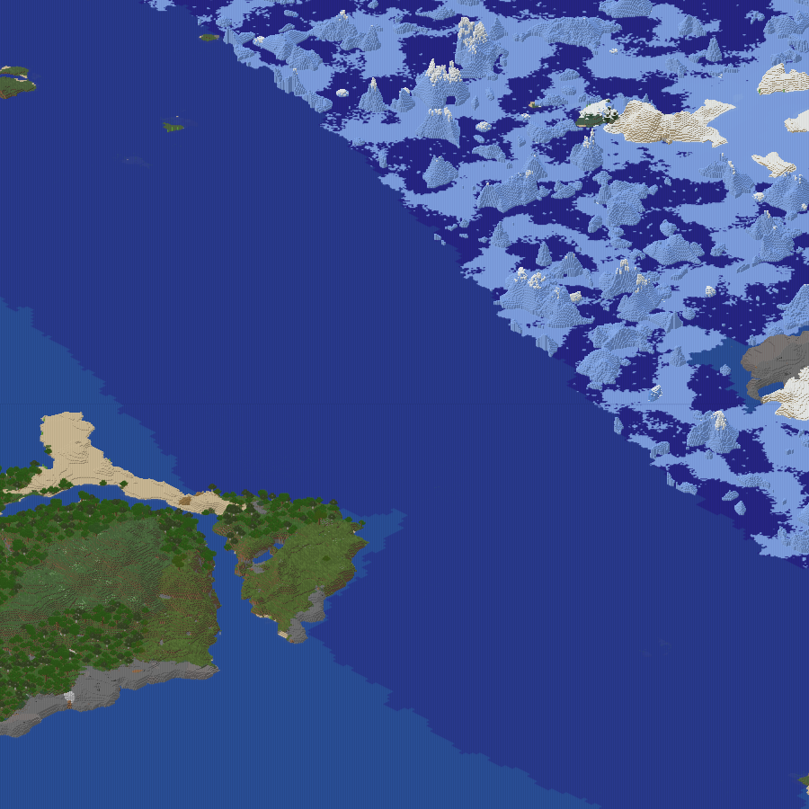
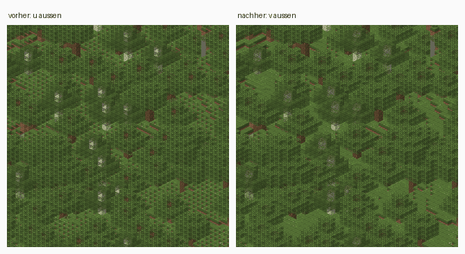

# TerraNova Map Renderer

Isometrischer Offline-Renderer für Minecraft-Java-Welten. Liest Weltdaten und
ein Resourcepack, rendert die Welt mit fester isometrischer Kamera und gibt
WebP-Rastertiles aus, die ein schlankes Leaflet-Frontend anzeigt.

```
Minecraft World + Resource Pack  ->  Rust Renderer  ->  WebP Tiles  ->  Leaflet
```

Der Browser rendert keine Minecraft-Geometrie, sondern nur fertige Rasterkacheln.

## Stand

Schritt 8 von 8: **Modelle und Transparenz im Detail**. Wasser und Lava
werden gezeichnet, Gras, Laub und Wasser bekommen die Farbe ihres Bioms,
`uvlock` hält Texturen an der Welt fest, durchsichtige Flächen mischen
sich im Sprite statt zu überschreiben, und Blöcke mit mehreren Varianten —
Sand, Stein, Erde — würfeln ihre Drehung aus der Position wie das Spiel.



900 mal 900 Pixel um (-64, 416), scale 16, 390 Chunks, 1,4 s —
dieselbe Stelle wie in Schritt 4, jetzt mit Wasser, Biomfarben und
gewürfelten Drehungen.

| Schritt | Inhalt | Status |
|---------|--------|--------|
| 1 | Welt-Reader (Region, Chunk, Palette) | **fertig** |
| 2 | Resourcepack: Blockstates, Models, Texturen | **fertig** |
| 3 | Model-Baking und Iso-Sprite-Rasterizer | **fertig** |
| 4 | Metatile-Renderer | **fertig** |
| 5 | Rayon-Parallelisierung, Tiles, WebP | **fertig** |
| 6 | Zoom-Pyramide und `map.json` | **fertig** |
| 7 | Frontend (Vite, TypeScript, Leaflet) | **fertig** |
| 8 | Modelle und Transparenz im Detail | **fertig** |

## Assets besorgen

Der Renderer braucht einen vollständigen Asset-Baum. Ein Overlay-Pack allein
reicht nicht: das TerraNova-Pack bringt 39 von 1198 Blockstates mit und keine
Colormaps. Die Basis kommt aus dem Client-JAR der Version, die der Server
fährt (hier 26.2):

```powershell
$v = "26.2"; $m = Get-Content "$env:APPDATA\.minecraft\versions\$v\$v.json" | ConvertFrom-Json; Invoke-WebRequest $m.downloads.client.url -OutFile "$env:TEMP\mc.zip"; Expand-Archive "$env:TEMP\mc.zip" "$env:TEMP\mc" -Force; Move-Item "$env:TEMP\mc\assets" vanilla-assets
```

Die SHA1-Prüfsumme steht im selben Manifest unter `downloads.client.sha1`.

Danach wird der Baum gestapelt übergeben, spätere Wurzeln gewinnen:

```bash
--assets ./vanilla-assets --assets ./assets
```

Für die Färbung von Gras, Laub und Wasser braucht der Renderer ausserdem
die Biomdefinitionen. Sie liegen im selben JAR unter `data/`, nicht unter
`assets/`:

```powershell
New-Item -ItemType Directory -Force vanilla-data\minecraft\worldgen | Out-Null; Move-Item "$env:TEMP\mc\data\minecraft\worldgen\biome" vanilla-data\minecraft\worldgen\biome
```

```bash
--data ./vanilla-data
```

66 Dateien, 352 kB. Ohne `--data` bekommt jeder Block die Farben von
`plains`; Ozeane und Wälder sehen dann überall gleich aus, aber nicht
falsch. Datenpakete mit eigenen Biomen kommen als weitere Wurzeln dazu,
spätere überschreiben frühere — auch Vanilla-Biome, die ein Paket
umdefiniert:

```bash
--data ./vanilla-data --data ./terralith-data
```

Erwartet wird `<DIR>/<namespace>/worldgen/biome/**/*.json`; Unterordner
gehören zur ID, `terralith:cave/underground_jungle` liegt unter
`biome/cave/underground_jungle.json`. Kommt in der Welt ein Biom vor, für
das keine Definition geladen ist, sagt der Renderer es beim Start und
färbt es wie `plains`.

## Benutzung

```bash
cargo run --release --manifest-path renderer/Cargo.toml -- --world ./world --at -64 72 416
```

```
Welt:       ./world
Regionen:   ./world\dimensions\minecraft\overworld\region
            383 Dateien, x -26..22, z -21..20

Chunk:      (-4, 26)  status=minecraft:full
            DataVersion 4903
            24 Sections, y -64..319

Block bei (-64, 72, 416):  minecraft:air
Höchster Block in Spalte:  y=71  minecraft:oak_leaves[distance=2,persistent=false,waterlogged=false]
Biom:                      minecraft:forest
```

Beide Weltlayouts werden erkannt: das klassische `world/region` und das seit
Minecraft 26.1 genutzte `world/dimensions/minecraft/overworld/region`.

Eine Blockstate direkt auflösen:

```bash
cargo run --release --manifest-path renderer/Cargo.toml -- --assets ./vanilla-assets --assets ./assets --block "oak_fence[north=true,east=true]"
```

```
minecraft:oak_fence[east=true,north=true]
  minecraft:block/oak_fence_post
      1 Elemente, 6 Flächen
      block/oak_fence
  minecraft:block/oak_fence_side
      2 Elemente, 12 Flächen
      block/oak_fence_planks
  minecraft:block/oak_fence_side y=90
      2 Elemente, 12 Flächen
      block/oak_fence_planks
```

Einzelne Blockstates als Sprites rastern, hier die zwanzig aus dem Bild:

```bash
cargo run --release --manifest-path renderer/Cargo.toml -- --assets ./vanilla-assets --assets ./assets --scale 64 --sprite docs/sprites.png \
  --block "stone" --block "grass_block[snowy=false]" --block "oak_log[axis=y]" --block "crafting_table" --block "glass" \
  --block "furnace[facing=north,lit=false]" --block "furnace[facing=east,lit=false]" --block "furnace[facing=south,lit=false]" --block "furnace[facing=west,lit=false]" --block "torch" \
  --block "oak_stairs[facing=east,half=bottom,shape=straight,waterlogged=false]" --block "oak_stairs[facing=north,half=top,shape=straight,waterlogged=false]" \
  --block "oak_slab[type=bottom,waterlogged=false]" --block "oak_fence[north=true,east=true,south=false,west=false,waterlogged=false]" \
  --block "cobblestone_wall[east=none,north=low,south=low,up=true,waterlogged=false,west=none]" \
  --block "oak_door[facing=east,half=lower,hinge=left,open=false,powered=false]" --block "lily_pad" \
  --block "oak_leaves[distance=1,persistent=false,waterlogged=false]" --block "short_grass" \
  --block "oak_hanging_sign[attached=false,rotation=3,waterlogged=false]"
```



Einen Weltausschnitt rendern:

```bash
cargo run --release --manifest-path renderer/Cargo.toml -- --world ./world --assets ./vanilla-assets --assets ./assets --data ./vanilla-data --render docs/map.png --center -64 416 --size 900 --scale 16
```

```
Render:     390 Chunks gelesen, 215 Blockstates, 1207 Sprites
            1 Modelle ragen über ihren Block hinaus, Würfel {[0, 1, 0]}
            900x900 px bei (-4290, 958) und scale 16 in 1.4 s -> docs/map.png

Texturen:   92 geladen, 0 fehlen
```

`--center` nennt die Blockspalte, die in der Bildmitte landet, `--scale` die
Pixelbreite eines Blocks, `--size` die Kantenlänge, mindestens 1. Die
Ausgabe nennt die linke obere Bildecke in Pixeln. Die Sprite-Tabelle kommt
aus demselben Vorlauf wie beim Kachelexport, nur über den Ausschnitt, und
der dekodiert nur, was im Bild landen kann: der sichtbare Bereich ist ein
schmales diagonales Band in x und z, kein Rechteck. Wer stattdessen die
Hüllbox nähme, läse für einen 1024er Ausschnitt rund das Sechzehnfache an
Chunks.

### Die ganze Welt als Kacheln

```bash
cargo run --release --manifest-path renderer/Cargo.toml -- --world ./world --assets ./vanilla-assets --assets ./assets --data ./vanilla-data --tiles ./tiles
```

```
Vorlauf:    316223 Chunks in 5.5 s, 3110 Blockstates, 292836 Kacheln
            33762 Sprites bei scale 32, davon 31265 Fassungen
            18 Modelle ragen über ihren Block hinaus, Würfel {[0, 1, 0]}
            200/292836 Kacheln
            400/292836 Kacheln
```

Danach stapelt der Lauf die gröberen Zoomstufen darüber und schreibt
`map.json`.

Der Vorlauf liest jeden Chunk einmal und beantwortet zwei Fragen auf einmal:
welche Blockstates vorkommen, und welche Kacheln überhaupt etwas zeigen. Erst
danach steht die Sprite-Tabelle — und erst dann kann parallel gerendert
werden, denn sonst müsste jeder Worker sie unter einer Sperre füllen. Die
Chunks werden deshalb mehrmals gelesen: vom Vorlauf, von der Basis und von
jeder nativen Stufe, bei scale 32 also fünfmal. Der Vorlauf kostet für die
ganze Welt 5 bis 11 Sekunden. Eine Fassung ist jedes Sprite, das nicht
selbst Alternative einer Blockstate ist: eines je Maske verdeckter
Flüssigkeitsflächen, je Tiefe dahinter und je Biomfarbe, dazu die Streifen
an Wasserstufen.

Gerendert wird mit Rayon über die Kacheln. Jeder Worker hält seinen eigenen
Chunk- und Regionscache, geteilt wird nur die unveränderliche Sprite-Tabelle.

`--center` und `--size` schränken auf einen Ausschnitt ein:

```bash
cargo run --release --manifest-path renderer/Cargo.toml -- --world ./world --assets ./vanilla-assets --assets ./assets --data ./vanilla-data --tiles ./tiles --center -64 416 --size 2048
```

```
Vorlauf:    788 Chunks in 0.1 s, 247 Blockstates, 256 Kacheln
            1580 Sprites bei scale 32, davon 1336 Fassungen
            1 Modelle ragen über ihren Block hinaus, Würfel {[0, 1, 0]}
            200/256 Kacheln
            256/256 Kacheln
Kacheln:    256 geschrieben, 0 leer, 256x256 px, 24 Threads
            31.2 MB in 2.2 s (119 Kacheln/s, 125 kB je Kachel)
Zoom  9:     64 Kacheln nativ bei scale 16, 8.0 MB in 1.2 s
Zoom  8:     16 Kacheln nativ bei scale 8, 1.9 MB in 0.7 s
Zoom  7:     4 Kacheln nativ bei scale 4, 0.5 MB in 1.2 s
Zoom  6:     2 Kacheln
...
Pyramide:   9 Kacheln, 0.2 MB in 0.0 s
Karte:      Zoom 0..10, 256 Basiskacheln, -10240/0 bis -6144/4096 px -> ./tiles/map.json
```

Der Ausschnitt wird dabei aufgerundet, bevor der Vorlauf irgendetwas
ausschliesst, und zwar auf ganze Kacheln der gröbsten nativen Stufe — bei
scale 32 auf 2048 Pixel, aus 2048 mal 2048 werden hier 4096 mal 4096. Die
nativen Stufen zeigen ganze Elternkacheln, und alle Stufen sollen denselben
Stand der Welt zeigen: sonst stünde ein Neubau neben dem Ausschnitt nur auf
den gröberen. Umgekehrt sammelt der Vorlauf Blockstates nur aus Chunks, die
tatsächlich in eine ausgegebene Kachel fallen, und was die gerundete Fläche
gar nicht berühren kann, dekodiert er nicht einmal: hier 788 Chunks statt
der 8192 aller Regionen, die sie schneiden. Ein kleiner Ausschnitt braucht
deshalb keine Assets für Blöcke am anderen Ende der Welt; fehlt eines in
seiner Fläche, bricht der Lauf ab, bevor er die erste Kachel schreibt.

Die Kacheln liegen als `tiles/<z>/<x>/<y>.webp`; x und y dürfen negativ sein,
weil der Blockursprung mitten in der Welt liegt. Wird eine Kachel bei einem
erneuten Lauf leer, löscht der Export die alte Datei — auf jeder Stufe, sonst
zeigte die Karte weiter, was inzwischen abgerissen wurde.

Eine Basiskachel, die gar kein Chunk mehr berührt, weil ein Editor ihn
zurückgesetzt hat, entfernt der Export nur mit `--prune`, dann auf jeder
Stufe. Ohne den Schalter zählt er sie und lässt sie stehen; nur wo der Lauf
eine native Elternkachel ohnehin neu rendert, fehlt dort schon, was sie
zeigen. Einer Teilkopie der Welt oder einer anderen Dimension mit demselben
Seed fehlt vieles, und ein Lauf mit `--prune` leerte über ihr den Baum: der
Schalter gehört nur an die vollständige Welt. Entfernt wird erst, wenn alle
Stufen darüber neu stehen. Bricht ein Lauf vorher ab, findet der nächste
die Kacheln wieder und baut ihre Eltern neu. Ein Ausschnitt sucht nur in
seiner gerundeten Fläche.

### Zoomstufen

Gröbere Stufen entstehen aus vier Kacheln der darunterliegenden, auf die
halbe Kantenlänge gestaucht — die Welt wird dafür kein zweites Mal
angefasst. Ausgenommen sind die nativen Stufen direkt unter der Basis,
siehe unten.



Gemittelt wird mit vormultipliziertem Alpha. Geradeaus gemittelt zögen
durchsichtige Pixel ihre Farbe in die Nachbarn, und jede Kante gegen Luft
bekäme einen dunklen Saum — auf einer Karte voller Blattwerk wäre das überall
zu sehen.

Die Nummerierung hängt an der **Welt**, nicht am Ausschnitt: `maxZoom` kommt
beim ersten Lauf aus der Ausdehnung aller Regionsdateien, und dafür wird kein
einziger Chunk gelesen. Ein bestehender Baum behält sie. Zoom 0 hat dabei
ohnehin bis zu vier Kacheln: das Stapeln endet an den vier Kacheln um den
Ursprung, sie sind ihre eigenen Eltern. Wächst die Welt über eine
Zweierpotenz an Kacheln hinaus, bleibt die Basis auf ihrer Stufe, und
Zoom 0 bekommt mehr — sonst müsste der ganze Baum nach der ersten neuen
Region von vorn entstehen. Passt Zoom 0 dann nicht mehr ins Fenster, zoomt
das Frontend darunter weiter heraus.

Ein nachgerenderter Ausschnitt passt damit in einen bestehenden Kachelbaum.
Welche Kinder in eine Elternkachel gehören, entscheidet dabei die Platte und
nicht der laufende Export: die Geschwister ausserhalb des Ausschnitts liegen
ja weiterhin da. Und `map.json` beschreibt den ganzen Baum, nicht den letzten
Lauf. An einer unveränderten Welt ändert ein Nachrendern deshalb keine einzige
Datei.

Dafür müssen Welt und Massstab passen. Weicht die Kennung der Welt oder
`scale` vom `map.json` im Zielverzeichnis ab, bricht der Export ab, bevor
er einen Chunk liest; sonst lägen im Baum Kacheln zweier Welten oder zweier
Massstäbe. `map.json` entsteht deshalb direkt vor der ersten Kachel und am
Ende noch einmal: bricht ein Lauf beim Schreiben ab, steht schon fest, wozu
der Baum gehört, und scheitert er vorher, etwa an einem fehlenden Asset,
legt er nichts fest. Ein Baum eines älteren Stands ohne Kennung gehört ab
dem nächsten Lauf zu dessen Welt, der Lauf sagt es; einer mit scale 2, 6
oder 10 lässt sich nicht fortsetzen, `--scale` nimmt nur noch Vielfache
von 4.

Die gröberen Stufen werden nicht alle verkleinert. Solange jeder Block
auf ganzen Pixeln liegt, der scale der Stufe also durch vier teilbar ist
— bei scale 32 drei Stufen lang, 16, 8 und 4 —, rendert der Renderer die
Stufe aus der Welt, mit Sprites in dieser Grösse. Verkleinern mittelt
Nachbarblöcke ineinander, und schon zwei Stufen unter der Basis wäre aus
jeder Kante Brei; ein nativer Render hält den Umriss jedes Blocks scharf
und mittelt stattdessen die Textur über den Block, was auf einer Karte
niemand vermisst. In Bytes kommt damit bei scale 32 ein Drittel dazu, in
Zeit fast noch einmal die Basis, denn jede Stufe zeichnet jeden Block ihrer
Fläche erneut; siehe unten. Bei scale 2 läge jede zweite Blockreihe auf
einem halben Pixel, und benachbarte Reihen überdeckten sich; ab dort wird
verkleinert. Aus demselben Grund nimmt `--scale` nur Vielfache von 4.

Ein Ausschnitt mit `--size` braucht dafür mehr Welt als sich selbst: eine
native Elternkachel zeigt auch, was neben dem Ausschnitt liegt. Der
Export rundet ihn deshalb auf ganze Kacheln der gröbsten nativen Stufe
auf, siehe oben.

Gemittelt wird dabei in linearem Licht, nicht in sRGB-Werten: die sind
gammakodiert, ihr Mittel ist zu dunkel, und jede Stufe verdunkelt weiter.
Halb Schwarz, halb Weiss ergibt so 188 statt 128.

### `map.json`

```json
{
  "tileSize": 256,
  "scale": 32,
  "minZoom": 0,
  "maxZoom": 10,
  "tiles": "{z}/{x}/{y}.webp",
  "bounds": [-10240, 0, -6144, 4096],
  "world": "05ff03f95077be56-07ba487af40a087d"
}
```

`bounds` ist der belegte Bereich auf der feinsten Stufe in Pixeln, als
`[links, oben, rechts, unten]`. Die Projektion selbst steht nicht drin: sie
hängt allein an `scale`, und die Formel gehört in den Renderer, nicht in eine
Datei.

`world` ist die Kennung der Welt: vorn ein Salz, das der Baum bei seinem
ersten Lauf zufällig bekommt, dahinter ein Hash ihres Seeds, SipHash-2-4
mit diesem Salz, eine Million Mal verkettet. Den Seed liest der Renderer
aus der Weltwurzel: seit 26.1 aus `data/minecraft/world_gen_settings.dat`,
bei Paper aus der Datei der Oberwelt, davor aus `level.dat`. Er selbst
steht nicht in der Datei: `map.json` liegt öffentlich neben den Kacheln,
und mit dem Seed fände jeder Strukturen und Erze ohne zu suchen. Ein
Zufallsseed hat nur 2^48 Werte, Vanilla zieht ihn mit 48 Bit Zustand; mit
einem einzelnen Hash liessen sich alle in Stunden bis Tagen durchprobieren.
Verkettet sind es 2^68 Aufrufe je Baum, auf einer Grafikkarte Jahrzehnte,
und der Export zahlt dafür 16 ms je Lauf. Ein Seed aus einem Text hat nur
2^32 Werte, 2^52 Aufrufe: den schützt die Kennung für Stunden bis Tage,
nicht für immer. Ohne `level.dat`
ist das Verzeichnis keine Weltwurzel, etwa eine einzelne Dimension, und das
Feld fehlt; Paper legt dort denselben Seed ab wie bei der Oberwelt.

Eine Kachel muss Pixel für Pixel dem entsprechenden Ausschnitt eines grossen
Renderings gleichen, sonst stünden im Browser Kanten dazwischen. Neun Kacheln
nebeneinander, die Grenzen rot eingezeichnet:



### Was das kostet

Gemessen an einem Ausschnitt, hochgerechnet auf die ganze Welt: derselbe
Weltausschnitt um (-64, 416) bei jedem scale, mit nativen Stufen und
Pyramide, also `--size 8192` bei scale 32, `4096` bei 16 und `2048` bei 8.
Das sind 1600, 400 und 100 Basiskacheln, gerendert auf 24 Threads. Die
Kachelzahl der ganzen Welt nennt der Vorlauf.

| `--scale` | Kacheln der Welt | je Kachel | Basis | native Stufen | zusammen | Dauer |
|-----------|------------------|-----------|-------|---------------|----------|-------|
| 32 | 292 836 | 109 kB | ~30 GB | ~10 GB | ~40 GB | ~80 min |
| 16 | 73 920 | 111 kB | ~7,8 GB | ~2,1 GB | ~10 GB | ~40 min |
| 8 | 18 951 | 101 kB | ~1,8 GB | ~0,4 GB | ~2,2 GB | ~20 min |

Auf demselben Ausschnitt wiegt eine Kachel bei jedem scale rund 100 bis
110 kB: sie zeigt bei kleinerem scale mehr Welt, aber gleich viele Pixel.
Der Platz hängt deshalb fast nur an der Kachelzahl. Die Dauer nicht: jede
native Stufe zeichnet jeden Block ihrer Fläche noch einmal, und zusammen
kosten sie fast so viel Zeit wie die Basis, bei scale 32 12,1 s gegen
13,6 s. In Bytes sind sie ein Fünftel bis ein Drittel. Die Sprite-Tabellen
aller 3110 Blockstates brauchen über die vier Stufen zusammen rund 12 s.

WebP wird **verlustfrei** geschrieben. Minecraft-Texturen sind Pixelkunst mit
wenigen flachen Farben; verlustbehaftet würde daraus Matsch, und an den
Kachelrändern sähe man die Artefakte im Raster. Gegenüber PNG spart
verlustfreies WebP auf diesem Inhalt 20 bis 40 Prozent — dieselbe Kachel wiegt
als PNG 173 kB und als WebP 108 kB.

### Wasser und Biomfarben

Flüssigkeiten haben kein Blockmodell — Minecraft baut ihre Geometrie im
Code. Der Renderer tut dasselbe: `water`, `lava`, `bubble_column`, Seegras
und Kelp sowie jede Blockstate mit `waterlogged=true` bekommen einen Würfel
mit der Flüssigkeitstextur, fliessendes Wasser (`level` 1 bis 7) einen
flacheren. Wie im Spiel endet eine Quelle bei 8/9 der Blockhöhe, knapp
zwei Texturpixel unter der Kante, und die Oberseiten gefluteter oberer
Platten, Treppen und Zaunpfosten bleiben trocken. Liegt dieselbe
Flüssigkeit darüber, reicht der Würfel bis oben, sonst hätte jede Schicht
eines Ozeans eine Fuge. Die Ecken gleicht der Renderer nicht an die
Nachbarn an wie Minecraft, jede Oberfläche bleibt eben. Auch die Seiten
gefluteter Blöcke bleiben trocken: Minecraft rückt jede Flüssigkeitsfläche
ein Tausendstel ins Blockinnere, der Renderer legt sie dafür in der Tiefe
knapp hinter die Blockfläche an derselben Stelle.



Um den Ursprung, `--center 0 0 --size 900 --scale 4`, sonst wie oben.

Die Wassertextur ist grau und durchscheinend. Ihre Farbe kommt aus
`water_color` des Bioms. Flächen zwischen zwei Wasserblöcken werden nicht
gezeichnet — wie im Spiel: ein Sprite kennt seine Nachbarn zwar nicht,
aber der Renderer, und er wählt je Block die Fassung ohne die Flächen zu
gleichem Wasser daneben und darüber. Sonst läge in jedem Becken Wasser
über Wasser, die Deckkraft stiege an jeder Blockgrenze, und der Grund
schimmerte durch ein Raster. Ein Wasserblock mitten im Ozean hat danach
keine Fläche mehr und kostet nichts. Steht das Wasser daneben tiefer, am
Fuss eines Wasserfalls oder an jeder Stufe fliessenden Wassers, fehlte über
dessen Oberfläche ein Streifen der eigenen Seite. Minecraft hebt dort die
Ecken der Oberfläche an; der Renderer zeichnet stattdessen genau diesen
Streifen, als eigenes Sprite je Paar aus eigener Höhe und Nachbarhöhe in
Neunteln.

Die Oberfläche trägt dafür die Deckkraft aller Schichten dahinter. Eine
Schicht der Wassertextur lässt 29 Prozent durch, zwei noch 9, vier noch
unter 1: durch einen Block Wasser sieht man den Grund, durch vier nicht
mehr. Der Renderer zählt je Oberflächenblock die Wasserblöcke entlang
des Blickstrahls, also schräg nach hinten unten auf der Diagonale
(x-1, y-1, z-1), und nimmt die Fassung mit dem entsprechend
hochgerechneten Alpha — ohne das sähe ein Ozean aus wie ein Meeresboden
hinter Milchglas, mit sichtbarem Kies in jeder Tiefe. Im Spiel erledigt
das der Unterwassernebel. Senkrecht gezählt verschwände, was knapp unter
einer tiefen Oberfläche liegt, ein Wrack oder ein Riff. Die Zählung endet
an dem, was den Strahl aufhält: dem Grund, dem Ufer, einem Stein. Dünne
Modelle zählen als Wasser, denn neben Seegras, Kelp oder einem gefluteten
Zaun geht der Strahl weiter bis zum Grund; endete die Zählung an ihnen,
stünde über jedem Seegras ein heller Fleck. Ob ein Block den Strahl
aufhält, misst der Renderer an den Pixeln, die die Oberfläche an seiner
Stelle belegen würde, auf ihrer Höhe und immer bei scale 32: hinter
fliessendem Wasser treten die Strahlen tiefer ein als hinter einer Quelle,
und jede Stufe soll gleich zählen. Deckt er mehr als die Hälfte davon,
endet die Zählung: eine obere
Platte und ein Mauerpfosten halten den Strahl auf, eine untere Platte nicht,
denn über sie gehen drei von fünf Strahlen hinweg. Hohes Seegras deckt genau
die Hälfte und zählt wie Wasser; sonst stünde über ihm ein heller Fleck. Der
Preis: jedes dünne Modell einen Block unter der Oberfläche verschwindet
fast, wenn dahinter tiefes Wasser steht — Seegras, Kelp, Zaunpfosten,
Korallenfächer. Die Oberfläche darüber trägt die Deckkraft aller Schichten
dahinter, und statt 29 Prozent bleibt von ihm unter 1 Prozent sichtbar.

Gras und Laub funktionieren wie das Wasser: die Textur ist grau, das Biom
liefert Temperatur und Niederschlag, und die Colormaps `grass.png` und
`foliage.png` aus den Assets machen daraus die Farbe.
Fichten, Birken und Seerosen haben feste Farben, der Sumpf seinen eigenen
Grünton, der Dunkelwald eine Abdunkelung — alles wie in `BlockColors`, nur
beschränkt auf das, was auf einer Karte Fläche macht. Redstone, Ranken und
Kürbisstiele bleiben ungefärbt.

Welche Blöcke gefärbt werden, steht nicht in den Assets. Minecraft
verdrahtet das im Code, und der Renderer tut es in
`renderer/src/assets/colors.rs` — eine Tabelle mit rund zwanzig Einträgen.

Gefärbte Fassungen entstehen nur für die Biome, mit denen ein Block im
Vorlauf eine Section teilt: auf der ganzen Welt kommt jedes Biom vor, aber
nicht jeder Block in jedem. Pixelgleiche Sprites teilen sich einen Eintrag,
wenn sie sich in jedem Biom gleich färben. Zusammen schrumpft die Tabelle
der Testwelt bei scale 32 damit auf ein Drittel, von 100 688 auf 33 762
Sprites.

Durchsichtige Flächen mischen sich seit diesem Schritt auch innerhalb
eines Sprites: jede Fläche legt je Pixel ein Fragment ab, und am Schluss
wird je Pixel von hinten nach vorne gemischt. Ein durchscheinendes Texel
liegt so immer über dem, was dahinter liegt, und eine Halmkante, die den
Pixel nur zum Teil deckt, verdeckt die Fläche dahinter nicht. Vorher
gewann ein Tiefenpuffer, und ein gefluteter Zaun war ein Wasserwürfel
ohne Zaun.

### Keine Nähte

Sprite-Kanten werden nicht geglättet. Die Geometrie wird nur im
Pixelmittelpunkt geprüft, damit an einer gemeinsamen Kante jeder Pixel
genau einer der beiden Flächen gehört und Nachbarflächen nahtlos
aneinanderstossen. Liegt ein Mittelpunkt genau auf der Kante, entscheidet
die Füllregel der Grafikkarten: der Pixel gehört dem Dreieck, für das die
Kante oben oder links liegt. Dafür rechnen beide Dreiecke die gemeinsame
Kante von derselben Ecke aus. Von verschiedenen Ecken aus rundet f32 bei
gedrehter Geometrie verschieden, und ein Pixel genau auf der Kante fiel bei
beiden durch — bei scale 32 derselbe Pixel in jedem Kreuzmodell. Ohne die
Regel nahmen beide Dreiecke einer Fläche
die Pixel auf ihrer Diagonale an, und bei scale 2 bekam Wasser dort
Alpha 233 statt 180. Geprüft ist beides an 300 zufällig gedrehten Quadern
bei scale 4 bis 64. Geglättete Kanten trügen
Teildeckung im Alpha, und beim Zusammensetzen der Sprites könnte niemand
mehr unterscheiden, ob zwei Nachbarflächen dasselbe Pixel teilen oder ob
eine durch die andere scheint: ein Wasserbecken bekam an jeder Blockgrenze
eine hellere Naht, ein Boden aus deckenden Blöcken dunkle Linien — bis
Schritt 8 hatte das Goldbild sie. Die Textur dagegen wird über den Pixel
gemittelt, sonst fiele auf einer acht Pixel breiten Seitenfläche jeder
zweite Texel weg. Gemittelt wird wie in der Pyramide in linearem Licht
und mit vormultipliziertem Alpha.

### scale 32

`scale` ist die Breite des ganzen Würfels; eine Seitenfläche ist halb so
breit. Bei scale 16 hat sie acht Pixel für sechzehn Texel, bei scale 32
sechzehn — erst dann ist die Textur vollständig zu sehen. Deshalb ist 32
jetzt der Standard. Der Preis: viermal so viele Kacheln, für die Testwelt
rund 300 000 statt 74 000 bei scale 16. Wer die Hälfte der Texturzeilen
verschmerzen kann, gibt `--scale 16` an.

### Varianten aus der Position

34 Vanilla-Blockstates liegen als Liste vor — Sand, Stein, Erde, Grasblock
in vier Drehungen. Welche ein Block bekommt, würfelt Minecraft aus seiner
Position: `Mth.getSeed(x, y, z)` wird die Saat, `nextInt` über das
Gesamtgewicht zieht eine Zahl, und die Gewichte werden der Reihe nach
abgezählt, bis sie verbraucht ist. Obere Hälften von Doppelpflanzen und
Türen nehmen die Position der unteren, das Fussende eines Betts die des
Kopfendes: `DoublePlantBlock`, `DoorBlock` und `BedBlock` überschreiben
`getSeed`, und beide Hälften passen so immer zusammen. Der Renderer rechnet
genau das nach,
geprüft an sieben Positionen gegen die Klassen des 26.2-Clients. Damit
sieht Sand aus wie im Spiel statt wie eine Tapete, und die Wahl hängt
weder von der Kachel noch vom Thread ab. Alle Alternativen sind vorab
gerastert; der Renderpfad rechnet je Block nur die Saat. Fehlt einer
Alternative das Modell, zeichnet der Renderer dort wie das Spiel den
Missing-Würfel, und ihr Gewicht bleibt. Fiele sie weg, würfelten auch die
intakten Positionen anders als im Client. Das gilt für jeden kaputten
Verweis: auch wenn alle Alternativen einer Blockstate kaputt sind, und für
den einen kaputten Teil eines Multipart-Modells, jeweils mit der Drehung
des Eintrags. Fehlt einem Modell sein Parent, bleiben wie im Client seine
eigenen Elemente. Packs stapeln sich dabei Zustand für Zustand: nennt die
Datei eines oberen Packs nur einen Teil der Zustände, gilt für den Rest
die darunter. Eine kaputte Blockstate-Datei verwirft der Renderer wie der
Client nur für ihr Pack, und er liest sie so streng wie 26.2: auch etwas
hinter dem ersten Dokument macht sie kaputt. Nur eine ganz fehlende
Blockstate-Datei bleibt ein Fehler.

Ein Durchlauf über die gesamte Testwelt, der jeden Chunk dekodiert, jede
vorkommende Blockstate auflöst und sie rastert:

```bash
cargo run --release --manifest-path renderer/Cargo.toml -- --world ./world --assets ./vanilla-assets --assets ./assets --scan
```

```
Scan:       316223 Chunks in 71.3 s (4436 Chunks/s), 0 Fehler
            3110 verschiedene Blockstates
Assets:     3110 Blockstates aufgelöst in 0.6 s, 0 ungelöst
            7 Blöcke ohne Modell:
            minecraft:air
            minecraft:brown_wall_banner
            minecraft:cave_air
            minecraft:chest
            minecraft:decorated_pot
            minecraft:skeleton_skull
            minecraft:white_wall_banner
Sprites:    3076 gerastert bei scale 32 in 0.4 s (7351/s)
            9.1 MB Sprite-Pixel, größtes: minecraft:brain_coral_fan[waterlogged=true] (46x31)
            1 Blöcke sind aus dieser Blickrichtung unsichtbar: minecraft:fire

Texturen:   738 geladen, 0 fehlen
```

Truhen, Banner, Schädel und Töpfe zeichnet Minecraft über Entity-Modelle,
die kennt der Renderer noch nicht. Wasser, Lava und Blasensäule fehlen in
der Liste, weil der Renderer sie wie das Spiel im Code baut; eine geflutete
Truhe steht trotzdem darin, auf der Karte ist dort nur ihr Wasser.

## Frontend

```bash
cargo run --release --manifest-path renderer/Cargo.toml -- --world ./world --assets ./vanilla-assets --assets ./assets --data ./vanilla-data --tiles web/public/tiles
cd web && npm install && npm run dev
```

Der Renderer schreibt die Kacheln direkt dorthin, wo Vite sie ausliefert;
damit braucht das Frontend keine Konfiguration. `npm run build` legt alles
unter `web/dist` ab, statisch ausliefern reicht.

Ohne echte Kacheln zeigt `http://localhost:5173/?tiles=/tiles-demo` einen
kleinen Kachelbaum, der mit im Repository liegt — 7 Dateien, 6,6 kB. Er ist
zugleich das Fixture des Smoke-Tests.

### Was das Frontend tut

Es liest `map.json` und baut daraus ein Koordinatensystem, in dem eine
Karteneinheit ein Pixel der feinsten Stufe ist. Leaflets `CRS.Simple`
rechnet mit `2^zoom`; hier bekommt stattdessen die feinste Stufe den Faktor
1:

```ts
scale: (zoom: number) => 2 ** (zoom - info.maxZoom),
zoom: (scale: number) => Math.log2(scale) + info.maxZoom,
```

Gespiegelt wird nicht: `screen_y` des Renderers zeigt schon nach unten.
Negative Kachelkoordinaten sind damit kein Sonderfall.

Über die feinste gerenderte Stufe hinaus sind zwei weitere Zoomstufen
erlaubt. Dort vergrössert Leaflet nur noch die vorhandenen Kacheln
(`maxNativeZoom`), und `image-rendering: pixelated` hält die Pixelkunst
scharf, statt sie zu verwischen.

Nach unten geht es unter Zoom 0, wenn die ganze Karte dort nicht ins
Fenster passt, etwa nachdem die Welt gewachsen ist. Dann verkleinert
Leaflet die Kacheln von Zoom 0 (`minNativeZoom`), bis alles zu sehen ist.

Mehr ist es nicht: keine Marker, keine Spieler, kein Zustand. Der Browser
bekommt fertige Bilder und ein Koordinatensystem.

## Eingabedaten

`world/`, `assets/`, `vanilla-assets/` und `vanilla-data/` sind in
`.gitignore` — die Testwelt allein ist 2,4 GB. Sie werden dem Renderer über
CLI-Argumente übergeben.

## Entwicklung

```bash
cd renderer
cargo fmt --all
cargo clippy --all-targets -- -D warnings
cargo nextest run --all-targets
cargo nextest run --all-targets --release
cargo deny check
```

```bash
cd web
npm run check     # tsc --noEmit
npm run lint      # ESLint
npm test          # Playwright, baut vorher und prüft den Build
```

Das Fixture unter `renderer/tests/fixtures/` ist eine 40 KB große Region mit
2×2 echten Terrain-Chunks aus der Zielwelt (Paper 26.2, DataVersion 4903).
Die Sollwerte der Tests stammen aus einem unabhängig geschriebenen
Python-Decoder, damit die Tests nicht dieselbe Annahme prüfen wie der Code.

Beschädigte Regionsdateien lassen sich nicht aus einer echten Welt
extrahieren. `renderer/tests/region_format.rs` baut sie deshalb zur Laufzeit:
ausgelagerte `.mcc`-Chunks, kaputte Längenfelder und Tabelleneinträge,
Paletten ohne Indexdaten, Indizes jenseits der Palette.

Für den Asset-Layer liegt unter `renderer/tests/fixtures/assets-base` und
`assets-overlay` ein kleiner, von Hand geschriebener Assetbaum. Er ist
synthetisch, bildet aber die Formen ab, die eine Bestandsaufnahme über
Vanilla 26.2 und das TerraNova-Pack ergeben hat.

`renderer/tests/metatile.rs` baut aus diesem Assetbaum ganze Welten im
Speicher und rendert sie; `renderer/tests/cli.rs` ruft dafür die echte
Binärdatei auf, weil der Weg über `--center` eine eigene Fehlerquelle ist.
`renderer/tests/tiles.rs` prüft die Naht: jede einzeln gerenderte Kachel gegen
den entsprechenden Ausschnitt eines grossen Renderings. Und `tests/cli.rs`
hält die ganze Exportkette fest — unter anderem, dass jede Kachel einer
gröberen Stufe Pixel für Pixel die Verkleinerung ihrer vier Kinder ist. Dazu gehört ein Goldbild unter
`tests/fixtures/golden/`: jede Änderung an Projektion, Baking, Rasterizer oder
Maleralgorithmus fällt damit auf. Neu erzeugen nach einer gewollten Änderung:

```bash
UPDATE_GOLDEN=1 cargo test --test metatile
```

Fällt der Test, schreibt er das Ist-Bild daneben als `metatile-ist.png`; in CI
liegt es als Artefakt am fehlgeschlagenen Lauf.

## Die Kamera

Fest und orthographisch, alle Faktoren stehen in `render/projection.rs`:

```text
screen_x = (x - z) * scale/2
screen_y = (x + z) * scale/4 - y * scale/2
```

Damit belegt ein voller Würfel genau `scale` mal `scale` Pixel. Sichtbar sind
immer dieselben drei Seiten: oben, Süden (links im Bild) und Osten (rechts).
Die Blickachse ist (1, 1, 1) — Punkte, die sich um ein Vielfaches davon
unterscheiden, landen auf demselben Pixel.

Daraus folgt die Zeichenreihenfolge. Der Metatile-Renderer sortiert erst nach
Höhe `y`, innerhalb einer Höhe nach Tiefe `v = x + z`. Beides ist nötig:

- Verdeckt B den Block A, dann liegt B nie tiefer. Sonst wäre der senkrechte
  Abstand im Bild mindestens eine Blockhöhe, und die Umrisse berührten sich
  höchstens.
- Auf gleicher Höhe verdecken Blöcke einander sehr wohl: der Südnachbar
  `(x, y, z+1)` verdeckt die Südfläche von `(x, y, z)`, der Ostnachbar
  `(x+1, y, z)` die Ostfläche. Dort heisst "verdeckt" genau `v_B > v_A`, denn
  `depth = x + y + z = v + y`.

Zusammen ergibt das eine gültige Reihenfolge, und ein globaler Tiefenpuffer
wird unnötig. Die zweite Regel wegzulassen sieht nicht nach einem Sortierfehler
aus, sondern nach Textur — links läuft `u` aussen, rechts `v`:



Das Muster links sind die Süd- und Ostflächen jedes Blattblocks, die durch den
Block davor schlagen.

Sortiert wird nach Blockwürfeln und nicht nach Blöcken. Der Unterschied zählt
für Modelle, die ihren Würfel verlassen — Feuer ist höher als ein Block. Solche
Sprites zerfallen beim Bauen der Sprite-Tabelle in einen Teil je Würfel, und
jeder Teil wird zu dem Zeitpunkt gezeichnet, der zu seinem eigenen Würfel
gehört. Sonst käme ein zwei Blöcke hohes Modell zu früh, und ein Block
dahinter mit höherem Ursprung übermalte seine obere Hälfte.

Zugeordnet wird über den Bildschirm: die Umrisse benachbarter Würfel kacheln
die Ebene lückenlos, ein Pixel liegt also in genau einem — bis auf die
Blickachse, wo Würfel im Abstand (1, 1, 1) aufeinanderfallen. Dort gewinnt der
vordere, und genau dessen Geometrie hat auch der Tiefenpuffer des Rasterizers
stehen lassen. Ein Modell, das zwei Würfel entlang der Blickachse ausfüllt,
wäre so nicht auflösbar; in Vanilla gibt es keines.

Ein Würfel wird übersprungen, wenn seine drei kamerazugewandten Nachbarn ihn
ganz decken — deren Umrisse setzen genau den eigenen zusammen, mehr nicht.
Der Ost- und der Südnachbar müssen dafür ihren ganzen Umriss deckend füllen,
dem Nachbarn darüber genügt sein Boden: Lava endet bei 8/9 und deckt
trotzdem den Block darunter. Ob ein Sprite deckt, entscheidet sein fertiges
Bild und nicht sein Modell, Pixel für Pixel gegen einen gerasterten vollen
Würfel, damit Glas von selbst herausfällt. Mit einer Pixelbreite Toleranz
fiele der Block unter einer Druckplatte weg, und ihr Rand zeigte den
Hintergrund.

Die Suche nach hineinragenden Nachbarmodellen kostet nichts, solange kein
Modell seinen Würfel verlässt. In einem Ausschnitt mit Feuer kostet sie ein
Nachschlagen je leerem Würfel, rund ein Viertel der Renderzeit.

Weltkoordinaten werden in `f64` projiziert. Minecraft erlaubt knapp 30
Millionen Blöcke in jede Richtung; ab 2²⁴ kann `f32` benachbarte ganzzahlige
Blöcke nicht mehr auseinanderhalten, und zwei Nachbarn landen auf demselben
Pixel.

## Entwurfsregel

Bei jeder neuen Dependency und jedem neuen Feature gilt die Frage: Braucht ein
Offline-Renderer für isometrische Minecraft-Rastertiles das wirklich? Wenn
nein, kommt es nicht dazu.
