<p align="center">
  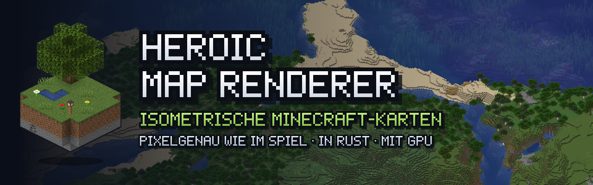
</p>

<p align="center">
  <a href="https://github.com/VonNekyia/heroic-map-renderer/actions/workflows/ci.yml"></a>
  
  
  
  
  <a href="#ai-driven-development-human-driven-design"></a>
</p>

**Heroic Map Renderer** zeichnet Minecraft-Java-Welten als isometrische
Karte. Jeder Block kommt mit seinem Modell, seiner Textur, seiner Biomfarbe
und seinem Licht aufs Bild, so wie der Client ihn zeichnet. Heraus kommen
WebP-Kacheln, die ein schlankes Leaflet-Frontend zeigt. Der Browser rendert
keine Geometrie, nur fertige Bilder. Dazu gehören ein Server, ein
Paper-Plugin und ein Fabric-Mod mit Minimap.

```
Minecraft-Welt + Resourcepack  ->  Rust-Renderer  ->  WebP-Kacheln  ->  Leaflet im Browser
                                         ^                    |
                          Paper-Plugin startet ihn             +->  Mod: Karte im Spiel
```

<p align="center">
  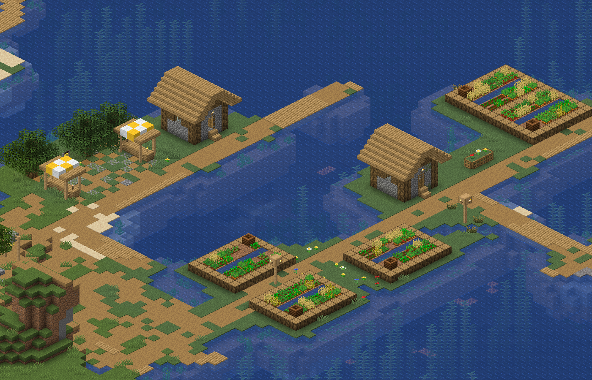
</p>

## Plugin und Mod

<table>
  <tr>
    <td width="50%" valign="top">
      <h3><a href="https://github.com/VonNekyia/heroic-map-renderer-plugin">Paper-Plugin</a></h3>
      <a href="https://bstats.org/plugin/bukkit/heroic-map-renderer-plugin/34598"></a><br>
      Rendert die Welt neben dem Spielserver, hält die Karte mit Updates aktuell, liefert sie über den eingebauten Webserver aus und bietet sie Spielern mit dem Mod zum Download an. Was es vom Renderer nutzt: <a href="docs/plugin.md">Plugin</a>.
    </td>
    <td width="50%" valign="top">
      <h3><a href="https://github.com/VonNekyia/heroic-map-renderer-mod">Fabric-Mod</a></h3>
      Zeigt im Spiel eine Minimap, die er selbst zeichnet, und eine Vollbildkarte aus den Kacheln, die er vom Plugin lädt oder selbst aus den geladenen Chunks zeichnet.
    </td>
  </tr>
  <tr>
    <td></td>
    <td></td>
  </tr>
  <tr>
    <td>Die Minimap, rund</td>
    <td>Die Vollbildkarte</td>
  </tr>
</table>

Beide Bilder stammen aus Gametests des Mods.

## Auf einen Blick

| | |
|---|---|
| **rund 950 Kacheln/s** | Basis der grossen Welt bei scale 32 auf 24 Threads mit Grafikkarte, im ganzen Lauf gemessen, mit Live-Ansicht nebenher, siehe [Vollrender mit #49](docs/messungen/2026-09-29-vollrender-mit-49.md) |
| **95 Minuten** | für die grosse Welt mit 2,5 Millionen Basiskacheln bei scale 32, samt drei nativen Stufen, 188 GB, ebenda |
| **Byte für Byte** | dasselbe Bild auf der CPU und auf der Grafikkarte, von der CI geprüft, siehe [Grafikkarte](docs/benutzung/grafikkarte.md) |
| **verlustfrei** | WebP über libwebp, Pixel für Pixel |
| **vorher geschätzt** | `--estimate` nennt Dauer und Platz als Spanne, bevor ein Lauf beginnt, siehe [Was ein Lauf kostet](docs/benutzung/kosten.md) |

## Was drin ist

- **Wie im Spiel:** Blockstates, Modelle mit Drehung, Gewicht und `uvlock`,
  Varianten aus der Position, Biomfarben samt Übergängen, Wasser und Lava
  mit ihren Fallstufen, jeder Block im Licht des Spiels, jede Fläche weich
  beleuchtet wie im Client der Welt. Das Verhalten ist am Code des Spiels belegt, siehe den
  [Wegweiser](docs/index.md).
- **Cinematic:** dieselbe Karte im Licht des Spiels in HDR, mit Sonne und
  Schatten, siehe [Karte und Cinematic](#karte-und-cinematic).
- **Schnell:** Bitmasken statt Blockbesuche, ein Cache je Thread, Zeichnen
  auf der Grafikkarte über Vulkan oder DX12. Ohne Karte zeichnet die CPU
  dasselbe Bild.
- **Kameras:** schräg in jeder Raute von 2:1 bis 1:1, von oben über Eck
  oder genordet, jede aus vier Richtungen, siehe [Kameras](#kameras).
- **Für grosse Welten:** Zoomstufen darüber, native Stufen auf Wunsch,
  `--resume` nach einem Abbruch, `--update` zeichnet nur, wo sich die Welt
  geändert hat, Zusehen während eines Renders.
- **Assets von Mojang:** Mit `--download-client-jar` lädt der Renderer das
  Client-JAR selbst und nimmt Texturen, Modelle und Biome daraus, nur mit
  deiner Zustimmung, siehe [Assets](docs/benutzung/assets.md), „Von Mojang
  laden“.
- **Eigene Laubfarben:** Ein Plugin kann Laub über die Chunk-Daten
  einfärben, so wie im Spiel, siehe
  [Eigene Laubfarben](docs/benutzung/laubfarben.md).
- **Server:** `--serve` liefert Karte und Kacheln selbst aus, mit HTTPS,
  Grenzen für das offene Netz und Titel, Beschreibung und Vorschaubild zur
  Laufzeit, siehe [Server](docs/benutzung/server.md).
- **Schlankes Frontend:** Leaflet mit Vite und TypeScript. Es lädt nur
  Kacheln, `map.json` und die Höhen für die Koordinaten.

## Ebenen

Server und Plugins legen Ebenen über die Karte: Regionen, Kreise, Linien,
Kartenschrift, Nadeln und Banner mit Tafel, schräg wie von oben auf dem
Gelände, siehe [Ebenen](docs/benutzung/ebenen.md).

<p align="center">
  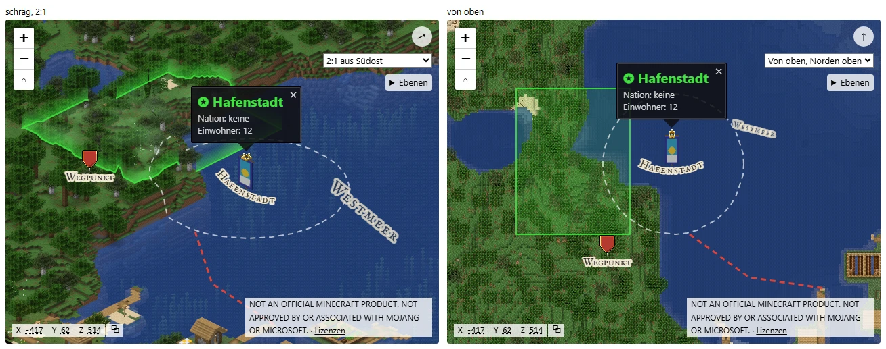
</p>

## Karte und Cinematic

<p align="center">
  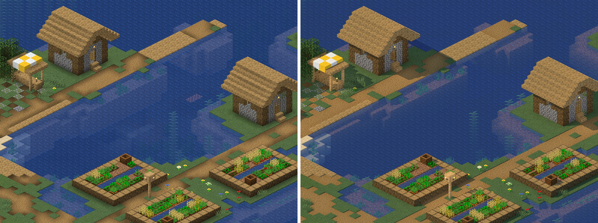
</p>

Links die Karte, rechts dasselbe Dorf mit `--cinematic`. Cinematic zeichnet
im Licht des Spiels in HDR: Die Sonne wirft harte Schatten aus einem
exakten Strahl, Wasser spiegelt den Himmel seines Bioms, Leuchtendes
leuchtet, Wärme und Kälte folgen dem Biom, dazu Bloom. Ein Lauf braucht das
2,15- bis 3,63-Fache der Karte und zeichnet immer auf der CPU. Mehr unter
[Cinematic](docs/renderer/cinematic.md). Das Dorf aus der Testwelt bei
scale 32, Stand `524990e`.

## Kameras

| Kamera | Blick | Fläche gegen 2:1 |
|---|---|---|
| `2:1`, die Vorgabe | schräg, 35,3° | 1 |
| `16:9` | schräg, 38,5° | 1,13 |
| `8:5` | schräg, 41,5° | 1,25 |
| `4:3` | schräg, 46,7° | 1,5 |
| `1:1` | schräg, 54,7° | 2 |
| `top` | von oben, über Eck | 2 |
| `top-north` | von oben, genordet | 4 |
| `north-45` | genordet, unter 45° | 4 |

- **Jede Raute** zwischen 2:1 und 1:1 geht mit `--camera W:H`, die Tabelle
  nennt die üblichen.
- **Jede Kamera** blickt mit `--direction` aus vier Richtungen.
- **Fläche gegen 2:1** heisst: so viele Kacheln, so viel Platz und etwa so
  viel Zeit beim selben scale.

<p align="center">
  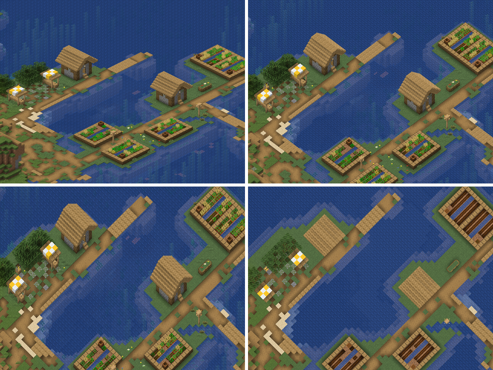
</p>
<p align="center">
  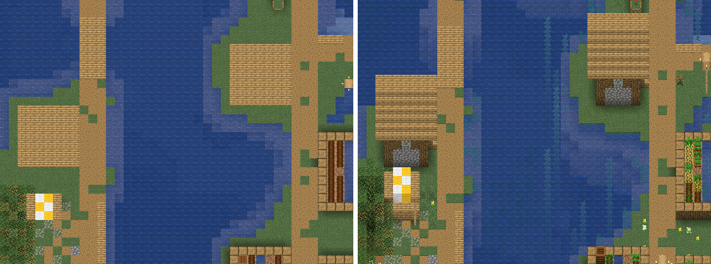
</p>

Oben 2:1, 4:3, 1:1 und `top`, darunter `top-north` und `north-45`, je
scale 16. Wie die Kameras rechnen: [Die Kamera](docs/renderer/kamera.md).

## Wie gross, wie lange

| Welt | Kamera und scale | Grösse | Dauer | Messung |
|---|---|---|---|---|
| Testwelt | 2:1, scale 8, alle Stufen | ~1,8 GB | | hochgerechnet, [Was ein Lauf kostet](docs/benutzung/kosten.md) |
| Testwelt | 2:1, scale 16, alle Stufen | ~6,8 GB | | ebenda |
| Testwelt | 2:1, scale 32, alle Stufen | ~26 GB | | ebenda |
| grosse Welt | 2:1, scale 24, eine native Stufe | 110 GB | 55 min | [29.09.](docs/messungen/2026-09-29-vollrender-mit-49.md) |
| grosse Welt | 2:1, scale 32, drei native Stufen | 188 GB | 95 min | [29.09.](docs/messungen/2026-09-29-vollrender-mit-49.md) |
| grosse Welt | Cinematic, 4:3, scale 24 | 160,2 GB | 2 h 43 min | [04.10.](docs/messungen/2026-10-04-vollrender-4x3.md) |
| grosse Welt | Cinematic, 8:5, scale 32, eine native Stufe | 222,8 GB | 5 h 26 min | [04.10.](docs/messungen/2026-10-04-vollrender-cinematic.md) |

- **Die grosse Welt** hat rund 2,5 Millionen Basiskacheln bei 2:1 und
  scale 32, die Testwelt rund 280 000.
- **Der Platz** hängt fast nur an der Zahl der Kacheln, also an scale und
  Kamera: Ein halber scale braucht ein Viertel. Seit den Messungen oben
  packt libwebp dichter, an einem Ausschnitt der Testwelt ×0,81 über alle
  Stufen, siehe
  [WebP mit quality 75](docs/messungen/2026-10-08-webp-quality-75.md).
- **Die Dauer** hängt auch an den nativen Stufen und an Cinematic. Seit
  den Messungen vom 29.09. sind die nativen Stufen an Ausschnitten der
  Testwelt 30 bis 38 % kürzer, siehe
  [Native Stufen in Bändern](docs/messungen/2026-10-01-native-stufen-in-baendern.md).
- **Für die eigene Welt** sagt `--estimate` beides vorher.

### Gegen andere Karten

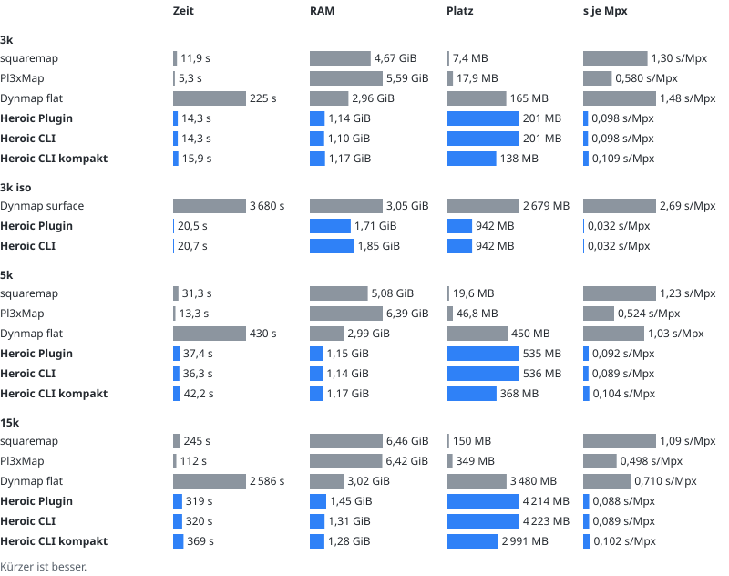

- **Bei gleicher Fläche** sind squaremap und Pl3xMap schneller: Auf
  15 000 Blöcken Seitenlänge brauchen sie 245 und 113 s, Heroic von oben
  320 s. Sie zeichnen aber ein Pixel je Block, Heroic bei scale 4
  sechzehn.
- **Je Million Pixel** ist Heroic darum rund 12-mal schneller als
  squaremap, 8-mal als Dynmap `flat` und 6-mal als Pl3xMap. Schräg gegen
  Dynmap `surface` ist es ein Faktor von rund 80.
- **RAM:** Heroic 1,3 bis 1,5 GiB, squaremap und Pl3xMap je rund 6,4 GiB,
  Dynmap 3,0 GiB.
- **Platz** wächst mit den Pixeln, hier liegt Heroic hinten: auf 15 000
  Blöcken 4,2 GB, mit `--compact` 3,0 GB, Pl3xMap 0,35 GB, squaremap
  0,15 GB.

Gemessen am 10.10.2026 mit Heroic v0.3.0 als CLI und als Plugin 0.1.0,
spätere Fassungen nicht. Messrechner: AMD Ryzen 9 5900X, 12 Kerne,
32 GiB RAM, Samsung 970 EVO Plus, Windows 11. Aufbau und alle Zahlen in
[Benchmark gegen andere Karten](docs/messungen/2026-10-10-benchmark-karten.md);
das Bild erzeugt
[`benchmark-diagramm.py`](docs/bilder/quellen/benchmark-diagramm.py) aus
dieser Seite.

Grössen sind dezimal, 1 GB = 10^9 Byte.

## Galerie

<table>
  <tr>
    <td width="50%">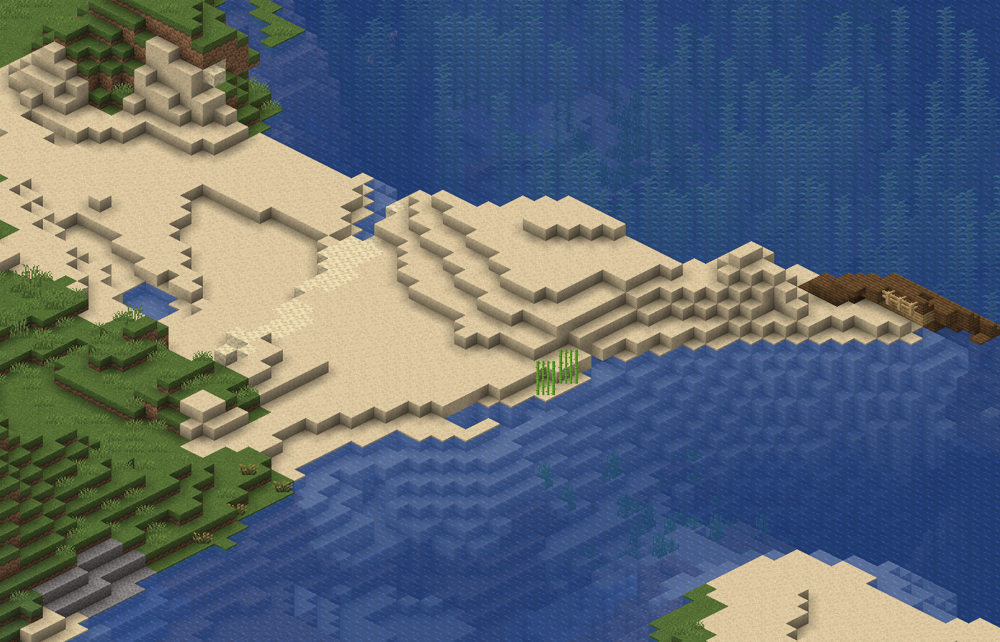</td>
    <td width="50%">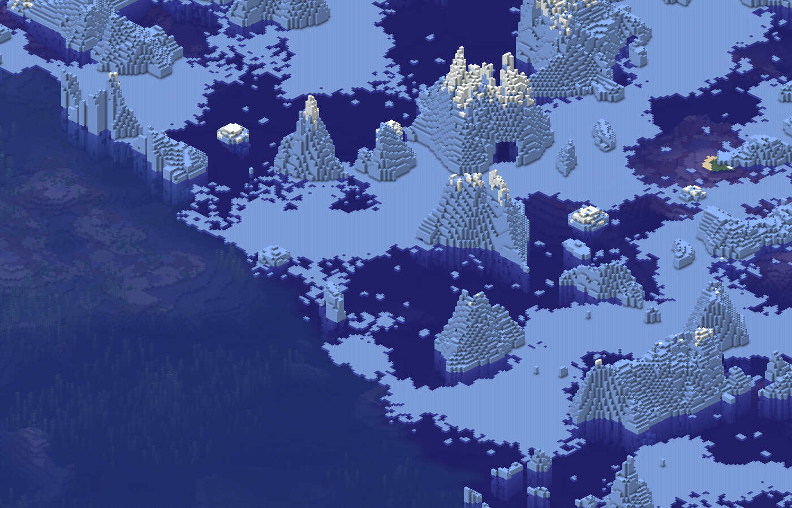</td>
  </tr>
  <tr>
    <td>Strand mit Schiffswrack, scale 32</td>
    <td>Eisberge im gefrorenen Meer, scale 8</td>
  </tr>
  <tr>
    <td width="50%">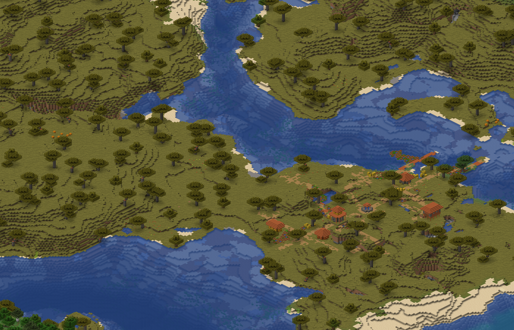</td>
    <td width="50%">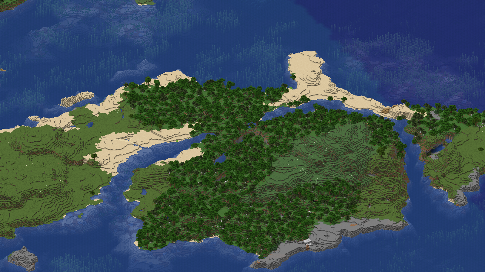</td>
  </tr>
  <tr>
    <td>Savanne mit Dorf und Fluss, scale 8</td>
    <td>Die Insel um den Spawn, scale 4</td>
  </tr>
</table>

Alle Bilder zeigen die Testwelt, Stand `326b30e`. Ausschnitte und Befehle:
Skill [`doku-bilder-rendern`](skills/doku-bilder-rendern/SKILL.md).

## Schnellstart

Gebraucht werden Rust mit einem C-Compiler, unter Windows der von Visual
Studio, und für das Frontend Node.js; die CI nimmt Version 22. Die Welt
liegt unter `./world`, ab Minecraft 26.1.

1. **Bauen:**

   ```bash
   cargo build --release --manifest-path renderer/Cargo.toml
   ```

2. **Die Welt als Kacheln rendern**, direkt dorthin, wo das Frontend sie
   findet. `--download-client-jar` lädt dafür einmal das Client-JAR von
   Mojang. Der Schalter ist deine Zustimmung: Du besitzt Minecraft: Java
   Edition und nimmst die [Minecraft-EULA](https://www.minecraft.net/eula)
   an. Ohne ihn geht es von Hand, siehe
   [Assets und Biomdaten](docs/benutzung/assets.md).

   ```bash
   cargo run --release --manifest-path renderer/Cargo.toml -- --world ./world --download-client-jar --tiles web/public/tiles
   ```

3. **Ansehen:**

   ```bash
   cd web && npm install && npm run dev
   ```

   Ohne eigene Kacheln zeigt `http://localhost:5173/?tiles=/tiles-demo`
   einen kleinen Kachelbaum aus dem Repository.

4. **Oder mit dem Server des Renderers**, ohne Devserver: erst die Seite
   bauen, dann `http://127.0.0.1:8080` öffnen.

   ```bash
   cd web && npm run build && cd ..
   cargo run --release --manifest-path renderer/Cargo.toml -- --serve web/public/tiles --web web/dist
   ```

Alle Schalter: [Schalter und Beispiele](docs/benutzung/schalter.md).

## Stand

- **Veröffentlicht:** der Renderer als
  [Release](https://github.com/VonNekyia/heroic-map-renderer/releases/latest)
  mit Paketen für Windows und Linux, siehe
  [Installation](docs/benutzung/installation.md); das Plugin auf
  [Hangar](https://hangar.papermc.io/Neky/heroic-map) und der Mod.
- Liest Welten ab 26.1 und Resourcepacks aus 26.2 und 26.3, mit den
  Tabellen aus 26.3, siehe
  [0059](docs/entscheidungen/0059-welten-aus-26-2-und-26-3.md); eine Welt
  aus 26.2 mit der weichen Beleuchtung von 26.2, siehe
  [0065](docs/entscheidungen/0065-sicht-in-der-ecke-nach-der-version.md).
- Truhen, Banner, Köpfe, Krüge und die übrigen Blockentities aus den
  Modellen des Spiels, mit Bannermustern und Scherben.
- Ebenen für Server und Plugins: Nadeln, Regionen, Kreise, Linien und
  Kartenschrift, auf der Webkarte wie im Mod, siehe
  [Ebenen](docs/benutzung/ebenen.md).
- Banner, die der Renderer selbst zeichnet, mit Krone für Hauptstädte und
  dem Namen im Bogen, siehe [Blockentities](docs/renderer/blockentities.md),
  „Banner ohne Welt“.
- Die einfarbige Ansicht `--flat`: von oben, ein Pixel je Block, siehe
  [Die einfarbige Ansicht](docs/renderer/einfarbig.md).
- Eine EXE mit Assistent für Windows, siehe
  [Assistent](docs/benutzung/assistent.md).
- Noch nicht: Text auf Schildern und Gegenstände in Blöcken.

## AI driven development, human driven design

Heroic Map Renderer bauen KI-Agenten, gestaltet hat ihn ein Mensch.

- **Die Agenten** sind Sitzungen von Claude Code, je Rolle eine: Renderer,
  Frontend, Plugin, Mod, Recherche und Review. Sie schreiben Code, Tests
  und Doku, messen und prüfen jede PR, bevor sie gemergt wird.
- **Der Mensch** ist der Maintainer. Er entscheidet, was gebaut wird und wie
  es aussieht: Look und Kameras, was ein Spieler darf, die Lizenz und was
  öffentlich wird. Fragen, die nur er beantworten kann, sammeln die Agenten
  für ihn, mit einer Empfehlung.
- **Belegt statt geraten:** Wie das Spiel etwas zeichnet, ist am Code des
  Spiels belegt, und jede Zahl ist gemessen. Über 80 Entscheidungen stehen
  in [`docs/entscheidungen/`](docs/entscheidungen/), fast 60 Messreihen in
  [`docs/messungen/`](docs/messungen/).
- **AI first dokumentiert:** Die Doku ist zuerst für Agenten geschrieben
  und für Menschen lesbar. Die Regeln stehen in [`AGENTS.md`](AGENTS.md),
  die Abläufe in [`skills/`](skills/).

## Doku

Die Doku liegt in [`docs/`](docs/index.md), jede Seite im
[Wegweiser](docs/index.md): Benutzung, wie der Renderer das Spiel nachbaut,
Entscheidungen und Messungen. Tests und CI:
[Tests](docs/entwicklung/tests.md), [CI](docs/entwicklung/ci.md).

## Lizenz

[Apache-2.0](LICENSE): nutzen, ändern, weitergeben und verkaufen, auch
übernommen in andere Projekte, solange der Hinweis aus [`NOTICE`](NOTICE)
mitgeht. Der Grund steht in
[0078](docs/entscheidungen/0078-apache-2-0.md).

NOT AN OFFICIAL MINECRAFT PRODUCT. NOT APPROVED BY OR ASSOCIATED WITH
MOJANG OR MICROSOFT. Die Texturen in den Bildern gehören Mojang und
Microsoft; für sie gilt die Lizenz nicht.

Herausgeber und verantwortlich: VonNekyia. Kontakt:
`contact@mcterranova.com`.
