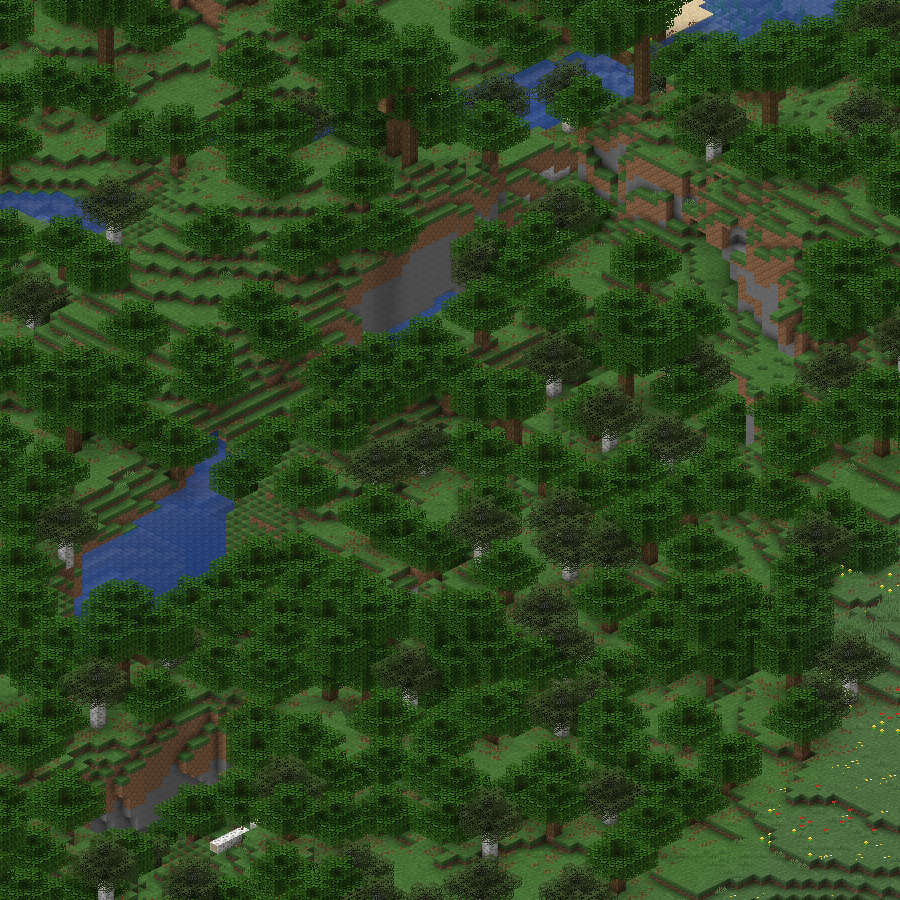

# TerraNova Map Renderer

Isometrischer Offline-Renderer für Minecraft-Java-Welten. Liest Weltdaten und
ein Resourcepack, rendert die Welt mit fester isometrischer Kamera und gibt
WebP-Rastertiles aus, die ein schlankes Leaflet-Frontend anzeigt.

```
Minecraft World + Resource Pack  ->  Rust Renderer  ->  WebP Tiles  ->  Leaflet
```

Der Browser rendert keine Minecraft-Geometrie, sondern nur fertige
Rasterkacheln.




Die Testwelt um (-64, 416), 900 mal 900 Pixel bei scale 16, und um den
Ursprung bei scale 4. Beide Bilder zeigen den Stand von Schritt 8, noch ohne
das Licht unter Wasser und ohne weiche Beleuchtung.

## Schnellstart

Gebraucht werden Rust mit einem C-Compiler, unter Windows der von Visual
Studio, und für das Frontend Node.js; die CI nimmt Version 22.

1. **Assets besorgen:** `vanilla-assets/` und `vanilla-data/` aus dem
   Client-JAR von Minecraft 26.2, wie in
   [Assets und Biomdaten](docs/benutzung/assets.md) beschrieben. Die Welt
   liegt unter `./world`, ab Minecraft 26.1.
2. **Bauen:**

   ```bash
   cargo build --release --manifest-path renderer/Cargo.toml
   ```

3. **Die Welt als Kacheln rendern**, direkt dorthin, wo das Frontend sie
   findet:

   ```bash
   cargo run --release --manifest-path renderer/Cargo.toml -- --world ./world --assets ./vanilla-assets --assets ./assets --data ./vanilla-data --tiles web/public/tiles
   ```

4. **Ansehen:**

   ```bash
   cd web && npm install && npm run dev
   ```

   Ohne eigene Kacheln zeigt `http://localhost:5173/?tiles=/tiles-demo`
   einen kleinen Kachelbaum aus dem Repository.

Alle Schalter: [Schalter und Beispiele](docs/benutzung/schalter.md).

## Stand

- Liest Welten ab 26.1 und Resourcepacks wie der Client von 26.2:
  Blockstates, Modelle, Texturen, Biomfarben, Varianten aus der Position.
- Wasser und Lava wie im Spiel, darunter jeder Block in seinem Licht; volle
  Würfel weich beleuchtet wie in der Voreinstellung des Spiels.
- Kacheln verlustfrei als WebP, Zoomstufen darüber, native Stufen auf
  Wunsch, Fortsetzen nach einem Abbruch, Zusehen während eines Renders.
- Zeichnen auf der Grafikkarte, Byte für Byte wie auf der CPU.
- Die ganze Testwelt braucht bei scale 32 rund 6,5 Minuten und 26 GB, siehe
  [Was ein Lauf kostet](docs/benutzung/kosten.md).
- Noch nicht: Truhen, Banner, Schädel und Töpfe (Entity-Modelle),
  Übergänge zwischen Biomen, weiche Beleuchtung für Teilflächen.

## Doku

Die Doku liegt in [`docs/`](docs/index.md), mit jeder Seite im
[Wegweiser](docs/index.md): Benutzung, wie der Renderer das Spiel nachbaut,
Entscheidungen und Messungen. Regeln für alle, die hier arbeiten, stehen in
[`AGENTS.md`](AGENTS.md), die Workflows in [`skills/`](skills/). Tests und
CI: [Tests](docs/entwicklung/tests.md), [CI](docs/entwicklung/ci.md).
