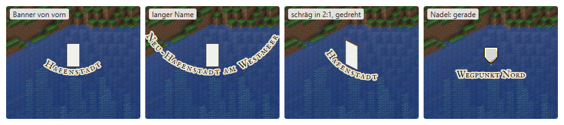

# Ebenen

Eine Ebene legt Nadeln, Banner, Kartenschrift, Regionen, Kreise und Linien
über die Kacheln, auf der Webkarte wie auf der Vollbildkarte des Mods. Jede
lässt sich einzeln an- und abschalten. Ebenen sind kein Teil der Kacheln:
Das Plugin schreibt sie als JSON, und jede Ansicht zeichnet sie selbst. Nur
die Sprites der Banner zeichnet der Renderer vorab, siehe „Banner“. Diese Seite ist die Schnittstelle zwischen
Plugin, Webkarte und Mod (#219). Warum so:
[0095](../entscheidungen/0095-ebenen.md), für Banner, feste Grösse und Tafel
beim Zeigen [0097](../entscheidungen/0097-banner-feste-groesse-tafel-beim-zeigen.md),
für Banner, die der Renderer zeichnet, [0100](../entscheidungen/0100-der-renderer-zeichnet-die-banner.md).
Was die Webkarte davon schon zeigt: [Frontend](../frontend.md), „Ebenen“.

## Überblick

| Datei | Wo | Wer schreibt | Wer liest |
|---|---|---|---|
| `layers.json` | neben `trees.json` in der Wurzel von `--tiles` | das Plugin | Webkarte |
| `layers/<modname>/<ebene>.json` | darunter, eine Datei je Ebene | das Plugin | Webkarte |
| `layers/<modname>/images/…` | Bilder einer Ebene | das Plugin | Webkarte, Mod über den Server |
| `layers/<modname>/banner/…` | Sprites der Banner je Ebene und Satz, siehe „Banner“ | der Renderer, `--banners` | Webkarte, Mod über den Server |
| `ebenen/<modname>/<ebene>.json` | im Ordner des Plugins | der Betreiber, von Hand | das Plugin |
| `ebenen/<modname>/images/…` | Bilder dazu, im Ordner des Plugins | der Betreiber | das Plugin, das sie nach `layers/<modname>/images/` kopiert |

- **Eine Wurzel, eine Welt und Dimension,** wie bei den Bäumen, siehe
  [map.json](map-json.md), „Liste der Bäume“. Die Ebenen gelten für alle
  Bäume der Wurzel; jede Ansicht rechnet sie in ihre Kamera um.
- **Kein `:` in Dateinamen:** Windows verbietet ihn. Die Ebene
  `beispiel:staedte` liegt in `layers/beispiel/staedte.json`; ihre
  Kennung steht im Inhalt.
- **Dasselbe Format** für die Dateien des Betreibers und für die der
  Webkarte. Was nur das Plugin braucht (`web`, `permission`), schreibt es
  nicht für die Webkarte.
- **Über die API** kommen Bilder als Bytes; das Plugin prüft Format und
  Grösse und schreibt sie wie die des Betreibers.
- **Schlüssel englisch,** wie in `map.json`, `trees.json` und der API des
  Plugins.

## Kennung

Jede Ebene heisst `modname:ebene`, etwa `beispiel:wasserkarte`.

- **`modname`:** der Name des Plugins oder Mods, dem die Ebene gehört.
- **Zeichen:** je Teil 1 bis 64 aus `a`–`z`, `0`–`9`, `_`, `-` und `.`.
  - nicht mit `.` am Anfang: So schreibt das Plugin halbe Dateien, und `..`
    fällt weg;
  - nicht mit `.` am Ende: Den streicht Windows;
  - kein Gerät von Windows: Der Teil vor dem ersten `.` ist nicht `con`,
    `prn`, `aux`, `nul`, `com0` bis `com9` oder `lpt0` bis `lpt9`.

  Dieselbe Regel gilt für den Namen der Datei einer Ebene und eines Bilds
  ohne die Endung, siehe „Bilder“: Eine Ebene mit einem Teil von 64
  Zeichen liegt in einer Datei mit 64 Zeichen vor `.json`. Was die Regel
  verletzt, liefert der Server nicht aus, siehe [Server](server.md), „Was
  er ausliefert“.
- **Ein Besitzer schreibt nur seine Ebenen.**

## Liste der Ebenen

`layers.json` nennt jede Ebene der Webkarte, ohne ihren Inhalt. So lädt die
Karte die Liste zum Umschalten sofort und eine Ebene erst, wenn sie
sichtbar ist.

```json
{
  "layers": [
    {
      "id": "beispiel:staedte",
      "name": { "de": "Städte", "en": "Towns" },
      "visible": true,
      "order": 100,
      "version": "5f3a9c1e"
    },
    {
      "id": "beispiel:stadtinfos",
      "name": { "de": "Stadtinfos", "en": "Town info" },
      "visible": false,
      "order": 99,
      "version": "0b77d2a4"
    }
  ]
}
```

| Feld | Inhalt | Vorgabe |
|---|---|---|
| `id` | die Kennung | Pflicht |
| `name` | Name je Sprache, mindestens `de` oder `en`; fehlt eine Sprache, gilt die andere | Pflicht |
| `visible` | sichtbar, bis der Betrachter es ändert | `true` |
| `order` | ganze Zahl; höher liegt oben und steht in der Liste weiter vorn; bei Gleichstand nach `id` | `0` |
| `version` | ändert sich mit jeder Änderung der Datei der Ebene, etwa ein Hash ihres Inhalts | Pflicht |

Die Wahl des Betrachters, welche Ebene an ist, merkt sich jede Ansicht
selbst, die Webkarte im Browser.

## Datei einer Ebene

```json
{
  "id": "beispiel:staedte",
  "name": { "de": "Städte", "en": "Towns" },
  "visible": true,
  "order": 100,
  "objects": [
    { "id": "stadt-17", "type": "pin", "at": [120.5, -340.5], "name": "Hafenstadt" }
  ]
}
```

- **Kopf:** `id`, `name`, `visible` und `order` wie in der Liste, dazu
  `designs`, die Entwürfe der Banner, siehe „Banner“.
- **Nur beim Plugin:**
  - `web`, Vorgabe `true`: ob die Ebene auf die Webkarte kommt;
  - `permission`: wer sie im Mod sieht. Eine Ebene mit `permission` kommt
    nie auf die öffentliche Webkarte. Ohne `web` gilt für sie `web: false`;
    nur ein ausdrückliches `web: true` dazu ist ein Fehler.
    Sie hat keine Bilder: `symbol`, `image` und Bilder in der Tafel sind
    dort ein Fehler, denn alles unter `layers/` ist öffentlich. Banner hat
    sie nur mit `design`; ihre Sprites gehen über den Kanal des Plugins,
    siehe „An den Mod“. Der Mod zeichnet ihre Nadeln als Nadel der Karte in
    `color`.
- **`objects`:** die Objekte, in der Reihenfolge, in der sie liegen; ein
  späteres liegt über einem früheren derselben Art.

### Gemeinsame Felder

| Feld | Inhalt |
|---|---|
| `id` | eindeutig in der Ebene, 1 bis 64 Zeichen; damit ersetzt das Plugin ein Objekt |
| `type` | `pin`, `banner`, `label`, `region`, `circle` oder `line` |
| `dimension` | etwa `minecraft:overworld`; Vorgabe `minecraft:overworld`. Für die Webkarte schreibt das Plugin nur die Objekte der Dimension ihrer Wurzel |
| `panel` | eine Infotafel beim Zeigen, nur bei `pin`, `banner`, `region` und `circle`, siehe „Infotafel“ |

- **Punkte** sind `[x, z]` in Blöcken der Welt, als Zahlen mit Komma. Die
  Ecke eines Blocks liegt auf ganzen Zahlen, seine Mitte bei `+0.5`. Eine
  Region um die Blöcke 0 bis 9 hat die Ecken 0 und 10.
- **Farben** sind `#RRGGBB` oder `#RRGGBBAA`.
- **Pixel der Ansicht:** Grössen, die nicht am Zoom hängen, wie Ränder,
  Nadeln und Banner. Auf der Webkarte sind das Pixel des Bildschirms, im
  Mod Einheiten seiner Oberfläche.
- **Ein Rand** (`stroke`):

  ```json
  { "color": "#8640E6DD", "width": 2, "style": "dashed", "dash": [8, 6] }
  ```

  `width` in Pixeln der Ansicht, Vorgabe 2; 0 heisst ohne Rand. `color`
  ist bei Region und Kreis als Vorgabe die Farbe von `fill` ohne Alpha,
  sonst `#2B2B2B`. `style` ist `solid` oder `dashed`, Vorgabe `solid`.
  `dash` sind Strich und Lücke, in denselben Einheiten wie `width`,
  Vorgabe `[8, 6]`.
- **Eine Füllung** (`fill`) ist eine Farbe; das Alpha macht sie
  halbdurchsichtig.
- **Texte** sind schlichter Text in UTF-8, nie HTML. Jede Ansicht setzt
  sie als Text, nie als Markup.
- **Unbekanntes übergehen:** Ein Objekt mit unbekanntem `type` und ein
  unbekanntes Feld übergeht jede Ansicht. So bricht eine ältere Ansicht
  nicht an einem neueren Plugin.

### Nadel

Ein Punkt der Karte als Wappenschild mit Symbol und Namen, etwa ein
Wegpunkt. `size` wählt die Grösse fest; sie bleibt auf jeder Stufe gleich,
siehe „Nadeln und Banner“ unter „Zeichnen“. Für Orte wie Städte gibt es das
Banner.

```json
{
  "id": "stadt-17",
  "type": "pin",
  "at": [120.5, -340.5],
  "y": 71,
  "name": "Hafenstadt",
  "size": "large",
  "symbol": { "large": "images/burg_16.png", "medium": "images/burg_9.png" },
  "color": "#40E53F",
  "panel": { "blocks": [] }
}
```

| Feld | Inhalt | Vorgabe |
|---|---|---|
| `at` | der Punkt | Pflicht |
| `y` | der Block, auf dem die Nadel steht; ihr Fuss liegt auf seiner Oberseite, `y + 1` | die Höhe aus `map.json` |
| `name` | steht unter der Nadel, höchstens 64 Zeichen | ohne |
| `size` | Grösse, fest auf jeder Stufe: `large`, `medium` oder `small` | `medium` |
| `symbol` | Bilder der Ebene im Schild, siehe „Bilder“: `large` genau 16 × 16 Pixel, `medium` genau 9 × 9; fehlt eins, steht das Schild in dieser Grösse leer. `small` hat nie ein Symbol | ohne |
| `color` | Farbe des Schilds | `#D9443A` |

- **Die Nadel der Karte** ist ein Wappenschild auf einer Nadel, in drei
  Grössen, je in Pixeln der Ansicht:

  | Grösse | Schild | Nadel darunter | Symbol |
  |---|---|---|---|
  | `large` | 23 × 27 | 6 | 16 × 16 |
  | `medium` | 15 × 18 | 5 | 9 × 9 |
  | `small` | 9 × 11 | 4 | ohne |

- **Farbe:** Das Feld des Schilds steht in Graustufen und wird mit `color`
  multipliziert, je Kanal `⌊Feld · Farbe / 255⌋`, abgeschnitten; Rahmen und
  Nadel bleiben, wie sie sind. `color` wirkt also auch mit Symbol. Das
  Alpha von `#RRGGBBAA` hat am Schild keine Wirkung, es bleibt deckend.
- **Symbol:** Pixel auf Pixel, nie skaliert, über dem gefärbten Feld und
  unter dem Rahmen. Seine linke obere Ecke liegt bei
  (⌊(Breite − Seite) / 2⌋, 3), in Pixeln des Schildbilds, von links oben
  ab 0 gezählt; Breite ist die des Schilds, Seite die des Symbols. Bei
  `large` und `medium` also (3, 3); ihr Feld beginnt in Zeile 2. Hat es
  nicht genau seine Grösse, bleibt das Schild leer. Die Bilder von Schild
  und Nadel liefert jede Ansicht selbst.
- **Fuss:** die Spitze der Nadel, in der Mitte der Unterkante.

### Banner

Ein Ort der Karte als Banner, etwa eine Stadt mit dem Banner ihrer Nation.
Der Besitzer der Ebene gibt einen Entwurf vor, Grundfarbe und Muster wie im
Spiel, und der Renderer zeichnet das Banner je Baum in dessen Kamera und
Licht, siehe „Entwürfe“ und „Sprites“. Ohne Entwurf bringt er ein fertiges
Bild mit wie bisher. Mehrere Banner dürfen sich einen Entwurf oder ein Bild
teilen, etwa alle Städte einer Nation; so reichen die 200 je Ebene auch für
1000 Banner.

```json
{
  "id": "stadt-17",
  "type": "banner",
  "at": [120.5, -340.5],
  "y": 71,
  "design": "nordreich",
  "capital": true,
  "image": "images/banner-nordreich.png",
  "name": "Hafenstadt",
  "panel": { "blocks": [] }
}
```

| Feld | Inhalt | Vorgabe |
|---|---|---|
| `at` | der Punkt | Pflicht |
| `y` | der Block, auf dem das Banner steht; sein Fuss liegt auf dessen Oberseite, `y + 1` | die Höhe aus `map.json` |
| `design` | der Name eines Entwurfs aus `designs` derselben Ebene | ohne |
| `capital` | mit Krone, für eine Hauptstadt; ohne `design` ohne Wirkung | `false` |
| `image` | ein Bild der Ebene, siehe „Bilder“, höchstens 32 × 64 Pixel; ein Plugin für Städte schickt etwa 22 × 40. Mit `design` nur Ersatz, solange es kein Sprite gibt | Pflicht ohne `design` |
| `name` | steht unter dem Banner, höchstens 64 Zeichen | ohne |

- **Pixel auf Pixel:** in der Grösse des Sprites oder Bilds, in Pixeln der
  Ansicht, nie skaliert, auf jeder Stufe gleich. Wie die Webkarte rundet,
  steht unter „Nadeln und Banner“ im Abschnitt „Zeichnen“.
- **Fuss:** beim Bild die Unterkante, `⌊Breite / 2⌋` Pixel rechts seiner
  linken Kante, so wie bei der Nadel; beim Sprite der aus `satz.json`,
  siehe „Sprites“.
- **Was die Ansicht zeichnet:** mit `design` das Sprite ihres Satzes, siehe
  „Sprites“; fehlt es, `image`. Ohne gültiges Sprite und Bild, zu gross, in
  einem anderen Format oder nicht an seinem Ort, übergeht die Ansicht das
  Banner und nennt es in der Konsole oder im Log.

#### Entwürfe

Der Kopf der Ebene nennt ihre Entwürfe unter `designs`, Name → Entwurf:

```json
{
  "id": "beispiel:staedte",
  "name": { "de": "Städte", "en": "Towns" },
  "designs": {
    "nordreich": {
      "base": "white",
      "layers": [
        { "pattern": "minecraft:stripe_bottom", "color": "red" },
        { "pattern": "minecraft:globe", "color": "light_blue" }
      ]
    }
  },
  "objects": []
}
```

| Feld | Inhalt | Vorgabe |
|---|---|---|
| Name | wie ein Teil der Kennung, siehe „Kennung“; etwa die UUID einer Nation oder `white` | Pflicht |
| `base` | die Grundfarbe, einer der 16 Farbstoffe des Spiels, klein mit Unterstrich: `white`, `orange`, `magenta`, `light_blue`, `yellow`, `lime`, `pink`, `gray`, `light_gray`, `cyan`, `purple`, `blue`, `brown`, `green`, `red`, `black` | Pflicht |
| `layers` | die Lagen von unten nach oben, je `pattern`, die ID eines Musters wie `minecraft:globe`, und `color`, ein Farbstoff | leer |

- **Höchstens 16 Lagen,** wie das Spiel sie zeichnet; mehr sind ein Fehler.
- **Ein Muster, das der Renderer nicht kennt,** lässt er weg und nennt es im
  Log, wie das Spiel eine Lage verwirft, die es nicht kennt. Das Plugin
  prüft nur die Form `namespace:pfad`.
- **Ein Entwurf gilt in seiner Ebene.** Zwei Ebenen dürfen denselben Namen
  für verschiedene Entwürfe nutzen.

#### Sprites

Der Renderer zeichnet die Entwürfe mit `--banners`, gerufen vom Plugin, und
legt je Entwurf zwei Sprites ab, ohne und mit Krone, dazu je Satz
`satz.json`:

```
layers/<modname>/banner/<ebene>/<satz>/<entwurf>.png
layers/<modname>/banner/<ebene>/<satz>/krone/<entwurf>.png
layers/<modname>/banner/<ebene>/<satz>/satz.json
```

- **`<ebene>`:** der Teil der Kennung nach `:`.
- **`<satz>`:** der Name eines Baums aus `trees.json`, der nicht von oben
  schaut, etwa `2x1-se`, oder `oben`: die Sicht aus `north-45`, Richtung
  `s`, im Look der Karte. `oben` gibt es immer.
- **Welches Sprite:** Ein Baum, der nicht von oben schaut, nimmt seinen
  Satz; jeder Baum von oben, `top-north`, `top` und `--flat`, und der Mod
  nehmen `oben`. Mit `capital` das aus `krone/`.
- **Grösse:** fest, auf jeder Stufe gleich, höchstens 32 × 64. Ein Pixel des
  Modells ist ein Pixel des Sprites, in jeder Kamera. Das Tuch ist 20 Pixel
  breit; von vorn 20 × 40, schräg fällt seine Unterkante um `20 · H / W`
  Pixel, in `2:1` um 10.
- **Leinwand und Fuss:** Alle Sprites eines Satzes, mit und ohne Krone,
  haben dieselbe Leinwand und denselben Fuss.
- **`satz.json`:** der Fuss im Sprite und der Winkel der Unterkante des
  Tuchs. Die Ansicht setzt das Sprite mit diesem Fuss auf den Ort und dreht
  den Namen darunter um diesen Winkel, so dass er parallel zur Unterkante
  läuft; von vorn ist er 0. Welcher Winkel je Kamera und Richtung gilt,
  steht in [0100](../entscheidungen/0100-der-renderer-zeichnet-die-banner.md).
  Mit `image` bleibt der Fuss bei `(⌊Breite / 2⌋, Höhe)` und der Name
  waagrecht. Die Felder nennt die PR, die sie einführt.
- **Wem `banner/` gehört:** dem Renderer, unter jedem `modname`. Das Plugin
  übergibt ihm alle öffentlichen Ebenen in einem Aufruf; er schreibt, was
  fehlt, und löscht, was zu keiner übergebenen Ebene, keinem Entwurf und
  keinem Satz mehr gehört.
- **Neu laden:** Jedes Sprite schreibt der Renderer unter einem Namen mit
  `.` davor und benennt es dann um. Er meldet, welche Ebenen geänderte
  Sprites haben; das Plugin hebt deren `version`, siehe „Ändern und
  Neuladen“.
- **Geheime Ebenen:** Ihre Sprites liegen nicht unter `layers/`; das Plugin
  lässt nur den Satz `oben` zeichnen und schickt ihn über seinen Kanal,
  siehe „An den Mod“.

### Kartenschrift

Ein Name entlang einer frei gebogenen Linie, wie auf alten Karten.

```json
{
  "id": "meer-west",
  "type": "label",
  "text": "Westmeer",
  "path": [[-400, 120], [-250, 60], [-90, 80]],
  "size": 24,
  "spacing": 0.3,
  "font": "map",
  "color": "#2B3A55",
  "outline": { "color": "#F2E8D0CC", "width": 3 }
}
```

| Feld | Inhalt | Vorgabe |
|---|---|---|
| `text` | höchstens 64 Zeichen | Pflicht |
| `path` | 1 bis 64 Punkte; die Schrift läuft mittig entlang der Linie durch sie, ein Punkt heisst waagrecht dort | Pflicht |
| `size` | Höhe der Grossbuchstaben in Blöcken; die Schrift wächst mit dem Zoom | `16` |
| `spacing` | zusätzlicher Abstand zwischen den Zeichen, in Anteilen von `size`, von 0 bis 1 | `0` |
| `font` | eine Schrift der Karte, heute `map`; eine unbekannte gilt als `map` | `map` |
| `color` | Farbe der Schrift | `#2B2B2B` |
| `outline` | Kontur um die Zeichen, `color` und `width` in Pixeln; `width` 0 heisst ohne; ohne `color` `#F2E8D0` | ohne |

- **Lesbar:** Unter 8 Pixeln Schrifthöhe blendet die Ansicht die Schrift
  aus, über 96 Pixeln deckelt sie sie.
- **Grenzfälle,** gleich in Webkarte und Mod:
  - Ein Feld mit falschem Typ gilt als fehlend und nimmt die Vorgabe.
    Fehlt so `text` oder `path`, übergeht die Ansicht die Schrift.
  - `size` 0 oder kleiner wird `16`.
  - `spacing` unter 0 wird 0, über 1 wird 1.
  - `outline` ohne `width` über 0, also auch `{}` oder `null`, heisst ohne
    Kontur; eine `outline`, die kein Objekt ist, ebenso. Eine `color` in
    `outline`, die keine Farbe ist, wird `#F2E8D0`.
  - Eine unbekannte `font` gilt als `map`.
- **Die Schriften** sind freie Vektorschriften, deren Lizenz die Hinweise
  nennen (#219, Teil 6).

### Region

Eine Fläche mit Rand, aus einem oder mehreren Polygonen, jedes mit Löchern.

```json
{
  "id": "stadt-17-flaeche",
  "type": "region",
  "name": "Hafenstadt",
  "polygons": [
    {
      "outer": [[100, -360], [160, -360], [160, -300], [100, -300]],
      "holes": [[[120, -340], [130, -340], [130, -330], [120, -330]]]
    }
  ],
  "fill": "#40E53F55",
  "stroke": { "color": "#40E53FDD", "width": 2 }
}
```

| Feld | Inhalt | Vorgabe |
|---|---|---|
| `polygons` | je Polygon `outer` mit mindestens 3 Punkten und `holes`, eine Liste von Ringen; fehlt `holes`, hat das Polygon keine Löcher; Ringe schliessen sich selbst, Drehsinn beliebig | Pflicht |
| `name` | erscheint beim Zeigen auf die Fläche | ohne |
| `fill` | Füllung | ohne |
| `stroke` | Rand, auch um die Löcher | `{ "width": 2 }` in der Farbe von `fill` ohne Alpha |

Ein Ring darf sich nicht selbst schneiden; Löcher liegen in ihrem Polygon.
Wo das nicht stimmt, füllt jede Ansicht nach der Regel gerade/ungerade.

### Kreis

```json
{
  "id": "stadt-17-weit",
  "type": "circle",
  "center": [130, -330],
  "radius": 2000,
  "stroke": { "color": "#FFFFFFAA", "width": 2, "style": "dashed" }
}
```

`center` ist der Mittelpunkt, `radius` in Blöcken, höchstens 100 000.
`fill` und `stroke` wie bei der Region. Auf dem Gelände ist ein Kreis eine
Region, deren Rand im Abstand `radius` liegt.

### Linie

```json
{
  "id": "route-hafen-insel",
  "type": "line",
  "points": [[130, -330], [600, -500], [1100, -480]],
  "stroke": { "color": "#3A6EA5", "width": 3, "style": "dashed", "dash": [10, 8] }
}
```

`points` mit 2 bis 10 000 Punkten, `stroke` wie oben.

## Infotafel

Eine Nadel, ein Banner, eine Region oder ein Kreis kann eine Tafel zeigen,
sobald der Zeiger darauf ruht. Sie ist eine Liste von Bausteinen, kein
HTML: Webkarte und Mod zeichnen dieselbe Tafel, und fremdes Markup auf der
Webkarte wäre eine Lücke für Skripte.

- **Beim Zeigen:** Ruht der Zeiger 50 ms auf dem Ziel, erscheint die
  Tafel, auf Wunsch des Users am 10.10., vorher 150 ms. Verlässt er Ziel
  und Tafel, schliesst sie nach 300 ms; dazwischen kann er in die Tafel
  wandern, etwa zum Scrollen. Bilder in der Tafel halten das Öffnen nicht
  auf: Die Tafel kommt mit dem Text, ihre Bilder laden nach, in der Grösse
  aus `width` und `height`.
- **Ein Klick** hält sie offen, bis zum Schliessknopf, zu Escape oder zu
  einem Klick daneben. Solange eine gehaltene Tafel offen ist, öffnet
  Zeigen auf ein anderes Ziel keine Tafel; ein Klick darauf wechselt.
- **Mit dem Ziel** schliesst sie, wenn ihre Ebene ausgeschaltet oder neu
  geladen wird.
- **Escape und ein Klick daneben** schliessen zuerst nur die Tafel. Erst
  der nächste Druck wirkt auf die Karte, im Mod etwa schliesst er die
  Vollbildkarte.
- **Ohne Zeiger,** auf Telefon und Tablett, öffnet Tippen die Tafel, Tippen
  daneben schliesst sie.
- **Per Tastatur,** nur auf der Webkarte: Nadeln, Banner und Flächen mit
  Tafel sind Ziele für Tab, Enter öffnet die Tafel des Ziels im Fokus,
  Escape schliesst sie. Im Mod sind sie keine Ziele für die Tastatur.
- **Im Mod** gibt es die Tafel nur auf der Vollbildkarte, nicht auf der
  Minimap.

```json
"panel": {
  "blocks": [
    { "type": "columns", "columns": [
      [
        { "type": "title", "text": "✪ Hafenstadt", "color": "#40E53F" },
        { "type": "lines", "lines": ["Nation: Nordreich", "Level: 3", "Claims: 12/20"] }
      ],
      [
        { "type": "image", "image": "images/banner-nordreich.png", "width": 44, "height": 80 }
      ]
    ] },
    { "type": "section",
      "heading": { "image": "images/mitglieder.png", "width": 200, "height": 50, "alt": "Mitglieder" },
      "blocks": [
        { "type": "lines", "lines": ["Bürgermeister: Anna", "Vize: Ben", "Rat: Cara, Dario"] }
      ] },
    { "type": "section",
      "heading": { "image": "images/statistiken.png", "width": 200, "height": 50, "alt": "Statistiken" },
      "blocks": [
        { "type": "rating", "rows": [
          { "label": "Bergbau", "value": 3, "max": 4, "color": "#E5C33F" },
          { "label": "Fischerei", "value": 1, "max": 4, "color": "#3FA5E5" }
        ] }
      ] }
  ]
}
```

| Baustein | Felder | Zeichnen |
|---|---|---|
| `title` | `text`, höchstens 64 Zeichen; `color`, Vorgabe die Schrift der Tafel | 20 px, fett |
| `lines` | `lines`, je Zeile höchstens 120 Zeichen | 13 px, Zeilenhöhe 1,4 |
| `image` | `image`, `width` und `height` in Pixeln der Tafel, `align` `left`, `center` oder `right`, Vorgabe `left` | in dieser Grösse; vergrössert ohne Glättung, jedes Pixel der Datei eine ganze Zahl Pixel des Geräts, gerundet aus dem Faktor wie bei Nadeln und Bannern; breiter als der Inhalt der Tafel, siehe „Breite“, verkleinert mit gleichem Seitenverhältnis und geglättet |
| `section` | `heading`: Bild mit `image`, `width`, `height` und `alt`, oder Text mit `text`; `blocks` darin | Überschrift über ihrem Inhalt, 8 px Abstand davor |
| `rating` | `rows`: je Reihe `label`, `value` und `max` als ganze Zahlen, `color` | `max` Punkte von 10 px, `value` davon in `color`, die übrigen in `color` mit 25 % Deckkraft; das Label links, 100 px breit |
| `columns` | `columns`: zwei Listen von Bausteinen | nebeneinander, oben bündig, die zweite so breit wie ihr Inhalt |

- **Breite:** Auf der Webkarte ist der Inhalt höchstens 320 Pixel breit,
  um ihn 8 Pixel Innenabstand, 4 Pixel zwischen Bausteinen. Im Mod ist er
  höchstens 200 Einheiten seiner Oberfläche breit, mit Rand 6, denn 320
  wären bei GUI-Massstab 2 fast der ganze Schirm; das legt der Mod in
  seiner eigenen Entscheidung fest (Repository des Mods, #52).
- **Aussehen,** dunkel und gleich in Webkarte und Mod, auf Wunsch des
  Users am 10.10.; im Mod in der schlichten Fassung, die Skins des Mods
  haben eigene Bilder:
  - Grund `#101014` mit Alpha 0,88 (`0xE0`), leicht durchscheinend;
  - Rahmen aussen 1 Pixel `#000000`, innen 1 Pixel `#3A3A44`, die Ecken
    kaum gerundet;
  - Schrift `#D9D9D9`, ein Titel fett, mit eigener `color` in dieser.
  - **Ein Titel bleibt lesbar:** Liegt der Kontrast seiner `color` gegen
    den Grund ohne Alpha, `#101014`, unter 3:1, hellt die Ansicht sie im
    selben Farbton auf. So bleibt eine Nation an ihrer Farbe erkennbar.
    Beide Ansichten rechnen genau so:
    1. Kontrast nach WCAG 2.1: `(L1 + 0,05) / (L2 + 0,05)`, `L` die
       relative Leuchtdichte, je Kanal `s = c / 255`,
       `s / 12,92` bis 0,03928, sonst `((s + 0,055) / 1,055)^2,4`,
       gewichtet 0,2126, 0,7152 und 0,0722. Die Schwelle 0,04045 aus sRGB
       gibt dasselbe: Kein Kanal von 0 bis 255 liegt dazwischen.
    2. Für s = 0, 1, 2 … 10 je Kanal `⌊(10 · c + (255 − c) · s + 5) / 10⌋`,
       also um s · 10 % mit Weiss gemischt, auf ganze Zahlen gerundet, 0,5
       aufwärts. Gleich ist `round(c + (255 − c) · s / 10)`, wenn erst
       multipliziert und dann geteilt wird; `c + (255 − c) · (0,1 · s)`
       kann sich verrunden. Das erste Ergebnis mit 3:1 oder mehr gilt;
       s = 10 ist Weiss.
    3. Alpha bleibt, wie es war.

    Beispiele: `#2B3A55` wird nach zwei Schritten `#556177` (3,04:1),
    `#000000` nach vier `#666666` (3,31:1); `#40E53F` (11,3:1),
    `#D9443A` (4,37:1) und `#CC52A7` (4,82:1) bleiben.
- **Schrift:** eine schlichte, gut lesbare Schrift der Oberfläche, nie die
  Kartenschrift: auf der Webkarte die der UI, im Mod die des Spiels. Die
  Grössen in der Tabelle gelten für die Webkarte; der Mod nimmt die Grösse
  seiner Schrift.
- **Höhe:** Die Tafel ist so hoch wie ihr Inhalt. Ist sie höher als der
  Platz in der Ansicht, scrollt die Ansicht sie, mit Mausrad, Finger oder
  Tastatur. Die Tafel des Beispiels unten ist rund 216 × 306 Pixel gross
  und passt im Mod bei 240 Einheiten Höhe nicht ganz.
- **Grenzen:** höchstens 64 Bausteine je Tafel, zwei Ebenen tief
  verschachtelt (`columns` und `section` nur mit Bausteinen ohne eigene
  `columns` oder `section`).
- **Unbekannte Bausteine** übergeht jede Ansicht. Neue Arten brechen alte
  Ansichten so nicht.
- **`alt`** steht für Screenreader und dort, wo ein Bild fehlt.

## Bilder

Symbole und Bilder der Tafeln liegen beim Server, nicht im JSON.

- **Ablage:** `layers/<modname>/images/`, Pfade in der Ebene relativ zu
  ihrem Ordner, etwa `images/burg.png`. Nur dieser Ordner, ohne
  Unterordner; `..`, absolute Pfade und Adressen anderer Server weist jede
  Ansicht ab.
- **Dateinamen:** der Name ohne die Endung `.png` oder `.webp` wie ein
  Teil der Kennung, also 1 bis 64 Zeichen, nur kleine `a`–`z`, `0`–`9`,
  `_`, `-` und `.`, etwa `burg_16.png`; die Regel steht unter „Kennung“.
  Andere liefert der Server nicht aus, siehe [Server](server.md), „Was er
  ausliefert“.
- **Formate:** PNG, oder WebP verlustfrei als einfaches `VP8L`: nur der
  Chunk `VP8L` im `RIFF`, ohne `VP8X` und ohne verlustbehaftetes `VP8`. Mehr
  liest der Mod nicht.
- **Grösse:** Symbole genau 16 × 16 oder 9 × 9 Pixel, siehe „Nadel“,
  Banner höchstens 32 × 64, siehe „Banner“, Bilder der Tafel höchstens
  512 × 512, jedes höchstens 256 KiB.
- **Kein `data:`:** Die Karte läuft unter `img-src 'self'`, siehe
  [Frontend](../frontend.md), „Ausliefern“. Ein Bild, das das Plugin
  erzeugt, etwa ein Banner, schreibt es als Datei.
- **Im Mod** holt der Mod die Bilder über den Server des Renderers, ohne
  Token, erst wenn eine Nadel oder ein Banner auf dem Schirm liegt oder die
  Tafel offen ist.
- **Bilder einer Ebene mit `permission`** gibt es nicht, siehe „Datei einer
  Ebene“; ihre Banner gehen über den Kanal des Plugins.
- **Sprites der Banner** liegen nicht unter `images/`, sondern unter
  `layers/<modname>/banner/`, siehe „Banner“, „Sprites“. Sie schreibt der
  Renderer, nicht das Plugin.
- **Öffentlich, auch bei `web: false`:** Das Plugin legt die Bilder jeder
  Ebene nach `layers/<modname>/images/`, auch wenn die Ebene selbst nicht
  auf die Webkarte kommt, damit der Mod sie holen kann. Der Server liefert
  alles unter `layers/` ohne Token aus. Wer ein Bild nicht zeigen will,
  legt es nicht ab.

## Ändern und Neuladen

- **Schreiben:** Das Plugin schreibt jede Datei erst unter einem Namen mit
  `.` vorn und benennt sie dann um. So sieht eine Ansicht nie eine halbe
  Datei, und der Server liefert die halbe nie aus. Es schreibt nur
  geänderte Ebenen.
- **Reihenfolge:** erst die Bilder, dann die Datei der Ebene, dann
  `layers.json`. Beim Entfernen umgekehrt: erst `layers.json`, dann die
  Datei, dann die Bilder, die keine Ebene des `modname` mehr nennt. So nennt
  `layers.json` nie eine fehlende Datei.
- **Erkennen:** Ändert sich eine Ebene oder eines ihrer Bilder, ändert sich
  ihre `version` in `layers.json`: Das Plugin rechnet den Hash über die
  Datei und ihre Bilder. Ein Bild, das unter gleichem Namen neu ist, kommt
  so auch an. Für die Sprites der Banner hebt es die `version` der Ebenen,
  die `--banners` als geändert meldet.
- **Neuladen ohne Seitenwechsel:** Die Webkarte fragt `layers.json` alle
  30 Sekunden und beim Zurückkehren auf den Tab nach, mit
  `cache: 'no-cache'`. Der Server antwortet mit ETag und 304, solange
  nichts neu ist, siehe [Server](server.md). Der Server liefert `layers.json`
  und `layers/` ohne Token und mit Revalidierung über ETag, nicht mit langem
  Cache. Eine Ebene, deren `version`
  sich geändert hat und die an ist, lädt sie neu; eine verborgene erst beim
  Einschalten.
- **Ohne `layers.json`** hat die Karte keine Ebenen und zeigt keine Liste.
  Fehlt sie beim Laden der Seite oder ist sie kaputt, fragt die Webkarte bis
  zum Neuladen nicht nach; eine später angelegte zeigt sie erst danach.

## Grenzen

Was darüber geht, weist das Plugin beim Aufruf ab; eine Ansicht übergeht
es und nennt es in der Konsole oder im Log.

| Was | Höchstens |
|---|---|
| Ebenen je Wurzel, mit denen nur für den Mod | 64 |
| `layers.json` | 64 KiB |
| Datei einer Ebene | 4 MiB |
| Objekte je Ebene | 10 000, davon 1000 Nadeln und Banner zusammen |
| Punkte je Objekt, über alle Ringe | 10 000 |
| Löcher je Polygon | 100 |
| Bilder je Ebene | 200 |
| Entwürfe je Ebene | 200 |
| Lagen je Entwurf | 16 |
| Punkte je Reihe einer Wertung | 20 |
| Symbol | 16 × 16 oder 9 × 9 Pixel |
| Bild oder Sprite eines Banners | 32 × 64 Pixel, 256 KiB |
| Bild der Tafel | 512 × 512 Pixel, 256 KiB |
| Nachricht an den Mod | 64 KiB je Teil; ein grösseres Objekt allein, höchstens 1 MiB |

## An den Mod

Das Plugin schickt dem Mod Nadeln, Banner, Kartenschrift, Regionen, Kreise
und Linien, über seinen Kanal. Regionen braucht der Mod auch zum Anheften
(heroic-map-renderer-mod#36).

- **Objekte:** dieselben Felder wie hier, ohne `panel`, in derselben
  Reihenfolge.
- **In Teilen:** 1000 Nadeln sind als JSON 150 bis 500 KB. Eine Ebene geht
  deshalb in Teilen, jeder mit ihrer `version`, die Objekte der Reihe nach.
  Ein Teil hat höchstens 64 KiB. Ein Objekt, das allein grösser ist, etwa
  eine Region mit 10 000 Punkten, geht allein in einem Teil, höchstens
  1 MiB wie eine Nachricht bei Paper. Der Mod ersetzt die Ebene erst, wenn
  alle Teile einer `version` da sind; unvollständige verwirft er bei einer
  neuen `version` und beim Trennen. Die Felder der Teile nennt die Doku des
  Plugins.
- **Liste:** dieselben Felder wie `layers.json`; dazu nennt sie die Adresse
  des Servers, von dem der Mod die Bilder holt.
- **Einzelheiten:** Nachrichten und Rechte beschreibt das Plugin in seiner
  Doku. Infotafeln holt der Mod später, wenn der Zeiger auf dem Ziel ruht.
- **Banner geheimer Ebenen:** Ihr Sprite fragt der Mod über den Kanal an,
  erst wenn das Banner auf dem Schirm liegt, mit Ebene, `version`, Entwurf
  und Krone. Das Plugin schickt den Satz `oben` nur an Spieler, die die
  Ebene sehen dürfen; die Anfragen zählen getrennt von denen nach Tafeln,
  im selben Budget, die Bytes als Base64 mit einem Drittel mehr. Öffentliche
  Sprites und `satz.json` holt der Mod über den Server wie die Bilder.

## Zeichnen

Jede Ansicht rechnet die Punkte mit derselben Projektion wie die Kacheln,
aus `projection`, `direction` und den Höhen in `map.json`, siehe
[map.json](map-json.md), „Kamera und Projektion“ und „Höhen“, und
[Kamera](../renderer/kamera.md), „Projektion“. Geprüft wird gegen
[`renderer/tests/fixtures/projektion.json`](../../renderer/tests/fixtures/projektion.json),
wie bei den Koordinaten.

- **Einmal je `version` und Baum:** Projektion, Netz und die Prüfung, was
  verdeckt ist, hängen nur an der Ebene, dem Baum und seinen Höhen, nicht
  an Zoom und Verschieben. Jede Ansicht rechnet sie in Pixeln der feinsten
  Stufe einmal und hält das Ergebnis; ein Zoom verschiebt und skaliert es
  nur noch. Neu gerechnet wird mit einer neuen `version`, einem anderen
  Baum oder neu geladenen Höhen.

- **Projektion eines Punkts** (x, y, z): erst in den Blick, k
  Vierteldrehungen von (x, z) nach (z, −x), dann
  `P(x, y, z) = (u · h, v · a − y · b)` mit u und v wie in der Kamera.
  Die Drehung der Punkte hat kein −1 wie die der Blöcke: Ein Punkt hat
  keine Ausdehnung.
- **2D,** die Kameras von oben (`top`, `top-north`, b = 0): `P(x, 0, z)`.
  Die Höhen spielen keine Rolle, alles liegt eben, ein Kreis bleibt rund.
- **iso,** alle anderen (b > 0): Alles liegt auf dem Gelände, nicht flach.
  Eine flache Ebene läge um (Höhe − Ebene) · b Pixel daneben, bei 2:1 und
  scale 32 bei 40 Blöcken Unterschied um 640 Pixel.

### Die Oberfläche im iso

`H(x, z)` ist die Oberseite des Geländes an einem Punkt:

- **Aus den Höhen:** je Zelle aus `heightsCell` × `heightsCell` Spalten ein
  Wert, siehe [map.json](map-json.md), „Höhen“. Die Oberseite ist Wert + 1.
- **Weich:** zwischen den Mitten der Zellen bilinear gemischt, damit ein
  Rand nicht in Stufen von 4 Blöcken springt.
- **Ohne Wert** (−32768 oder eine fehlende Region): der Mittelwert der
  Nachbarn mit Wert im Umkreis von zwei Zellen, sonst `seaLevel`, sonst 64.
- **Ohne `heights`** in `map.json` liegt alles auf `seaLevel`, sonst 64,
  und die Konsole sagt es.

### Ränder, Linien und Kreise

1. **Abtasten an den Zellen:** `H` mischt bilinear zwischen den Mitten der
   Zellen, feiner bringt nichts Neues. Jede Strecke bekommt deshalb ihre
   Schnittpunkte mit dem Raster dieser Mitten und je einen Punkt dazwischen.
   Ein Kreis wird erst als Vieleck mit Seiten von höchstens `heightsCell`
   Blöcken angenähert, dann ebenso.
2. **Projizieren:** je Punkt `P(x, H(x, z), z)`.
3. **Zeichnen** als ein Linienzug in Pixeln der Ansicht, siehe „Ein Rand“
   unter „Gemeinsame Felder“. Die Striche
   eines gestrichelten Rands zählen entlang des gezeichneten Zugs, nicht
   je Strecke, so laufen sie über Ecken weiter.

### Flächen

1. **Als Netz:** Das Polygon samt Löchern wird an den Linien durch die
   Mitten der Zellen in Felder zerschnitten, denn dazwischen mischt `H`
   bilinear. Ein Feld ist das Quadrat zwischen vier Mitten von Zellen.
   Jedes Stück wird gezeichnet, als Dreiecke oder als Vieleck, jede Ecke
   mit ihrer Höhe projiziert, auf jeder Kante dazu ihre Mitte. Die
   Webkarte zeichnet statt der Felder ganz drinnen den Umriss der
   sichtbaren unter ihnen; das gibt dasselbe Bild, ausser am Rand des
   Verdeckten, siehe
   [0096](../entscheidungen/0096-formen-und-schrift-im-browser.md).
2. **In einem Zug gefüllt:** Die Stücke kommen erst deckend in eine Maske,
   dann die Maske einmal in der Farbe von `fill`; die Webkarte füllt sie
   als einen Pfad, gerade/ungerade. So doppelt sich das Alpha nicht an den
   Kanten zweier Stücke.

### Was verdeckt ist

Im iso kann Gelände vor einer Fläche liegen, etwa ein Berg vor einem Tal.
Geprüft wird entlang der Linie vom Punkt zur Kamera: Auf ihr steigt der
Strahl, der denselben Bildpunkt trifft, je Block in x oder z um die
Steigung `2a/b`, genordet `a/b`. Gelände zählt erst ab mehr als einer Zelle
vor dem Punkt: diagonal ab der nächsten Mitte auf der Linie, genordet ab der
übernächsten.

- **Ein Punkt** ist verdeckt, wenn `H` auf dieser Linie über dem Strahl
  liegt, abgetastet in Schritten einer halben Zelle.
- **Ein Feld** ist verdeckt, wenn seine Mitte es ist.
- **Verdeckte Ränder** zeichnet die Ansicht dünn, gestrichelt und mit
  40 % Deckkraft, so bleibt die Form lesbar.
- **Verdeckte Felder** füllt sie nicht.
- **Nadeln und Schrift** liegen immer obenauf, auch hinter einem Berg.

### Kartenschrift

- **Pfad:** dicht abgetastet und projiziert wie ein Rand. Die Höhen entlang
  des Pfads werden über 32 Blöcke gemittelt, damit die Schrift nicht mit
  jeder Kuppe springt.
- **Richtung:** Läuft der gezeichnete Pfad im Bild nach links, kehrt die
  Ansicht ihn um, so steht die Schrift nie auf dem Kopf.
- **Zeichen:** jedes aufrecht zur gezeichneten Linie, mittig auf ihr, mit
  der Sperrung aus `spacing`. Ist der Pfad kürzer als der Text, läuft die
  Schrift an beiden Enden in Richtung des letzten Stücks weiter.
- **Grösse:** `size` Blöcke auf dem Boden, in Pixeln also `size · scale`
  auf der feinsten Stufe, mal 2^(Zoom − maxZoom).

### Nadeln und Banner

- **Fuss:** `P(x, y + 1, z)` mit `y` aus dem Objekt oder `H(x, z)`.
- **Grösse:** fest, auf jeder Stufe gleich, siehe
  [0097](../entscheidungen/0097-banner-feste-groesse-tafel-beim-zeigen.md):
  die Nadel in ihrer `size`, siehe „Nadel“, das Banner in der Grösse seines
  Bilds, in Pixeln der Ansicht, siehe „Gemeinsame Felder“; im Mod wie
  seine Wegpunkte. Auf der Webkarte ist ein Pixel des Bilds eine ganze
  Zahl Pixel des Geräts breit, gerundet aus `devicePixelRatio`. Sie hängt
  nicht am Zoom.
- **Name:** immer, mittig unter dem Fuss der Nadel oder des Banners, und
  er sieht aus wie die Kartenschrift, nicht wie die Oberfläche: Schrift
  `map`, Farbe `#2B2B2B`, Kontur `#F2E8D0` 2 Pixel breit, ohne Kasten.
  Die Grösse ist fest, auf jeder Stufe gleich: auf der Webkarte
  Schriftgrösse 16 Pixel, im Mod 10 Einheiten seiner Oberfläche, im
  Verhältnis wie die Breite der Tafel, 200 zu 320. So zeigt ein Plugin für
  Städte die Namen am Banner, ohne eigene Kartenschrift.
- **Name einer Nadel:** gerade und waagrecht wie bisher, mittig unter dem
  Fuss, ohne Sperrung.
- **Name eines Banners:** auf einem Bogen unter dem Fuss, nach unten
  gewölbt, jedes Zeichen aufrecht zum Bogen wie die Kartenschrift an ihrem
  Pfad, siehe [0102](../entscheidungen/0102-name-im-bogen.md). In Einheiten
  der Ansicht, `s` die Schriftgrösse von oben, `F` der Fuss, y nach unten,
  `h` die Höhe des Banners, wie die Ansicht es zeichnet, in ihren
  Einheiten: auf der Webkarte die Höhe von Sprite oder Bild in Pixeln des
  Bildschirms, im Mod nach seinem Faktor für Ebenen, höchstens 32
  Einheiten:
  - **Sperrung** `0,125 · s` zwischen den Zeichen, nicht nach dem letzten:
    auf der Webkarte 2 Pixel, im Mod 1,25 Einheiten.
  - **Länge** `L`: die Vorschübe aller Zeichen plus die Sperrung, gemessen
    auf dem Bogen.
  - **Radius** `r = max(2 · h, L / (2π / 3))`: Mit `2 · h` wird der Bogen
    für längere Namen weiter, bis er 120° öffnet; darüber wächst `r`, und
    er wird flacher.
  - **Lage:** Mittelpunkt `F + (0, 0,75 · s − r)`, der tiefste Punkt also
    `0,75 · s` unter dem Fuss. Die Mitte des Namens liegt auf dem tiefsten
    Punkt; die Grundlinie läuft eine halbe Höhe der Grossbuchstaben
    ausserhalb des Bogens, wie bei der Kartenschrift.
  - **Schräger Satz:** Der ganze Bogen dreht sich um `F` um den Winkel aus
    `satz.json`, nach rechts fallend positiv, so folgt er der Unterkante
    des Tuchs. Mit `image` ist der Winkel 0.

  

### Reihenfolge, Zeigen und Anklicken

- **Ebenen:** nach `order`, die höhere oben.
- **In einer Ebene:** Füllungen, dann Ränder und Linien, dann Schrift.
  Nadeln und Banner aller Ebenen liegen über allem anderen; in einer Ebene
  liegt das spätere oben.
- **Zeigen und Anklicken:** Es gilt, was oben liegt: eine Nadel oder ein
  Banner, sonst eine Region oder ein Kreis, in dessen gezeichnetem Umriss
  der Zeiger liegt. Was dann geschieht, steht unter „Infotafel“.

## Beispiel: Städte, Stadtinfos, Schiffsrouten

Drei Ebenen eines Plugins für Städte, wie #219 sie als Prüfstein nennt:

- **`beispiel:staedte`,** sichtbar: je Stadt das Banner ihrer Nation, ohne
  Nation ein weisses, mit der Tafel oben, dazu die Fläche der Stadt in der
  Farbe ihrer Nation, `fill` mit Alpha `55`, `stroke` mit `DD`, siehe
  „Region“.
- **`beispiel:stadtinfos`,** verborgen: je Stadt zwei Kreise, 750 und 2000
  Blöcke, der äussere gestrichelt:

  ```json
  { "id": "stadt-17-nah", "type": "circle", "center": [130, -330], "radius": 750,
    "stroke": { "color": "#FFFFFFAA" } },
  { "id": "stadt-17-weit", "type": "circle", "center": [130, -330], "radius": 2000,
    "stroke": { "color": "#FFFFFFAA", "style": "dashed" } }
  ```

- **`beispiel:schiffsrouten`,** verborgen: gestrichelte Linien zwischen den
  Häfen, siehe „Linie“.

Die Bilder (Banner, Überschriften) liefert das Plugin unter
`layers/beispiel/images/`.
