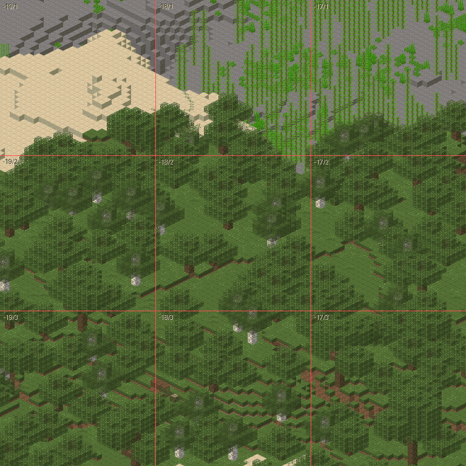

# Kacheln exportieren

`--tiles` rendert die Welt als verlustfreie WebP-Kacheln von 256 mal 256
Pixeln, stapelt die gröberen Zoomstufen darüber und schreibt `map.json`.
Ein Vorlauf liest dafür jeden Chunk einmal, dann rendern alle Threads die
Basis in Streifen. `--center` und `--size` schränken auf einen Ausschnitt
ein, der in einen bestehenden Baum passt. Der Ablauf steht in `write_tiles` in
[`renderer/src/cli.rs`](../../renderer/src/cli.rs), der Vorlauf in `survey` in
[`renderer/src/render/tiles.rs`](../../renderer/src/render/tiles.rs). Was
ein Lauf kostet: [Was ein Lauf kostet](kosten.md).

## Die ganze Welt

```bash
cargo run --release --manifest-path renderer/Cargo.toml -- --world ./world --assets ./vanilla-assets --assets ./assets --data ./vanilla-data --tiles ./tiles
```

```
GPU:        <Name der Karte> (Vulkan)

Vorlauf:    249103 Chunks in 5.5 s, 3107 Blockstates, 280630 Kacheln
            67120 Chunks nicht fertig erzeugt, nicht gezeichnet
            4953 Sprites bei scale 32, davon 2437 Fassungen
            30 Modelle ragen über ihren Block hinaus, Würfel {[0, -1, 0], [0, 1, 0]}
Höhen:      383 Regionen, 1.7 MB in 0.2 s
            200/280630 Kacheln
            400/280630 Kacheln
```

Danach stapelt der Lauf die gröberen Zoomstufen darüber und schreibt
`map.json`.

Der Vorlauf beantwortet zwei Fragen auf einmal: welche Blockstates
vorkommen, und welche Kacheln überhaupt etwas zeigen. Er kostet für die
ganze Welt 5 bis 11 Sekunden. Chunks, die das Spiel nicht fertig erzeugt
hat, übergeht er und nennt ihre Zahl, siehe
[Welten und Kennung](welten.md), „Nicht fertig erzeugte Chunks“. Eine
Fassung ist jedes Sprite, das nicht
selbst Alternative einer Blockstate ist: eines je Maske verdeckter
Flüssigkeitsflächen, dazu die Streifen an Wasserstufen. Wie
Vorlauf und Renderlauf zusammenspielen und warum die Welt dafür mehrmals
durchlaufen wird, steht in
[Der Weg einer Kachel](../renderer/renderpfad.md).

## Ein Ausschnitt

`--center` und `--size` schränken auf einen Ausschnitt ein:

```bash
cargo run --release --manifest-path renderer/Cargo.toml -- --world ./world --assets ./vanilla-assets --assets ./assets --data ./vanilla-data --tiles ./tiles --center -64 416 --size 2048 --native-levels 3
```

```
GPU:        <Name der Karte> (Vulkan)

Vorlauf:    788 Chunks in 0.1 s, 247 Blockstates, 256 Kacheln
            570 Sprites bei scale 32, davon 323 Fassungen
            1 Modelle ragen über ihren Block hinaus, Würfel {[0, 1, 0]}
Höhen:      4 Regionen, 0.0 MB in 0.0 s
            200/256 Kacheln
            256/256 Kacheln
Kacheln:    256 geschrieben, 0 leer, 256x256 px, 24 Threads + GPU
            23.7 MB in 0.3 s (794 Kacheln/s, 95 kB je Kachel)
Zoom  9:     64 Kacheln nativ bei scale 16 + GPU, 6.0 MB
Zoom  8:     16 Kacheln nativ bei scale 8 + GPU, 1.4 MB
Zoom  7:     4 Kacheln nativ bei scale 4 + GPU, 0.4 MB
            7.7 MB in 0.6 s (138 Kacheln/s), in Bändern aus 1 Kacheln bei scale 4
Zoom  6:     2 Kacheln
...
Pyramide:   9 Kacheln, 0.2 MB in 0.0 s
Karte:      Zoom 0..10, 256 Basiskacheln, -10240/0 bis -6144/4096 px -> ./tiles/map.json
```

MB und kB zählt die Ausgabe binär, 2^20 und 2^10 Byte, siehe
[Was ein Lauf kostet](kosten.md). Die Rate eines so kurzen Laufs sagt wenig;
die Basis braucht hier eine Drittelsekunde. Wie stark sie streut, steht in
[2026-09-27, Biomübergänge](../messungen/2026-09-27-biomuebergaenge.md),
„Die Beispielausgabe“. Die Ausgabe oben ist ein Lauf aus
[2026-10-01, Native Stufen in Bändern](../messungen/2026-10-01-native-stufen-in-baendern.md),
„Beispiel“. Die nativen Stufen nennen ihre Zeit zusammen, in der Zeile
unter ihnen, mit der Grösse der Bänder, siehe
[Der Weg einer Kachel](../renderer/renderpfad.md), „Native Stufen in
Bändern“.

Der Ausschnitt wird aufgerundet, bevor der Vorlauf irgendetwas
ausschliesst, und zwar auf ganze Kacheln der gröbsten nativen Stufe: mit
drei Stufen bei scale 32 auf 2048 Pixel, aus 2048 mal 2048 werden hier 4096
mal 4096. Die nativen Stufen zeigen ganze Elternkacheln, und alle Stufen
sollen denselben Stand der Welt zeigen: sonst stünde ein Neubau neben dem
Ausschnitt nur auf den gröberen. Umgekehrt sammelt der Vorlauf Blockstates
nur aus Chunks, die tatsächlich in eine ausgegebene Kachel fallen, und was
die gerundete Fläche gar nicht berühren kann, dekodiert er nicht einmal:
hier 788 Chunks statt der 8192 aller Regionen, die sie schneiden. Ein
kleiner Ausschnitt braucht deshalb keine Assets für Blöcke am anderen Ende
der Welt; fehlt eines in seiner Fläche, bricht der Lauf ab, bevor er die
erste Kachel schreibt.

## Wo die Kacheln liegen

Die Kacheln liegen als `tiles/<z>/<x>/<y>.webp`; x und y dürfen negativ
sein, weil der Blockursprung mitten in der Welt liegt. Daneben liegen je
Region die Höhen für die Koordinatenanzeige als
`tiles/heights/<x>.<z>.bin`, siehe [map.json](map-json.md), „Höhen“. Jede
Kachel, jede Datei der Höhen und `map.json` entstehen erst als eigene Datei
daneben und werden dann getauscht: Ein Leser sieht nie eine halbe Datei,
siehe [0018](../entscheidungen/0018-dateien-tauschen-statt-ueberschreiben.md).

Eine Kachel muss Pixel für Pixel dem entsprechenden Ausschnitt eines
grossen Renderings gleichen, sonst stünden im Browser Kanten dazwischen.
Neun Kacheln nebeneinander, die Grenzen rot eingezeichnet:



## Leer gewordene Kacheln

Wird eine Kachel bei einem erneuten Lauf leer, löscht der Export die alte
Datei, auf jeder Stufe, sonst zeigte die Karte weiter, was inzwischen
abgerissen wurde. Nur eine native Elternkachel, unter der eine Kachel
stehen bleibt, bleibt durchsichtig stehen, siehe unten.

## Kacheln ohne Chunk: `--prune`

Eine Basiskachel, die gar kein Chunk mehr berührt, weil ein Editor ihn
zurückgesetzt hat, entfernt der Export nur mit `--prune`, dann auf jeder
Stufe. Bis zum Ende der Pyramide läuft ein Lauf mit dem Schalter wie einer
ohne ihn; erst dann nimmt er diese Kacheln heraus und setzt die Stufen über
ihnen ohne sie neu zusammen. Ohne den Schalter zählt er sie und lässt sie
stehen; nur wo der Lauf eine native Elternkachel ohnehin neu rendert, fehlt
dort schon, was sie zeigen. Die Elternkachel bleibt dann durchsichtig
stehen, damit keine Kachel ohne Eltern dasteht. Einer Teilkopie der Welt
fehlt vieles, und ein Lauf mit `--prune` leerte über ihr den Baum: der
Schalter gehört nur an die vollständige Welt. Der Lauf nennt deshalb vor
der ersten Kachel, wie viele Kacheln es trifft, von wie vielen. Ein
Ausschnitt sucht nur in seiner gerundeten Fläche. Mit `--prune` läuft er
auch dann, wenn der Vorlauf dort gar nichts mehr findet, und auch, wenn
dort schon aufgeräumt ist.

Die Höhen einer Region, deren Regionsdatei fehlt, entfernt ebenfalls nur
`--prune`, am Ende des Laufs mit den Kacheln, soweit der Lauf die Region
läse. Die Höhen eines verschwundenen Chunks in einer Region, die es noch
gibt, schreibt dagegen jeder Lauf leer, der ihn liest, siehe
[map.json](map-json.md), „Höhen“.

## Wann entfernt wird

Entfernt wird erst am Ende des Laufs, auf allen Stufen, auch was nur leer
geworden ist, von der gröbsten Stufe bis zur Basis. Bis dahin zeigt eine
Kachel, die beim Rendern oder in der Pyramide leer geworden ist, schon
nichts mehr, der Lauf überschreibt sie durchsichtig. Bricht er vorher ab,
hat er nichts gelöscht, mit `--resume` nur die frischen Basiskacheln (siehe
[Pyramide und Fortsetzen](pyramide-und-resume.md)), und auch ein späterer
Ausschnitt holt nichts Abgerissenes in eine Elternkachel zurück.

Über den Kacheln ohne Chunk hat ein Lauf mit `--prune` bis zum Ende der
Pyramide nur verändert, was auch ein Lauf ohne ihn verändert hätte. Danach
setzt er die verkleinerten Stufen über ihnen ohne sie neu zusammen. Was
dabei leer wird, entfernt er erst am Ende, mit diesen Kacheln und ihren
nativen Vorfahren, unter denen nichts bleibt. Bricht er dazwischen ab,
zeigen die neu zusammengesetzten Kacheln schon den aufgeräumten Stand. Die
Basis, native Kacheln, die dieser Lauf nicht gerendert hat, und was leer
geworden ist, zeigen noch den alten. Ein Lauf mit `--prune` über dieselbe
Fläche bringt den Baum in Ordnung, einer ohne den Schalter nicht immer.

Bricht er beim Entfernen ab, fehlen feineren Kacheln die Eltern. Jeder Lauf
sucht solche Kacheln, soweit sie seine Fläche berühren, und baut ihnen die
Eltern neu, auch einer, dessen Vorlauf dort nichts mehr findet; einer mit
`--prune` räumt dann auch die Kacheln ohne Chunk weg.

## Weitere Schalter beim Export

- `--native-levels`: [Zoomstufen](zoomstufen.md)
- `--resume`: [Pyramide und Fortsetzen](pyramide-und-resume.md)
- `--gpu`: [Grafikkarte](grafikkarte.md)
- `--defender-exclusion`: [Echtzeitschutz](echtzeitschutz.md)

## Was bleibt eine Näherung

- **Ohne `--prune` bleiben Kacheln verschwundener Chunks stehen.** Rendert
  der Lauf eine native Elternkachel ohnehin neu, zeigt sie die Welt ohne
  den Chunk, die Basis darunter noch mit ihm; rendert sie leer, bleibt sie
  durchsichtig stehen. Die Ausgabe nennt den Schalter.
