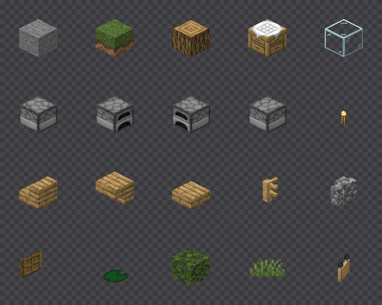

# Schalter und Beispiele

`terranova-render` ist ein einziges Binär; welche Arbeit es tut, entscheiden
die Schalter. `--tiles` exportiert Kacheln, `--pyramid` baut nur Zoomstufen
nach, `--heights` trägt nur die Höhen nach, `--render`, `--sprite`,
`--block`, `--at` und `--scan` helfen beim Ansehen und Prüfen. Die Schalter stehen in `Args` in
[`renderer/src/cli.rs`](../../renderer/src/cli.rs); `--help` nennt dieselben
Texte.

## Alle Schalter

| Schalter | Wirkung | Mehr |
|---|---|---|
| `--world DIR` | Weltwurzel mit `level.dat` oder eine Dimension darin | [Welten und Kennung](welten.md) |
| `--assets DIR` | Asset-Wurzel, mehrfach, spätere überschreiben frühere | [Assets und Biomdaten](assets.md) |
| `--data DIR` | Datenwurzel mit Biomdefinitionen, mehrfach | [Assets und Biomdaten](assets.md) |
| `--at X Y Z` | die Blockstate an dieser Weltkoordinate ausgeben | unten |
| `--block BLOCKSTATE` | eine Blockstate auflösen, mehrfach | unten |
| `--sprite DATEI` | die Blockstates aus `--block` als Sprites in eine PNG rastern | unten |
| `--scale N` | Pixelbreite eines Blocks, ein Vielfaches von 4, Vorgabe 32 | [Kamera](../renderer/kamera.md) |
| `--biome-blend N` | wie weit Gras, Laub und Wasser über Biomgrenzen gemischt werden, 0 bis 7 Blöcke wie der Biomübergang im Spiel, Vorgabe 2; ein bestehender Kachelbaum behält seinen | [Biomfarben](../renderer/biomfarben.md), [map.json](map-json.md) |
| `--render DATEI` | einen Weltausschnitt in eine PNG rendern | unten |
| `--center X Z` | die Blockspalte in der Bildmitte, Vorgabe `0 0` | unten |
| `--size N` | Kantenlänge des Ausschnitts in Pixeln, ab 1; für `--render` Vorgabe 1024, ohne Angabe deckt `--tiles` die ganze Welt | [Kacheln exportieren](kacheln.md) |
| `--scan` | jeden Chunk dekodieren, mit `--assets` jede vorkommende Blockstate auflösen und rastern | unten |
| `--tiles DIR` | die Welt als WebP-Kacheln exportieren | [Kacheln exportieren](kacheln.md) |
| `--prune` | mit `--tiles`: Kacheln entfernen, die kein Chunk mehr berührt, und Höhen von Regionen ohne Regionsdatei | [Kacheln exportieren](kacheln.md) |
| `--native-levels N` | mit `--tiles`: so viele gröbere Stufen aus der Welt rendern, Vorgabe 0 | [Zoomstufen](zoomstufen.md) |
| `--resume` | mit `--tiles`: einen abgebrochenen Lauf fortsetzen | [Pyramide und Fortsetzen](pyramide-und-resume.md) |
| `--gpu auto\|on\|off` | mit `--tiles`: die Grafikkarte zeichnet, Vorgabe `auto` | [Grafikkarte](grafikkarte.md) |
| `--defender-exclusion` | mit `--tiles`, nur unter Windows: eine Ausnahme im Echtzeitschutz setzen | [Echtzeitschutz](echtzeitschutz.md) |
| `--pyramid DIR` | Zoomstufen und `map.json` aus den Basiskacheln nachbauen, ohne Welt und Assets | [Pyramide und Fortsetzen](pyramide-und-resume.md) |
| `--heights DIR` | die Höhen für die Koordinatenanzeige in einen bestehenden Baum schreiben, ohne zu rendern; braucht `--world` und `--assets` | [map.json](map-json.md), „Höhen“ |

## Einen Block ansehen: `--at`

```bash
cargo run --release --manifest-path renderer/Cargo.toml -- --world ./world --at -64 72 416
```

```
Welt:       ./world
Regionen:   ./world\dimensions\minecraft\overworld\region
            383 Dateien, x -26..22, z -21..20

Chunk:      (-4, 26)  status=minecraft:full
            DataVersion 4903
            24 Sections, y -64..319

Block bei (-64, 72, 416):  minecraft:air
Höchster Block in Spalte:  y=71  minecraft:oak_leaves[distance=2,persistent=false,waterlogged=false]
Biom der Zelle:            minecraft:forest
Biom des Blocks:           minecraft:forest
```

`Biom der Zelle` ist das gespeicherte Biom der Zelle aus 4×4×4 Blöcken,
`Biom des Blocks` das Biom des Blocks nach dem Zoom des Spiels; gemischt
wird darüber erst beim Zeichnen. Ohne Seed in der Welt fehlt die zweite
Zeile. Siehe [Biomfarben](../renderer/biomfarben.md), „Biom je Block“.

Welche Welten der Renderer liest, steht in [Welten und Kennung](welten.md).

## Eine Blockstate auflösen: `--block`

```bash
cargo run --release --manifest-path renderer/Cargo.toml -- --assets ./vanilla-assets --assets ./assets --block "oak_fence[north=true,east=true]"
```

```
minecraft:oak_fence[east=true,north=true]
  minecraft:block/oak_fence_post
      1 Elemente, 6 Flächen
      block/oak_fence
  minecraft:block/oak_fence_side
      2 Elemente, 12 Flächen
      block/oak_fence_planks
  minecraft:block/oak_fence_side y=90
      2 Elemente, 12 Flächen
      block/oak_fence_planks
```

## Sprites rastern: `--sprite`

Einzelne Blockstates als Sprites rastern, hier die zwanzig aus dem Bild:

```bash
cargo run --release --manifest-path renderer/Cargo.toml -- --assets ./vanilla-assets --assets ./assets --scale 64 --sprite docs/bilder/sprites.png \
  --block "stone" --block "grass_block[snowy=false]" --block "oak_log[axis=y]" --block "crafting_table" --block "glass" \
  --block "furnace[facing=north,lit=false]" --block "furnace[facing=east,lit=false]" --block "furnace[facing=south,lit=false]" --block "furnace[facing=west,lit=false]" --block "torch" \
  --block "oak_stairs[facing=east,half=bottom,shape=straight,waterlogged=false]" --block "oak_stairs[facing=north,half=top,shape=straight,waterlogged=false]" \
  --block "oak_slab[type=bottom,waterlogged=false]" --block "oak_fence[north=true,east=true,south=false,west=false,waterlogged=false]" \
  --block "cobblestone_wall[east=none,north=low,south=low,up=true,waterlogged=false,west=none]" \
  --block "oak_door[facing=east,half=lower,hinge=left,open=false,powered=false]" --block "lily_pad" \
  --block "oak_leaves[distance=1,persistent=false,waterlogged=false]" --block "short_grass" \
  --block "oak_hanging_sign[attached=false,rotation=3,waterlogged=false]"
```



## Einen Ausschnitt rendern: `--render`

```bash
cargo run --release --manifest-path renderer/Cargo.toml -- --world ./world --assets ./vanilla-assets --assets ./assets --data ./vanilla-data --render docs/bilder/map.png --center -64 416 --size 900 --scale 16
```

```
Render:     390 Chunks gelesen, 215 Blockstates, 532 Sprites
            1 Modelle ragen über ihren Block hinaus, Würfel {[0, 1, 0]}
            900x900 px bei (-4290, 958) und scale 16 in 0.3 s -> docs/bilder/map.png
```

`--center` nennt die Blockspalte, die in der Bildmitte landet, `--scale` die
Pixelbreite eines Blocks, `--size` die Kantenlänge, mindestens 1. Die
Ausgabe nennt die linke obere Bildecke in Pixeln. Die Sprite-Tabelle kommt
aus demselben Vorlauf wie beim Kachelexport, nur über den Ausschnitt, und
der dekodiert nur, was im Bild landen kann: der sichtbare Bereich ist ein
schmales diagonales Band in x und z, kein Rechteck. Wer stattdessen die
Hüllbox nähme, läse für einen 1024er Ausschnitt rund das Sechzehnfache an
Chunks.

Alles über 1024 Pixel Kantenlänge rendert `--render` in Stücken, siehe
[Der Weg einer Kachel](../renderer/renderpfad.md), „Grosse Ausschnitte“.

## Die ganze Welt prüfen: `--scan`

Ein Durchlauf über die gesamte Testwelt, der jeden Chunk dekodiert, jede
vorkommende Blockstate auflöst und sie rastert:

```bash
cargo run --release --manifest-path renderer/Cargo.toml -- --world ./world --assets ./vanilla-assets --assets ./assets --scan
```

```
Scan:       316223 Chunks in 71.3 s (4436 Chunks/s), 0 Fehler
            3110 verschiedene Blockstates
Assets:     3110 Blockstates aufgelöst in 0.6 s, 0 ungelöst
            7 Blöcke ohne Modell:
            minecraft:air
            minecraft:brown_wall_banner
            minecraft:cave_air
            minecraft:chest
            minecraft:decorated_pot
            minecraft:skeleton_skull
            minecraft:white_wall_banner
Sprites:    3076 gerastert bei scale 32 in 0.4 s (7351/s)
            9.0 MB Sprite-Pixel, größtes: minecraft:brain_coral_fan[waterlogged=true] (46x31)
            1 Blöcke sind aus dieser Blickrichtung unsichtbar: minecraft:fire

Texturen:   715 geladen, 0 fehlen
```

MB zählt die Ausgabe binär, 2^20 Byte. Warum Truhen, Banner, Schädel und
Töpfe fehlen und Wasser nicht in der Liste steht, steht in
[Modelle und Texturen](../renderer/modelle-und-texturen.md),
„Was kein Blockmodell hat“.
