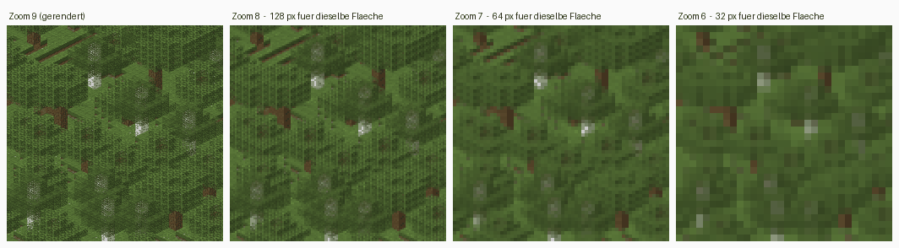

# Zoomstufen

Gröbere Stufen entstehen aus vier Kacheln der darunterliegenden, auf die
halbe Kantenlänge gestaucht, gemittelt in linearem Licht mit
vormultipliziertem Alpha; die Welt wird dafür kein zweites Mal angefasst.
Ausgenommen sind native Stufen direkt unter der Basis, wenn
`--native-levels` sie verlangt. Die Nummerierung hängt an der Welt, nicht am
Ausschnitt, und ein Baum gehört zu genau einer Welt, einem scale und einer
Zahl nativer Stufen. Das Verkleinern steht in `merge` in
[`renderer/src/render/pyramid.rs`](../../renderer/src/render/pyramid.rs).

## Verkleinern

Gemittelt wird mit vormultipliziertem Alpha. Geradeaus gemittelt zögen
durchsichtige Pixel ihre Farbe in die Nachbarn, und jede Kante gegen Luft
bekäme einen dunklen Saum; auf einer Karte voller Blattwerk wäre das
überall zu sehen.

Gemittelt wird in linearem Licht, nicht in sRGB-Werten: die sind
gammakodiert, ihr Mittel ist zu dunkel, kontrastreiche Texturen fielen
beim Herauszoomen zusammen, und jede Stufe verdunkelte weiter.
Halb Schwarz, halb Weiss ergibt so 188 statt 128. Eine Tabelle übernimmt
die Hinrichtung, eine Schwellentabelle den Rückweg, bitgleich zu `powf`:
die 255 Schwellen, ab denen der gerundete sRGB-Wert um eins steigt. Den
Rückweg ruft auch der Rasterizer, je Kanal und Pixel, bei scale 32 rund
dreizehn Millionen Mal je Sprite-Tabelle.

## Nummerierung

Die Nummerierung hängt an der **Welt**, nicht am Ausschnitt: `maxZoom` kommt
beim ersten Lauf aus der Ausdehnung aller Regionsdateien, und dafür wird
kein einziger Chunk gelesen (`world_box` in
[`renderer/src/render/tiles.rs`](../../renderer/src/render/tiles.rs)). Ein
bestehender Baum behält sie. Zoom 0 hat dabei ohnehin bis zu vier Kacheln:
das Stapeln endet an den vier Kacheln um den Ursprung, sie sind ihre eigenen
Eltern. Wächst die Welt über eine Zweierpotenz an Kacheln hinaus, bleibt die
Basis auf ihrer Stufe, und Zoom 0 bekommt mehr; sonst müsste der ganze Baum
nach der ersten neuen Region von vorn entstehen. Passt Zoom 0 dann nicht
mehr ins Fenster, zoomt das Frontend darunter weiter heraus. Warum:
[0005](../entscheidungen/0005-zoomstufen-haengen-an-der-welt.md).

Die Elternkachel findet `>> 1`, nicht `/ 2`: Am Blockursprung treffen alle
vier Vorzeichen aufeinander, und `-1 / 2` wäre `0` statt `-1`.

## Nachrendern in einen Baum

Ein nachgerenderter Ausschnitt passt damit in einen bestehenden Kachelbaum.
Welche Kinder in eine Elternkachel gehören, entscheidet dabei die Platte und
nicht der laufende Export: die Geschwister ausserhalb des Ausschnitts liegen
ja weiterhin da. Und `map.json` beschreibt den ganzen Baum, nicht den
letzten Lauf. An einer unveränderten Welt ändert ein Nachrendern deshalb
keine einzige Datei.

## Ein Baum, eine Welt

Dafür müssen Welt und Massstab passen. Weicht die Kennung der Welt oder
`scale` vom `map.json` im Zielverzeichnis ab, bricht der Export ab, bevor
er einen Chunk liest; sonst lägen im Baum Kacheln zweier Welten oder zweier
Massstäbe. `map.json` entsteht deshalb direkt vor der ersten Kachel und am
Ende noch einmal: bricht ein Lauf beim Schreiben ab, steht schon fest, wozu
der Baum gehört, und scheitert er vorher, etwa an einem fehlenden Asset,
legt er nichts fest. Ein Baum eines älteren Stands, dessen `map.json` gar
kein Feld `world` hat, gehört ab dem nächsten Lauf zu dessen Welt, der
Lauf sagt es; sonst müsste jeder bestehende Baum neu entstehen, bei einer
grossen Welt über Stunden. Eine Welt ohne Kennung übernimmt ihn nicht,
sonst nähme er danach seine eigene nicht mehr auf. Einer mit scale 2, 6
oder 10 lässt sich nicht fortsetzen, `--scale` nimmt nur noch Vielfache
von 4. Die Kennung selbst: [Welten und Kennung](welten.md).

## Native Stufen

Verkleinern mittelt trotzdem Nachbarblöcke ineinander; zwei Stufen unter
der Basis ist ein Block noch acht Pixel breit, und Blockkanten werden zu
Verläufen. Wer die Kanten länger scharf haben will, lässt mit
`--native-levels N` die ersten N gröberen Stufen aus der Welt rendern, mit
Sprites in dieser Grösse. Ein nativer Render hält den Umriss jedes Blocks
scharf und mittelt stattdessen die Textur über den Block, was auf einer
Karte niemand vermisst. Das geht, solange jeder Block auf ganzen Pixeln
liegt, der scale der Stufe also durch vier teilbar ist: bei scale 32 drei
Stufen lang, 16, 8 und 4. Bei scale 2 läge jede zweite Blockreihe auf
einem halben Pixel, und benachbarte Reihen überdeckten sich; aus demselben
Grund nimmt `--scale` nur Vielfache von 4.

Der Preis ist hoch: jede Stufe zeichnet jeden Block ihrer Fläche erneut.
Mit allen drei Stufen kommt bei scale 32 in Bytes ein Drittel dazu, ein
Viertel je Stufe, und sie brauchen zusammen etwa so lange wie die Basis,
siehe [Was ein Lauf kostet](kosten.md). Deshalb ist die Vorgabe 0, siehe
[0016](../entscheidungen/0016-native-stufen-nur-auf-wunsch.md).

Die Zahl gehört zum Baum wie der scale: `map.json` hält sie als
`nativeLevels` fest. Ein Lauf ohne `--native-levels` nimmt sie von dort,
einer mit einer anderen bricht ab, bevor er einen Chunk liest. Sonst lägen
über einem nachgerenderten Ausschnitt verkleinerte Kacheln neben nativen,
und an einer unveränderten Welt änderte ein Nachrendern Dateien. Mehr, als
der scale hergibt, heisst alle. Nennt die `map.json` eines Baums aus einem
älteren Stand die Zahl nicht, bricht ein Lauf ohne den Schalter ab und
fragt nach ihr: der Stand davor renderte alle Stufen nativ, die der scale
hergibt, und mit 0 lägen über dem Ausschnitt verkleinerte Kacheln neben
nativen. Ein Lauf mit dem Schalter hält die Zahl fest.

Ein Ausschnitt mit `--size` braucht mit nativen Stufen mehr Welt als sich
selbst: eine native Elternkachel zeigt auch, was neben dem Ausschnitt
liegt. Der Export rundet ihn deshalb auf ganze Kacheln der gröbsten
nativen Stufe auf, siehe [Kacheln exportieren](kacheln.md), „Ein
Ausschnitt“.

## Was bleibt eine Näherung

- **Ein Ausschnitt bekommt degenerierte Stufen.** Weil `maxZoom` an der
  ganzen Welt hängt, fällt ein kleiner Ausschnitt schon auf einer feinen
  Stufe auf eine einzige Kachel zusammen und bleibt bis Zoom 0 dabei; die
  Stufen darüber zeigen dasselbe Bild. Ein Vollexport hat das nicht.
