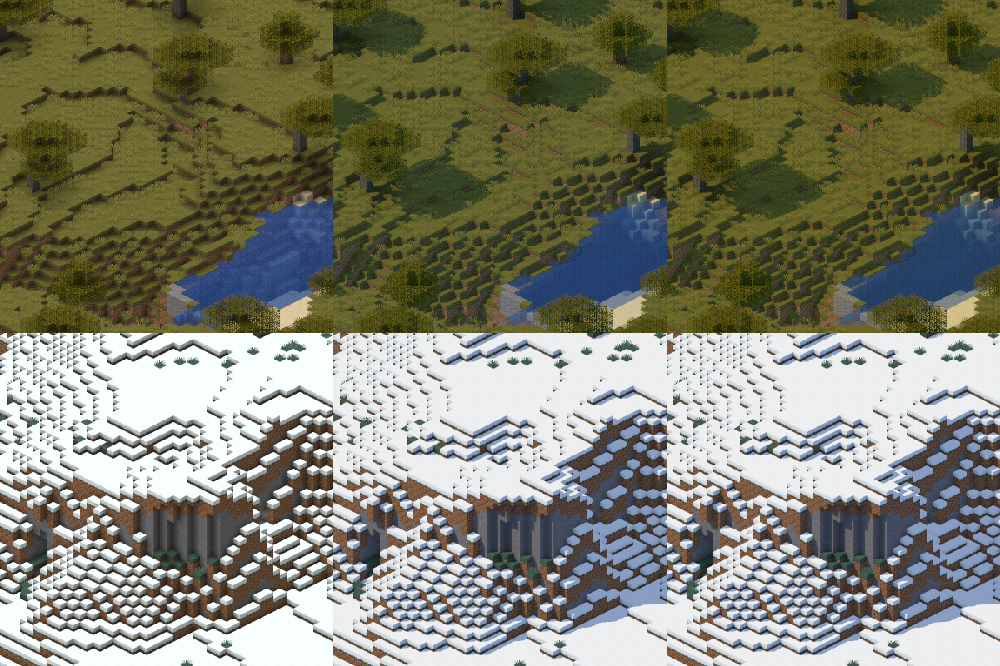
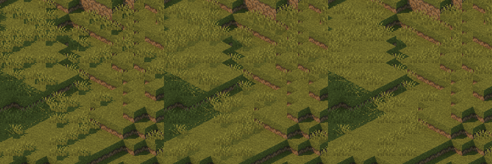

# 0058: Look von Cinematic

## Anlass

[0053](0053-cinematic-als-schalter-der-karte.md) legt fest, was ein Pixel
in Cinematic bekommt, aber nicht, mit welchen Werten.
- **#89:** stimmt sie am Prototyp ab.
  - Varianten je Gruppe: Kurve, Himmelslicht, Weissabgleich, Nebel, Bloom,
    Sonne, Wasser, Pflanzen.
  - Danach Kandidaten zusammen.
  - An vier Szenen der Testwelt in sechs Ansichten, mit Kennzahlen gegen
    die Karte.
- **Der User:** hat die Kandidaten je Szene beurteilt.
  - Warm besser: in der Savanne, im Dorf und im Wald.
  - Klar besser: im Schnee, an einem Ufer und an Gebäuden.
  - Bei den Pflanzen störte ihn das Kreuz, nicht die Pflanze.

## Entscheidung

**Regel:** In der Sonne sieht die Welt aus wie auf der Karte. Schatten,
Himmelslicht und Leuchten kommen dazu.

| Teil | Wert |
|---|---|
| Sonne | Stärke 3, Farbe (1; 0,93; 0,83) linear, 48,47° hoch, 8,75° von links zur Kamera hin; exakter harter Schatten wie in [0056](0056-exakter-strahl-zur-sonne.md) |
| Himmelslicht | Stärke 3: das Himmelslicht des Spiels nach der Kurve der Lightmap, in der Farbe des Himmels |
| Farbe des Himmelslichts | Nebel und Himmel linear gemischt, zu 0,75 der Himmel; aus dem Prototyp von #89 |
| Blocklicht | Stärke 1,5 |
| Leuchten | Stärke 2, nur die hellen Texel leuchtender Blöcke |
| Bodenpflanzen | Sie dämpfen den Strahl zur Sonne auf 0,5, einmal je Block, statt ihn zu decken. Nicht dämpfen die Pflanze, auf der der Strahl beginnt, und bei zwei Blöcken Höhe ihr oberer Block. Flächen ohne `shade` bekommen das Licht einer Fläche nach oben. Die Form der Kreuze bleibt die des Spiels. |
| Wasser | Spiegelung des Himmels nach Fresnel mit F0 0,04; Farbe nach der Strecke bis zum Grund mit Dichte 8 |
| Nebel | keiner |
| Weissabgleich | je Kanal `1 + (v − 1) · w` mit `w = 1 + 0,5 · clamp((t − 0,5) / 0,5, 0, 1)`; Erklärung unter der Tabelle |
| Belichtung | fest 0,25: Oberseiten in der Sonne sind im Mittel so hell wie auf der Karte, in L*, bestimmt an Dorf, Hügel und Stand in 2:1 bei scale 32 |
| Kurve | je Kanal: `y = x` bis 0,8, darüber `y = x − (x − 0,8)² / 0,8`, bei 1,2 flach in 1 |
| Bloom | aus dem Leuchtenden ohne Schwelle, Stärke 1, Unschärfe nahe einer Gaussglocke mit σ = scale/4 |

**Weissabgleich im Einzelnen:**
- **`v`:** der Abgleich, der eine weisse Fläche nach oben in Sonne und
  Himmel der Oberwelt farblos macht.
- **`t`:** die `temperature` des Bioms aus den Spieldaten.
- **Mischung:** wie die Biomfarben über die Blöcke im Quadrat mit dem
  Radius aus `--biome-blend`, auf der Höhe des getroffenen Blocks.
- **Wirkung:** Bis 0,5 bleibt es klar: Meer, Flüsse, Wiesen, Taiga, Schnee.
  Ab 1,0 ist es warm mit 1,5: Savanne, Badlands, Wüste. Ebenen und Strände
  (0,8) bekommen 1,3, Wald (0,7) 1,2.

**Werte an einer Stelle:** Der User will den Look später noch anpassen
können.
- Alle Werte des Looks stehen im Code an einer Stelle, als benannte Werte
  eines Looks, nicht verteilt.
- Die Werte hier sind der Anfang: Eine spätere Anpassung ist eine kleine
  Änderung an dieser Stelle und ein neues Rendern. Wie alte Kacheln dabei
  nicht mit neuen gemischt werden, steht unter „Folgen“.

**Grenzen:** Das Prüfmass für #73. Die Kennzahlen sind erklärt in
[Look von Cinematic](../messungen/2026-10-02-look-von-cinematic.md).

| Kennzahl | Grenze |
|---|---|
| übersteuert | höchstens 0,1 % |
| Schatten/Sonne | 0,35 bis 0,66 |
| dL zur Karte in der Sonne | ±3 |
| C zur Karte in der Sonne | 0,9 bis 1,25 |
| Farbton | ±5° |
| C heller Flächen | mindestens 0,85 |

Der Look hält sie in 20 von 24 Ansichten der Testwelt. Ausserhalb liegen
Schnee von oben und schräg von Norden und das Dorf aus `n`; siehe
„Folgen“.

- **Bild oben:** Savanne (obere Reihe) und Schnee (untere Reihe), 2:1 bei
  scale 32 aus `se`, auf die Hälfte verkleinert.
  - Je Reihe: die Karte, Cinematic mit Weissabgleich 1, Cinematic mit
    Weissabgleich nach Biom.
  - In der Savanne wärmt die Regel, im Schnee bleibt das Bild gleich.

- **Bild darunter:** eine Wiese der Savanne, zweifach vergrössert.
  Bodenpflanzen mit hartem Schatten (`pflanzen` 0), mit weichem (0,5) und
  ohne (1).
- **Herkunft:** Beide Bilder rendert der Renderer mit Cinematic aus #73,
  der Test `bilder_zu_0058` in
  [`renderer/tests/kennzahlen.rs`](../../renderer/tests/kennzahlen.rs).
  Zur Entscheidung lagen dieselben Ausschnitte aus dem Prototyp zu #89
  vor.

## Verworfene Alternativen

Alle Zahlen stammen aus
[Look von Cinematic](../messungen/2026-10-02-look-von-cinematic.md).

- **Eine Filmkurve mit Fuss, je Kanal.**
  - Sie bleicht Sand: C* 19,9 statt 22,0 auf der Karte.
  - Sie übersättigt mittlere Töne: C 1,36 bis 1,53 der Karte.
- **Dieselbe Kurve, nur auf die Helligkeit.**
  - Die Farbe bleibt.
  - Ihr Fuss dunkelt Schatten: Schatten/Sonne 0,42 bis 0,53 statt 0,56 bis
    0,61.
  - Sand wird heller: L* 84,3 statt 78,2.
- **Eine Schulter über den ganzen Bereich, Belichtung aufs Mittel der
  Karte.**
  - Die Karte kennt keine Schlagschatten; ihr Mittel verlangt hellere Mitten.
  - Die Schulter drückt helle Texturen stärker als mittlere: Schnee liegt in
    der Sonne 14 bis 21 L* unter der Karte.
  - Darum kommt die Belichtung aus den Oberseiten in der Sonne, und die
    Kurve ist bis zum Knie gerade.
- **Dunst:** Nebel nach der Höhe, Strecke 800. Er hebt Schatten auf 0,69
  bis 0,71 und nimmt Farbe (C 0,81 bis 0,95).
- **Ein fester warmer Weissabgleich.**
  - Mit 1,5 wird Schnee cremefarben (b* +10,4), und 7 von 24 Ansichten liegen
    ausserhalb der Grenzen.
  - Mit 1,25 wird er gelblich (+5,4), 6 Ansichten liegen ausserhalb.
  - Nach Biom sind es 4, wie beim neutralen Abgleich.
- **Weissabgleich unter 1.**
  - Er macht das Bild blau, nicht warm, denn der Himmel mit Stärke 3 ist
    blauer als die warme Sonne.
  - Schnee in der Sonne: b* −8,2 bei 0,3 und −10,2 bei 0, gegen +0,7 bei 1.
- **Wärme nach Biom mit 0,8 als oberer Grenze:** Ebenen und Strände würden
  überall ganz warm, auch an einem Ufer.
- **Wärme nach der Farbe der Oberfläche:** Das wäre nicht mehr natürlich.
  Die Wärme folgt der Welt, nicht dem Bild.
- **Harter Schatten der Bodenpflanzen.**
  - Kreuzmodelle werfen dreieckige, unruhige Flecken.
  - Wiesen werden bis 3,7 L* dunkler als ohne Schatten und unruhiger (7,4
    statt 6,5, Karte 5,2).
- **Bodenpflanzen ohne Schatten oder mit 0,3.**
  - Ohne Schatten sind Wiesen flacher.
  - Mit 0,3 kommt eine Spur des Musters zurück (Unruhe 6,6).
  - 0,5 behält Tiefe (bis 1,6 L*); die Unruhe steigt um höchstens 0,1.
- **Die Form der Kreuze ändern.**
  - In den schrägen Kameras sieht man eine Fläche von vorn und eine auf der
    Kante; nur `north-45` zeigt das X.
  - Eine Fläche zur Kamera wiche vom Modell des Spiels ab.
- **Eine Datei mit eigenen Werten des Looks, mit Schalter.**
  - Die Karte braucht sie heute nicht (Regel 22).
  - Sie kommt nur dazu, wenn der User den Look später selbst einstellen
    will.
  - Bis dahin ist eine Anpassung eine Änderung an der einen Stelle im Code.

## Folgen

- **Was die Regel nicht trifft.**
  - Ein Ufer auf Strand oder Ebene (0,8) wird so warm wie ein Dorf auf einer
    Ebene: Weissabgleich 1,3. Wer es klar will, bekommt das von dieser
    Regel nicht.
  - Gebäude folgen ihrem Biom, in heissen Biomen sind sie warm.
  - Wasser bleibt klar (0,5); an Küsten mischt sich die Wärme über fünf
    Blöcke.
- **Dunkler als die Karte, wo Schatten fallen.**
  - Das Mittel liegt 1,2 bis 9,3 L* unter der Karte, am tiefsten im Wald und
    in der Savanne von oben und im Schnee.
  - Schnee liegt von oben und schräg von Norden in der Sonne bis 6,7 L*
    unter der fast weissen Karte. Das liegt ausserhalb der Grenze, dafür
    behält er seine Textur und übersteuert nicht.
  - Das Dorf aus `n` hat Schatten bis 0,67 der Sonne.
- **Was #73 dafür braucht:**
  - **Wärme** (rund 3 bis 4 Stunden, geschätzt):
    - die Temperatur je Biom in der Tabelle der Biome;
    - eine Mischung wie die der Biomfarben;
    - den Weissabgleich je Pixel aus dem getroffenen Block, je Block
      zwischengespeichert.
  - **Bodenpflanzen** (rund 1 Stunde ohne die Regel aus den Spieldaten,
    geschätzt):
    - Sie dämpfen im Strahl zur Sonne, statt zu decken.
    - Welche Blöcke das sind, muss aus den Spieldaten kommen. Der Prototyp
      nimmt eine Liste von Namen: Gras, Farn, Büsche, Blumen, Seegras, Kelp,
      Feldfrüchte, Setzlinge.
    - `shade: false` allein reicht nicht. Das tragen auch Fackeln,
      Laternen, Feuer, Ketten, Leitern, Redstone und Tropfblatt.
  - **Bloom:** Er braucht einen Rand von rund 3σ aus der Nachbarkachel, bei
    scale 32 also 24 Pixel.
  - **Biome ohne Definition** nimmt der Renderer als plains, für Farbe wie
    für Wärme: 0,8, also Weissabgleich 1,3. Mit ihren Biomdateien unter
    `--data` bekommen sie ihre Temperatur.
  - **Kurve, Belichtung, Weissabgleich und Bloom** rechnet heute nur die
    Nachbearbeitung des Prototyps; #73 rechnet sie je Pixel.
  - **Werte an einer Stelle:** #73 setzt sie dort.
- **Kein Mischen.**
  - Ein Cinematic-Baum merkt sich als kurzen Fingerabdruck in `map.json`,
    mit welchen Werten er gerendert ist. #73 leitet ihn aus den Werten an
    der einen Stelle ab.
  - Ändern sich die Werte, mischt ein Lauf keine alten und neuen Kacheln,
    auch nicht mit `--resume`.
  - Er bricht ab, bevor er einen Chunk liest, wie bei einem anderen scale
    oder Radius der Mischung; siehe
    [`map.json`](../benutzung/map-json.md), „Radius der Mischung“.
  - Die Form legen Backend und Frontend in #72 fest, denn `map.json` ist
    ihr Vertrag.
- **Später anpassen.**
  - Die Werte an der einen Stelle ändern, dann die Cinematic-Bäume neu
    rendern.
  - Die neuen Werte hält eine Entscheidung fest, die die Tabelle hier
    ablöst.
- **Kachelsicher.**
  - Alles hängt nur an der Welt und am Platz im Pixelraster.
  - Der Weissabgleich hängt an derselben Mischung der Biome, die schon die
    Biomfarben ohne Nähte macht.
