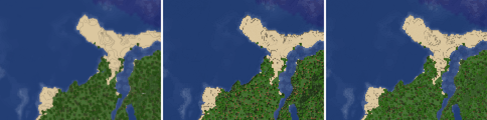

# 0094: Von oben der nächste Pixel

## Anlass

Die Mod zeigt die Karte von oben, `top-north` bei scale 4. Beim
Herauszoomen wirkte sie unscharf und verwaschen: Jede Stufe der Pyramide
mittelte 2 × 2 Pixel, und nach drei Stufen war aus jedem Block ein Verlauf
geworden. Der Reviewer zeigte dem User am 09.10. heruntergeladene Kacheln:
links die Pyramide, rechts je Stufe jeder zweite Pixel. Der User wählte
rechts, aber nur für die Ansicht von oben.

## Entscheidung

- **Von oben je 2 × 2 ein Pixel:** Bei `top` und `top-north` mittelt die
  Pyramide nicht, sie nimmt einen Pixel (`Verkleinern::Pixel` in
  [`renderer/src/render/pyramid.rs`](../../renderer/src/render/pyramid.rs)).
  Alle anderen Kameras mitteln weiter, siehe
  [Zoomstufen](../benutzung/zoomstufen.md), „Verkleinern“.
- **Welcher Pixel:** in ungerader Tiefe über der gröbsten gerenderten Stufe
  der rechts unten, in gerader der links oben. Von dieser Stufe aus liegt
  er so nie auf dem Rand eines Blocks aus vier Pixeln. Jede Stufe hat ihre
  Regel, und jeder Lauf nimmt dieselben Pixel.
- **Alpha** geht mit, ohne Mischen. Ein durchsichtiger Pixel hat keine
  Farbe.
- **Der Baum merkt es sich** in `map.json` als `"downscale": "nearest"`,
  wie `compact`. Jeder Lauf auf ihm verkleinert so: voll, `--update`,
  `--resume` und `--pyramid`. Siehe [map.json](../benutzung/map-json.md),
  „Verkleinern“.
- **Ein älterer Baum von oben** hat das Feld nicht und eine gemittelte
  Pyramide. Der nächste Lauf auf ihm baut jede Kachel der Pyramide einmal
  neu, auch ein Update ohne Änderung, und trägt das Feld erst am Ende ein.
- **Gemessen** in [2026-10-09, Pyramide von oben](../messungen/2026-10-09-pyramide-von-oben.md).

## Abwägen nach Regel 26

Gemessen an der ganzen Testwelt in `top-north` bei scale 4, siehe die
Messung oben:

- **Live-Rendern:** Jede Elternkachel kostet auf einem Thread rund 10,6
  statt 12,3 ms, rund −14 %. Ein Update baut nur die Eltern seiner
  Kacheln. Es wird etwas billiger, und die CPU neben dem Server ebenso.
- **Erster Render:** Die Basis bleibt gleich. Die Pyramide ist ein kleiner
  Teil des Laufs und wird ebenso etwas billiger.
- **Arbeitsspeicher:** gleich, 0,02 GiB für `--pyramid` auf einem Thread.
- **Platz:** Die Pyramide wird 0,9 % kleiner, der ganze Baum 0,3 %. Auf
  Tiefe 1 packt der nächste Pixel besser, auf den groben Stufen bis zu 8 %
  schlechter.
- **Der einmalige Umbau** eines älteren Baums der grossen Welt: rund
  51 000 Kacheln der Pyramide, hochgerechnet rund 9 min auf einem Thread,
  im ersten Update.

## Verworfene Alternativen

- **Weiter mitteln, auch von oben:** Von oben liegt jeder Block auf ganzen
  Pixeln, und gemittelt werden seine Kanten von Stufe zu Stufe weicher.
  Daran stiess sich der User.
- **Der nächste Pixel für alle Kameras:** Der User wollte ihn nur von
  oben. In den schrägen Kameras liegen die Kanten der Blöcke schräg, und
  ein einzelner Pixel je 2 × 2 gäbe dort Treppen.
- **Ein fester Platz je 2 × 2,** jede Stufe rechts unten oder jede links
  oben: Ab der zweiten Stufe läge er auf einer Ecke jedes Blocks aus vier
  Pixeln, wo Kanten und Schatten liegen. An der Testwelt gibt das
  gestrichelte dunkle Linien an jeder Stufe des Geländes, mit links oben
  ist die Karte im Mittel 3 Punkte dunkler. Im Bild unten die Mitte.
- **Von der Basis aus die Mitte jedes Blocks von 2^k × 2^k,** wie im
  Vergleich des Reviewers: Jede Stufe müsste dafür die Basis lesen statt
  ihrer vier Kinder, von der Platte das 4^k-Fache. Die Stufen im Speicher
  sehen nur ihre Kinder. Der Wechsel liegt ebenso nie auf dem Rand eines
  Blocks.
- **Ein Baum ohne Feld bleibt gemittelt,** wie ein schneller Baum mit
  `--compact`: Die Karte der Mod würde nie scharf, ohne den ganzen Baum neu
  zu rendern.
- **Abbrechen statt umbauen** und `--pyramid` verlangen: Das Plugin startet
  seine Updates selbst, ein Abbruch hielte jede Karte an. Die Pyramide folgt
  ganz aus der gerenderten Stufe, der Umbau braucht weder Welt noch Assets.
- **Das Feld vor dem Umbau eintragen,** wie `--compact-tree`: Bräche der
  Lauf ab, nennte der Baum den nächsten Pixel, und die gemittelten Eltern
  blieben, bis sich ihre Kinder ändern. So aber fehlt das Feld, bis alles
  umgebaut ist, und der nächste Lauf fängt von vorn an.

*Testwelt, `top-north` bei scale 4, drei Stufen über der Basis, vierfach
vergrössert. Links gemittelt, in der Mitte je 2 × 2 der feste Platz rechts
unten, rechts der Wechsel, wie der Renderer ihn nimmt.*

## Folgen

- **Das Frontend** ändert sich nicht: Es prüft nur die Felder, die es
  braucht, und zeigt die Kacheln, wie sie sind. Zwischen zwei Stufen
  glättet es verkleinerte Kacheln
  ([0067](0067-gesamtansicht-zwischen-zwei-stufen.md)); für Bäume mit
  `"nearest"` wäre dort auch der nächste Pixel denkbar. Das ist nicht Teil
  dieser Entscheidung.
- **Das Plugin:** Der erste Lauf nach dem neuen Renderer auf einem Baum von
  oben baut dessen Pyramide einmal neu, siehe [Plugin](../plugin.md).
- **Kacheln mit neuen Bytes:** Jede Kachel der Pyramide eines Baums von
  oben bekommt einmal neue Pixel und ein neues ETag. Die Mod lädt sie
  einmal neu, die Basis nicht.
