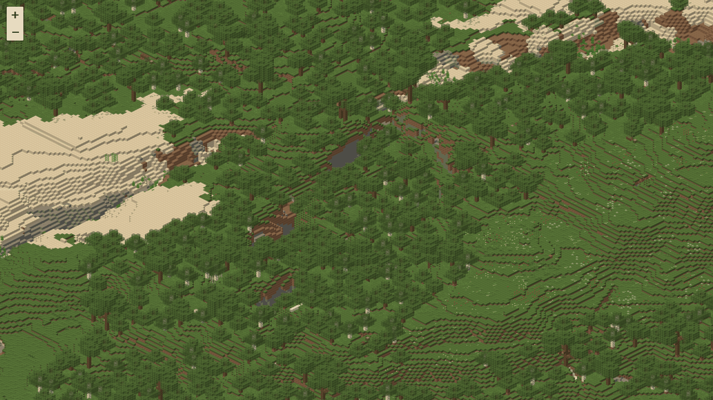

# Frontend

Das Frontend ist eine Seite mit Vite, TypeScript und Leaflet
([`web/src/main.ts`](../web/src/main.ts)). Es liest `map.json`, baut daraus
ein Koordinatensystem, in dem eine Karteneinheit ein Pixel der feinsten
Stufe ist, und zeigt die fertigen Kacheln: keine Marker, keine Spieler, kein
Zustand. Der Browser bekommt fertige Bilder und ein Koordinatensystem, dazu
die Höhen, aus denen er die Koordinaten unter Maus und Finger rechnet.



## Ansehen

```bash
cargo run --release --manifest-path renderer/Cargo.toml -- --world ./world --assets ./vanilla-assets --assets ./assets --data ./vanilla-data --tiles web/public/tiles
cd web && npm install && npm run dev
```

Der Renderer schreibt die Kacheln direkt dorthin, wo der Devserver sie
ausliefert; damit braucht das Frontend keine Konfiguration, siehe
[0006](entscheidungen/0006-kacheln-unter-web-public.md). `npm run build`
legt die Seite unter `web/dist` ab, ohne `public/tiles`: dort liegt oft ein
Link auf Hunderte Gigabyte, und Vite folgte ihm beim Kopieren, auch unter
`npm test`. Wohin die Kacheln beim Ausliefern gehören, steht unter
„Ausliefern“.

Ohne echte Kacheln zeigt `http://localhost:5173/?tiles=/tiles-demo` einen
kleinen Kachelbaum, der mit im Repository liegt, 7 Dateien, 6,6 kB. Er ist
zugleich das Fixture des Smoke-Tests.

## Einem Render zusehen

Wer einem langen Render zusehen will, legt die Kacheln woanders ab und
setzt einen Link auf die Wurzel von `--tiles`, nicht auf einen Baum darin,
sonst lägen `trees.json` und `../heights` ausserhalb: unter Windows
`mklink /J web\public\tiles <wurzel>`, sonst
`ln -s /pfad/zur/wurzel web/public/tiles`. Findet Vite unter `public/`
einen Link, fragt es bei jeder Anfrage die Platte und liefert auch Kacheln
aus, die nach seinem Start entstanden sind, etwa durch `--pyramid`, siehe
[Pyramide und Fortsetzen](benutzung/pyramide-und-resume.md). Aus einem
echten Verzeichnis dort liefert es nur, was beim Start dalag, bis zum
nächsten Neustart. Neue Dateien meldet ihm sonst sein Watcher, und den hat
`vite.config.ts` von den Kacheln abgekoppelt: er beobachtete jede der
Millionen Dateien und verbrannte Kerne, die der Render braucht.

## Das Koordinatensystem

Das Frontend liest `map.json` und baut daraus ein Koordinatensystem, in dem
eine Karteneinheit ein Pixel der feinsten Stufe ist. Leaflets `CRS.Simple`
rechnet mit `2^zoom`; hier bekommt stattdessen die feinste Stufe den Faktor
1, siehe
[0007](entscheidungen/0007-karteneinheit-ist-ein-pixel-der-basis.md):

```ts
scale: (zoom: number) => 2 ** (zoom - info.maxZoom),
zoom: (scale: number) => Math.log2(scale) + info.maxZoom,
```

Gespiegelt wird nicht: `screen_y` des Renderers zeigt schon nach unten.
Negative Kachelkoordinaten sind damit kein Sonderfall. Die Felder von
`map.json` stehen in [map.json](benutzung/map-json.md).

## Zoom über und unter den Kacheln

Über die feinste gerenderte Stufe hinaus sind zwei weitere Zoomstufen
erlaubt. Dort vergrössert Leaflet nur noch die vorhandenen Kacheln
(`maxNativeZoom`), und `image-rendering: pixelated` hält die Pixelkunst
scharf, statt sie zu verwischen.

Nach unten geht es unter Zoom 0, wenn die ganze Karte dort nicht ins
Fenster passt, etwa nachdem die Welt gewachsen ist. Dann verkleinert
Leaflet die Kacheln von Zoom 0 (`minNativeZoom`), bis alles zu sehen ist.

`bounds` auf der Kachelebene hält Leaflet davon ab, beim Herumziehen
Kacheln anzufragen, die es nicht gibt. Innerhalb der Grenzen sind einzelne
404 möglich: der Vorlauf kennt nur die Hüllkästen der Blockspalten. Leaflet
lässt solche Kacheln leer.

## Koordinaten

Unten links steht, welcher Block unter Maus oder Finger zu sehen ist,
`X 35  Y 5  Z -15`, auf wenige Blöcke genau; das Symbol daneben kopiert
`/tp`, siehe „Koordinaten kopieren“, und ein Klick auf einen Wert springt
zu einer Eingabe, siehe „Zu Koordinaten springen“. Dazu zeichnet die Karte
seinen
Umriss wie den Auswahlrahmen im Spiel, aber nur beim Tippen mit Finger
oder Stift; mit der Maus zeigt der Zeiger selbst, wohin man zielt, und die
Anzeige genügt, siehe
[0049](entscheidungen/0049-umriss-nur-ohne-zeiger.md). Über Wasser nennt
die Anzeige die Oberfläche, die man sieht; das Spiel zielt dort auf den
Grund. Ohne `heights` in `map.json` gibt es keine Anzeige, ebenso ohne
brauchbare `heightsCell`, `minY` und `maxY`; die Karte lädt dann trotzdem,
und die Konsole sagt, was fehlt. Fehlt nur die Höhenkarte einer Region (404
oder eine HTML-Seite statt der Datei), steht dort `X –  Y –  Z –`.

Ein Bildpunkt allein verrät den Block nicht: Die Projektion wirft die
Blickachse der Kamera auf einen Punkt, diagonal (b, 2a, b), genordet
(0, a, b), siehe
[Die Kamera](renderer/kamera.md), „Projektion“. Die Zahlen h, a und b
liest das Frontend aus `projection` in `map.json`, siehe
[map.json](benutzung/map-json.md), „Kamera und Projektion“; fehlt sie,
rechnet es 2:1 aus `scale`. Kennt es `azimuth` oder `direction` nicht,
alles ausser `diagonal` mit `se`, `sw`, `nw`, `ne` und `north` mit `s`,
`w`, `n`, `e`, oder sind `u` und `v` keine ganzen Zahlen ab 1 oder `y`
keine ganze Zahl ab 0, zeigt es keine Koordinaten, und die Konsole nennt
den Grund.
[`web/src/pick.ts`](../web/src/pick.ts) geht deshalb den Strahl durch die
Mitte des Pixels ab, wo auch der Renderer abtastet:

1. `strahl` zählt die Würfel von vorn nach hinten auf, von `maxY` bis
   `minY`, als Gang durch das Würfelgitter: bei 2:1 drei je Schicht, rund
   1150 über die ganze Bauhöhe, bei steileren Kameras weniger, von oben
   einen je Schicht. Genordet bleibt x je Pixel fest, nur z wandert, bei
   `north-45` zwei Würfel je Schicht.
   - Gerechnet wird ganzzahlig, damit eine Pixelmitte auf einer Blockkante
     genau dort liegt; das kommt bei 1:1, `top` und etwa 5:3 vor, genordet
     nie.
   - Dort gilt die Füllregel des Renderers: Der Pixel gehört der Fläche
     rechts der Kante, siehe [Rastern ohne Nähte](renderer/naehte.md),
     „Füllregel“. `strahl` rückt die Mitte dafür um ein unendlich kleines
     Stück nach rechts.
2. `pick` nimmt den ersten, dessen Zelle bis zu ihm hinauf gefüllt ist:
   `y` ≤ Höhe der Zelle.
3. Die Höhe steht je Zelle aus `heightsCell` × `heightsCell` Spalten, heute
   4 × 4, in den Höhenkarten des Renderers, eine Datei je Region, siehe
   [map.json](benutzung/map-json.md), „Höhen“. Das Frontend lädt nur die
   Regionen, durch die ein Strahl geht, und hält höchstens 64 davon, bei
   4 × 4 zusammen 2 MiB.

Aus einer anderen Richtung als `se` oder `s` rechnet `strahl` im Blick:
Die Welt ist dort k Vierteldrehungen gedreht, k aus der Reihenfolge
`se`, `sw`, `nw`, `ne`, genordet `s`, `w`, `n`, `e`, wie in
[map.json](benutzung/map-json.md), „Kamera und Projektion“. Höhen und Anzeige
sind in Weltkoordinaten; `inDieWelt` dreht jeden Block des Strahls
zurück, bevor er seine Höhe nachschlägt, `inDenBlick` dreht hin.

Warum der Strahl gegen Höhen läuft, siehe
[0035](entscheidungen/0035-koordinaten-aus-hoehenkarten.md); warum durch
das Würfelgitter und mit den Zahlen aus `map.json`, siehe
[0051](entscheidungen/0051-kameras-und-richtungen.md), „Strahl im
Frontend“; woher die Höhen
kommen, warum je 4 × 4 Spalten und warum über Wasser die Oberfläche, siehe
[0036](entscheidungen/0036-hoehen-aus-der-heightmap.md).

## Koordinaten kopieren

Rechts neben der Anzeige steht ein Knopf mit einem Kopiersymbol, für
Screenreader „/tp kopieren“, per Tastatur erreichbar. Er kopiert
`/tp X Y Z` für den gezeigten Block, zum Einfügen im Spiel.

- **Y ist einen Block höher** als der gezeigte, sonst stünde man im Block.
  x und z rückt das Spiel selbst auf die Mitte des Blocks: `TeleportCommand`
  nimmt `Vec3Argument.vec3()`, und `WorldCoordinate.parseDouble` zählt zu
  einer ganzen Zahl ohne Punkt 0,5 dazu, für x und z, nicht für y
  (`WorldCoordinates.parseDouble`; Client 26.2, per javap). Aus
  `X 35  Y 5  Z -15` wird `/tp 35 6 -15`, man steht bei (35,5; 6; −15,5)
  mitten auf dem Block.
- **Mit der Maus** hält ein Klick auf die Karte den Block fest. Sonst
  zeigte die Anzeige auf dem Weg zum Knopf jeden Block, über den die Maus
  fährt. Die Anzeige trägt dann einen Rahmen; einen Umriss gibt es mit der
  Maus weiter nicht, siehe
  [0049](entscheidungen/0049-umriss-nur-ohne-zeiger.md). Los lässt sie,
  sobald sich die Karte bewegt, bei Escape oder mit dem nächsten Klick auf
  einen anderen Block.
- **Mit Finger oder Stift** bleibt der getippte Block ohnehin stehen: auf
  den Block tippen, dann auf das Symbol.
- **In der Leiste** aus Anzeige, Knopf und Rückmeldung verschiebt Ziehen
  die Karte nicht, und die Maus darüber ändert die Anzeige nicht. Endet ein
  Druck aus der Leiste über der Karte, wählt das keinen Block.
- **Rückmeldung** zwei Sekunden lang neben dem Knopf, als `role="status"`,
  damit Screenreader sie sagen:

  | Fall | Text |
  |---|---|
  | kopiert | `Kopiert: /tp 35 6 -15` |
  | noch kein Block gewählt | `Erst einen Block wählen` |
  | keine Zwischenablage: Die gibt es nur im sicheren Kontext, unter HTTPS oder auf `localhost` | `Kopieren geht nur über HTTPS` |
  | der Browser verweigert das Schreiben | `Kopieren fehlgeschlagen` |

## Zu Koordinaten springen

Jeder Wert der Anzeige ist ein Knopf. Ein Klick oder Tippen, per Tastatur
Enter, macht ihn zu einem Eingabefeld; Enter springt dorthin.

- **Die anderen beiden Werte** bleiben, wie sie beim Klick standen. Während
  des Eintrags folgt die Anzeige keinem Zeiger. Zeigt sie noch keinen
  Block, gilt der in der Mitte der Karte.
- **Y:** Ändert sich X oder Z, kommt Y aus der Höhenkarte, die Oberfläche
  dort; sonst läge die Mitte in der Schrägsicht neben dem Block. Ohne Höhe
  dort bleibt Y. Wird Y selbst geändert, gilt es.
- **Der Sprung** setzt die Mitte der Oberseite des Blocks in die Mitte der
  Karte, auf derselben Stufe, wie `at` in der Adresse. Danach hält die
  Anzeige den Block wie nach einem Klick. Die Adresse folgt wie nach jeder
  Bewegung, mit dem Block, den die Mitte dann zeigt; liegt ein Y in der
  Luft oder im Boden, ist das der Block, den man dort sieht.
- **Abbrechen:** Escape oder ein Klick daneben. Escape lässt dabei einen
  gehaltenen Block gehalten.
- **Abgewiesen** werden Eingaben, die keine ganze Zahl sind, X oder Z über
  ±30 000 000 (die Weltgrenze des Spiels) und Y ausserhalb von `minY` bis
  `maxY`. Das Feld wird rot, trägt `aria-invalid`, die Rückmeldung nennt den
  Grund, und es bleibt offen.
- **Auf dem Handy:** Das Feld ist `type="text"` ohne `inputmode`. Mit
  `inputmode="numeric"` fehlt auf vielen Tastaturen das Minus, auch
  `decimal` bietet es nicht überall.
- **Mit der Maus** verschiebt ein Klick in die Anzeige die Karte nicht,
  wie überall in der Leiste.

## Ansichten und Kompass

Oben rechts zeigt ein Pfeil nach Norden, gedreht nach `projection` und
`direction`: aus Südosten bei 2:1 um 63,4°, genordet aus Süden gerade nach
oben.

Liegt unter dem Kachelpfad eine `trees.json`, ist jeder Eintrag unter
`trees` ein eigener Baum mit eigenem `map.json`, siehe
[map.json](benutzung/map-json.md), „Liste der Bäume“. Das Frontend öffnet
den aus `?tree=<path>`, sonst den ersten. Ohne `trees.json` (404, oder ein
Server, der stattdessen die Seite schickt) ist der Kachelpfad selbst der
Baum, wie bisher. Eine Liste ohne brauchbare Einträge zeigt die Seite als
Fehler an, wie eine fehlende `map.json`.

Bei mehr als einem Baum steht neben dem Kompass ein `select`. Er nennt
jeden Baum lesbar, nicht mit seinen Kürzeln:

| Kamera | Name |
|---|---|
| W:H, etwa 2:1 | „2:1 aus Südost“, ebenso Südwest, Nordwest, Nordost |
| `top` | „Von oben aus Südost“ |
| `top-north` | „Von oben, Norden oben“; aus `w` Osten, aus `n` Süden, aus `e` Westen |
| `north-45` | „Schräg, Norden oben“, ebenso |

Ein `look` ausser `map` kommt dazu, `cinematic` als „· Cinematic“. Eine
unbekannte Kamera oder Richtung steht als `camera · direction` da. Die
Wahl lädt die Seite neu, mit drei Parametern in der Adresse:

| Parameter | Inhalt |
|---|---|
| `tree` | `path` des Baums aus `trees.json` |
| `at` | der Block in der Mitte, `x,y,z` in Weltkoordinaten |
| `zoom` | die Zoomstufe ab der feinsten gerenderten: 0 ist ein Pixel der Kachel je Pixel des Bildschirms, −1 halb so gross |

Der neue Baum setzt die Mitte der Oberseite von `at` in die Mitte der
Karte. `zoom` zählt ab `maxZoom`, weil `maxZoom` je Baum an seiner
Ausdehnung hängt, siehe [Zoomstufen](benutzung/zoomstufen.md),
„Nummerierung“. So bleibt beim Umschalten derselbe Block in der Mitte, mit
derselben Vergrösserung, auch aus einer anderen Richtung. Ohne Koordinaten
im alten Baum fehlt `at`, und der neue zeigt die ganze Karte.

Die Adresse folgt der Karte: Nach jedem Verschieben oder Zoomen schreibt
das Frontend `at` und `zoom` hinein, mit dem Baum in `tree`, wenn es eine
Liste gibt. Es nimmt `history.replaceState`, der Verlauf bekommt also
keine Einträge. Wer die Adresse kopiert oder die Seite neu lädt, sieht
denselben Block in der Mitte auf derselben Stufe. Ohne Koordinaten gibt es
keinen Block für `at`, und die Adresse bleibt, wie sie ist.

## Ausliefern

`web/dist` ist die ganze Seite; statisch ausliefern reicht. Die Kacheln
liegen als `tiles/` daneben, oder `?tiles=` nennt ihren Pfad.

- **Header:** Die Karte läuft unter einer strengen Content-Security-Policy
  ohne Ausnahmen für Inline-Skripte, Inline-Styles oder fremde Quellen. Die
  Header, unter denen die Tests das prüfen, stehen in `preview.headers` in
  [`web/vite.config.ts`](../web/vite.config.ts); ein Betreiber setzt sie
  in seinem Server so oder strenger. Liegen die Kacheln auf einer anderen
  Domain als die Seite, brauchen `img-src` und `connect-src` diese Domain.
- **Adresse, Titel, Beschreibung, Bild:** Der Betreiber setzt sie beim
  Build, etwa
  `SITE_URL=https://example.org/karte/ SITE_TITLE="Karte von …" npm run build`.

  | Variable | ohne Angabe | wofür |
  |---|---|---|
  | `SITE_URL` | keine Adresse | `canonical`, `og:url`, `og:image` als absolute Adresse und der Pfad in `robots.txt` |
  | `SITE_TITLE` | `Heroic Map Renderer` | `<title>`, `og:title`, die Überschrift für Screenreader |
  | `SITE_DESCRIPTION` | `Isometrische Karte einer Minecraft-Welt.` | `description`, `og:description` |
  | `SITE_IMAGE` | `vorschau.jpg` | Vorschau beim Teilen, relativ zu `SITE_URL` oder absolut |

  Leere Werte zählen wie keine. Ohne `SITE_URL` fehlen `canonical`,
  `og:url` und das Vorschaubild; Titel,
  Beschreibung und Icon bleiben. Die Adresse steht nie im Repository. Warum
  beim Build: [0048](entscheidungen/0048-seite-beim-build.md).
- **Vorschaubild:** `public/vorschau.jpg`, 1200 × 630, ist ein Ausschnitt
  aus `docs/bilder/welt.webp`, der Testwelt; wie es entsteht, steht im
  Skill [`doku-bilder-rendern`](../skills/doku-bilder-rendern/SKILL.md). Wer seine Welt zeigen will,
  legt ein eigenes Bild neben die Seite und nennt es in `SITE_IMAGE`.
- **Icon:** `public/favicon.png` und `public/apple-touch-icon.png` sind die
  Ebene „Insel“ aus `docs/bilder/quellen/banner.aseprite`, ebenso aus dem
  Skill.
- **`robots.txt`** schreibt der Build: alles erlaubt ausser `tiles/`, damit
  Suchmaschinen die Seite finden, aber nicht jede Kachel abrufen.
  Erlaubt bleiben `tiles/trees.json`, `tiles/*/map.json` und für einen
  Baum ohne Liste `tiles/map.json`: Ohne sie rendert eine Suchmaschine nur
  die Meldung, dass die Karte nicht lädt. Die längere Regel gewinnt, `*`
  steht für beliebige Zeichen (RFC 9309). `robots.txt` wirkt nur im
  Wurzelverzeichnis einer Domain; der Pfad zählt deshalb ab dort, mit
  `SITE_URL=https://example.org/karte/` also etwa
  `Allow: /karte/tiles/trees.json` und `Disallow: /karte/tiles/`.

## Prüfen

```bash
cd web
npm run check     # tsc --noEmit
npm run lint      # ESLint
npm test          # Playwright, baut vorher und prüft den Build
```

Die Tests: [Tests](entwicklung/tests.md). Lighthouse in der CI und lokal:
[CI](entwicklung/ci.md), „Lighthouse“.

## Was bleibt eine Näherung

- **Zellen aus 4 × 4 Spalten.** Die Höhenkarte kennt je Zelle nur den
  oberen Median ihrer 16 Spalten. An Hängen, Kanten und einzelnen Bäumen
  hält der Strahl deshalb zu früh oder zu spät, meist um wenige Blöcke. Wie
  oft: [2026-09-28, Höhen](messungen/2026-09-28-hoehen.md), „Auflösung“.
- **Überhänge.** Je Zelle gibt es nur eine Höhe. Läuft der Strahl unter
  einem Überhang hindurch, etwa unter dem Rand einer Baumkrone, hält er
  schon dort, obwohl das Bild den Boden dahinter zeigt. Drei Würfel sind
  etwa ein Block in jeder Achse; X und Z liegen dann zu gross. Wie oft, bei
  einer Höhe je Spalte:
  [2026-09-28, Höhen](messungen/2026-09-28-hoehen.md), „Überhänge“.
- **Nicht volle Blöcke** zählen wie ein voller Würfel. Wer knapp neben eine
  Blume zeigt, bekommt die Blume.
- **Was die Karte nicht zeigt, zählt mit.** Die Höhenkarte des Spiels
  zählt jeden Block ausser Luft: auch Barriere, Licht und Strukturleere,
  die unsichtbar sind, und Blöcke, die der Renderer leer lässt, etwa das
  End-Portal, siehe [Blockentities](renderer/blockentities.md), „Was
  fehlt“. Das ist selten.
