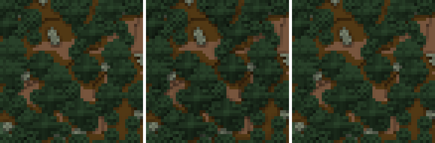

# Licht von der Seite

Ein Schritt Licht von der Seite, nur im Chunk, holt 76,6 % der Pixel
zurück, die das Licht je Spalte gegen die Ausbreitung geändert hatte:
Statt 10,48 % weichen über die ganze Testwelt noch 2,46 % der Pixel ab.
Zeit, CPU und Arbeitsspeicher bleiben gleich. Am Rand der Chunks weichen
3,37 % der Pixel ab, innen 2,18 %; als Linie sieht man das nicht.

*Testwelt, `--flat`, 48 × 48 Blöcke um die Chunkecke bei (−1192, −1768),
sechsfach vergrössert. Links das Licht ausgebreitet (`812197f`), in der
Mitte je Spalte (master, `fb50ffc`), rechts mit einem Schritt von der
Seite (`4302932`). Die Ecke liegt in der Mitte.*

## Aufbau

- **Stände,** Release-Build:
  - master, `fb50ffc`: Licht je Spalte; dasselbe Binär für `--flat` wie
    `8c98c14` aus [2026-10-10, Licht je Spalte](2026-10-10-licht-je-spalte.md);
  - Versuch, `4302932`: dazu der Schritt von der Seite im Chunk.
- **Welt und Befehl** wie in
  [2026-10-10, Einfarbige Ansicht](2026-10-10-einfarbige-ansicht.md): die
  ganze Testwelt, `--flat`, `--gpu off`, Threads nach Vorgabe.
- **Vergleich der Pixel:** gegen den Baum mit ausgebreitetem Licht aus
  [2026-10-10, Licht je Spalte](2026-10-10-licht-je-spalte.md), Stand
  `812197f`, mit
  [`licht-vergleich.py`](../bilder/quellen/licht-vergleich.py). Der Rand
  eines Chunks sind seine Spalten und Zeilen 0 und 15, 23,4 % der Pixel.
  Das Werkzeug wählt auch den Ausschnitt: um die Chunkecke, an der der
  Schritt am meisten zurückholt.

## Ablauf

- **Folge:** master, Versuch, im Wechsel, je drei Läufe, am 10.10. von
  13:57 bis 14:05.
- **Ruhe:** vor jedem Lauf die Last unter 10 % und 15 s Pause; die Reihe
  unter der Sperre, ohne laufenden Minecraft-Client. Die Last vor den Läufen
  lag bei 2 bis 9 %.
- **Quelle:** das Messskript misst Wanduhr, CPU-Zeit und die Spitze des
  Arbeitsspeichers; das Werkzeug zählt die Pixel.

## Ergebnis

| Stand | Wanduhr | CPU | Spitze | Platz |
|---|---|---|---|---|
| master, `fb50ffc` | 48,64 s, 48,41 s, 48,87 s | 868 s, 852 s, 860 s | 1,50 bis 1,54 GiB | 92,40 MB |
| Versuch, `4302932` | 52,10 s, 49,50 s, 45,22 s | 871 s, 862 s, 850 s | 1,47 bis 1,55 GiB | 91,18 MB |

- **Zeit:** im Mittel 48,9 gegen 48,6 s Wanduhr und 861 gegen 860 s CPU;
  die Spannen überlappen. Ein Unterschied ist nicht belegt.
- **Speicher:** gleich.
- **Platz:** −1,3 %, nahe am Baum mit Ausbreitung, 91,53 MB.
- **Bytes:** In jedem Lauf eines Stands Byte für Byte gleich.

### Pixel gegen die Ausbreitung

Die Basis, 75 563 008 Pixel:

| | anders | Anteil | am Rand | innen |
|---|---|---|---|---|
| je Spalte, master | 7 919 567 | 10,48 % | 10,41 % | 10,50 % |
| mit Schritt, Versuch | 1 859 788 | 2,46 % | 3,37 % | 2,18 % |

- **Zurück:** 6 067 721 Pixel, 76,6 % der Abweichung je Spalte. Neu anders
  sind 7942.
- **Chunkgrenzen:** Am Rand fehlt das Licht von der Seite aus dem
  Nachbarchunk; dort weichen rund 1,5-mal so viele Pixel ab wie innen. Im
  Ausschnitt oben liegen die Abweichungen verstreut, am Rand 64 von 540
  Pixeln, innen 191 von 1764, höchstens um 13 von 255; eine Linie entlang
  der Grenze gibt es nicht.

## Schluss

- **Bild:** Die Ränder der Baumkronen sind fast wieder wie mit Ausbreitung.
- **Kosten:** keine messbaren, an Zeit, CPU und Speicher.
- **Chunkgrenzen:** Der Schritt bleibt im Chunk; Nachbarchunks dafür zu
  laden lohnt sich nicht.
