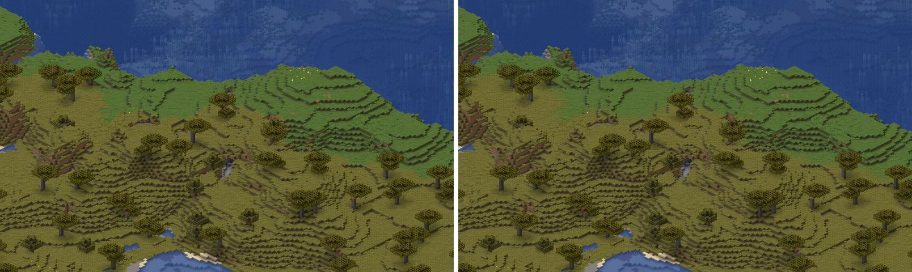
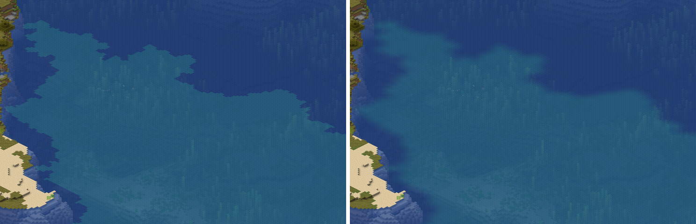

# Biomfarben

Gras, Laub und Wasser haben graue Texturen; die Farbe kommt aus dem Biom.
Das Spiel gibt jedem Block das Biom einer der Zellen aus 4×4×4 Blöcken um
ihn, gewürfelt aus dem Seed der Welt, und mischt die Farbe über die Blöcke
im Quadrat um ihn. Der Renderer macht beides wie der Client von 26.2. Die
Sprites tragen dafür statt der Farbe eine Tönungskarte, und die Farbe je
Block kommt erst beim Zeichnen dazu, auf der CPU wie auf der Karte.

## Gras, Laub und Wasser

Gras und Laub funktionieren wie das Wasser: die Textur ist grau, das Biom
liefert Temperatur und Niederschlag, und die Colormaps `grass.png` und
`foliage.png` aus den Assets machen daraus die Farbe. Der Index in die
Colormap rechnet wie `GrassColor.get` in double, geklemmt in float wie
`Biome.getGrassColorFromTexture` und `ColorMapColorUtil.get`. In f32
landeten acht Vanilla-Biome eine Zeile oder Spalte daneben, darunter Wiese,
Kirschhain und Taiga, die Wiese in Zeile 153 statt 152. Fichten, Birken und
Seerosen haben feste Farben, der Dunkelwald eine Abdunkelung, alles wie in
`BlockColors`, nur beschränkt auf das, was auf einer Karte Fläche macht. Der
Sumpf wählt je Spalte zwischen zwei Grün, siehe „Sumpfgras“. Die Farbe des
Wassers kommt aus `water_color` des Bioms.

Welche Farbe eines Bioms eine Fläche trägt, sagen die vier `ColorResolver`
aus `BiomeColors`: Gras nach `Biome.getGrassColor(x, z)`, Laub nach
`getFoliageColor`, trockenes Laub nach `getDryFoliageColor`, Wasser nach
`getWaterColor`. Im Renderer ist das `Resolver` in
[`renderer/src/assets/colors.rs`](../../renderer/src/assets/colors.rs), die
Farben eines Bioms `BiomeColors`.

## Welche Blöcke

Welche Blöcke gefärbt werden, steht nicht in den Assets. Minecraft
verdrahtet das in `BlockColors.createDefault`, und der Renderer tut es in
`source_of` in `colors.rs`: Gras, Farne, Busch und Zuckerrohr nach der
Gras-Colormap, dazu die Stiele von Blütenteppich und Wildblumen, Laub und
Ranken (`vine`) nach der Laub-Colormap, Laubstreu nach `dry_foliage`,
Fichten- und Birkenlaub und Seerosen fest, der Wasserkessel nach dem
Wasser des Bioms. Alles andere mit `tintindex` bleibt ungefärbt: Kirsch-
und Blasseichenlaub tragen ihre Farbe in der Textur, Redstone und die
Stiele von Kürbis und Melone färben im Spiel nach ihren Eigenschaften und
machen auf einer Karte keine Fläche. Feste Farben rastert der Renderer
gleich ins Sprite.

Zwei Ausnahmen aus `BlockTintSources`:

- **Blütenteppich und Wildblumen** färben mit `[BLANK_LAYER, grass()]`:
  `tintindex` 0 bliebe ungefärbt, 1 bekommt die Grasfarbe. In ihren Modellen
  `flowerbed_1` bis `flowerbed_4` tragen nur die Stiele einen `tintindex`,
  und zwar 1; der Renderer färbt jede Fläche mit `tintindex` in der Farbe
  des Blocks, das trifft hier genau die Stiele.
- **Hohes Gras und grosser Farn** färben mit `doubleTallGrass()`: Die obere
  Hälfte (`half=upper`) nimmt die Farbe am Block darunter. Im Renderer ist
  das `tinted_below` in `colors.rs`, gemischt wird dann auf der Höhe der
  unteren Hälfte.

## Biom je Block

Gespeichert sind Biome je Section in 64 Zellen aus 4×4×4 Blöcken, je
Viertelposition eines. `BiomeManager.getBiome` gibt einem Block nicht das
Biom seiner Zelle:

- Der Block rückt um zwei nach unten in jeder Achse. Von den acht
  Viertelpositionen an den Ecken der Zelle, in der er dann liegt, gewinnt
  die mit dem kleinsten Abstand, bei Gleichstand die frühere in der
  Reihenfolge von `getBiome`.
- Jeder Abstand ist je Achse um bis zu ±0,45 verwackelt, gewürfelt aus dem
  Seed und der Viertelposition (`getFiddledDistance`, `getFiddle`,
  `LinearCongruentialGenerator.next`). Die Summanden rechnet der Renderer in
  der Reihenfolge des Spiels, Gleitkomma rundet sonst anders.
- Der Seed geht gehasht ein: `BiomeManager.obfuscateSeed`, SHA-256 über die
  acht Bytes des Seeds, Little Endian, davon die ersten acht Bytes. Nur
  diesen Wert schickt der Server dem Client.
- Das Biom der gewinnenden Viertelposition liest `ChunkAccess.getNoiseBiome`
  aus ihrem Chunk, die Höhe auf die des Chunks geklemmt. Ein fehlender Chunk
  ist plains wie im Client (`ClientLevel.getUncachedNoiseBiome`). Eine
  Section ohne Biome und ein Biom ohne Definition macht der Renderer
  ebenfalls zu plains; das ist sein Ersatz, der Client kennt beide Fälle
  nicht.

So verlaufen die Grenzen zwischen Biomen blockgenau und ausgefranst statt
auf dem Raster. Der Nachbau steht in
[`renderer/src/world/biomzoom.rs`](../../renderer/src/world/biomzoom.rs),
`zoom` und `obfuscate_seed`; die Welt liefert den Seed aus
`world_gen_settings.dat`, siehe [Welten und Kennung](../benutzung/welten.md).
Nennt die Welt keinen Seed, trägt jeder Block das Biom seiner Zelle, und der
Lauf sagt das. `ChunkCache::biome_of` in
[`renderer/src/render/metatile.rs`](../../renderer/src/render/metatile.rs)
rechnet das Biom eines Blocks einmal und behält es je Chunk und Höhe; die
Mischung fragt jeden Block bis zu (2r + 1)² Mal, bei Radius 2 also 25, bei
7 225 Mal.

## Übergänge zwischen Biomen

`ClientLevel.calculateBlockTint` mischt die Farbe eines Blocks über das
Quadrat mit dem Radius r um ihn, auf seiner Höhe:

- Für jeden Block des Quadrats die Farbe seines Bioms an seiner Spalte,
  nach dem Resolver der Fläche.
- Je Kanal die Summe, ganzzahlig geteilt durch (2r + 1)², bei r = 2 durch
  25. Mit r = 0 ist es die Farbe des eigenen Bioms.
- r ist die Einstellung „Biomübergang“ (`Options.biomeBlendRadius`), 0 bis
  7, Vorgabe 2. Im Renderer ist das `--biome-blend`, siehe
  [Schalter](../benutzung/schalter.md).

Gemischt wird nur für Blöcke, deren Sprite eine Tönungskarte trägt, und nur
die Farben, die sie braucht: die des Blocks nach seinem Resolver, die des
Wassers für Wasser und geflutete Blöcke. Der Nachbau ist `BiomeTable::blend`
in [`renderer/src/render/tint.rs`](../../renderer/src/render/tint.rs). Ein
Kachelbaum behält seinen Radius, siehe [map.json](../benutzung/map-json.md),
„Radius der Mischung“.

Die Testwelt an einer Grenze zwischen savanna und plains um (624, 716) und
an einer zwischen lukewarm_ocean und ocean um (816, 720), scale 8, links
`--biome-blend 0`, rechts die Vorgabe 2. Stand `08594cf`. Befehle: Skill
[`doku-bilder-rendern`](../../skills/doku-bilder-rendern/SKILL.md).

## Sumpfgras

Im Sumpf ist Gras je Spalte eines von zwei Grün, unabhängig von der Farbe
aus der Colormap: `GrassColorModifier.SWAMP.modifyColor` nimmt #4C763C, wo
`BIOME_INFO_NOISE.getValue(x · 0,0225, z · 0,0225, false)` unter -0,1 liegt,
sonst #6A7039. `BIOME_INFO_NOISE` ist ein `PerlinSimplexNoise` mit der
Oktave 0 aus `WorldgenRandom(LegacyRandomSource(2345))`, also ein einziges
`SimplexNoise` in zwei Dimensionen, Eingabe und Ergebnis unskaliert. Der
Nachbau in [`renderer/src/assets/noise.rs`](../../renderer/src/assets/noise.rs)
liefert an 123 Stellen dasselbe double wie das Spiel, auch an den beiden,
die der Grenze am nächsten liegen.

## Tönung beim Zeichnen

Ein Sprite mit gefärbten Flächen trägt die Farbe nicht, sondern eine
Tönungskarte (`Sprite::tint`), siehe
[0033](../entscheidungen/0033-toenung-beim-zeichnen.md):

- Das Bild hält je Pixel den Rest, der von keiner Farbe des Bioms abhängt.
- Die Karte hält je Pixel zwei Wörter: den Anteil, der die Farbe des Blocks
  trägt, und den, der die des Wassers trägt, je Kanal ein Byte.
- Beim Zeichnen wird daraus je Kanal Rest + (Anteil des Blocks · Farbe des
  Blocks + Anteil des Wassers · Farbe des Wassers + 127) / 255, danach Licht
  und weiche Beleuchtung, dann über den Grund. Die Rechnung ist
  ganzzahlig, `rasterizer::tinted` auf der CPU und `tinted` in `gpu.wgsl`
  liefern dasselbe Byte.

Die Karte entsteht aus drei Rastern desselben Modells: jede Farbe des Bioms
schwarz, dann die des Blocks weiss, dann die des Wassers weiss. Das Mischen
der Flächen eines Sprites und das Licht unter seiner eigenen Oberfläche sind
linear in der Farbe; der Anteil einer Farbe ist deshalb je Kanal der
Unterschied zum Raster in Schwarz, und das Raster in Schwarz ist der Rest.
So stimmt auch ein Pixel, in dem sich Farben treffen: die halb
durchsichtige Wasseroberfläche über Seegras oder einem gefluteten Zaun, der
Rand der Auflage an der Seite eines Grasblocks. Alle drei Raster tragen das
Licht des Blocks; ein gefluteter Block, der selbst leuchtet, liegt unter
seiner Oberfläche in seinem eigenen Blocklicht. Deshalb gehört das Leuchten
zum Schlüssel der Familie. Sonst teilt sich ein Sculk-Sensor in `cooldown`
die Familie mit einem in `active`, und eine Leuchtflechte ohne Fläche, die
das Spiel mit allen sechs Flächen zeichnet, aber nicht leuchten lässt, die
mit einer, die alle sechs hat.

Gegenüber einem Raster, das die Farben gleich trägt, liegt ein Kanal
höchstens um 2 daneben, meist höchstens um 1. Das Raster rundet an jeder
Schicht, die Karte einmal je Pixel; wo eine Wasseroberfläche über mehreren
Schichten liegt, summiert sich das. Gemessen mit
`toenungskarte_an_allen_vanilla_bloecken` in `sprites.rs`: alle Blöcke aus
`blocks.txt`, die gefärbt oder geflutet sein können, je Block die ersten und
die letzten zwölf Zustände, geflutete mit Wasser, bei scale 4, 8, 16 und 32,
mit drei Paaren aus Block- und Wasserfarbe. Von 65 952 Rastern mit Karte
liegen 37 um 2 daneben, alle geflutet, etwa Korallenfächer, Amethyst,
Tropfblatt, Mangrovenwurzeln und Falltüren, der Rest höchstens um 1. 186
Raster fehlen im Vergleich, weil ihr Modell über den Würfel ragt. Ohne das
Leuchten im Schlüssel lägen Leuchtflechte um 4, Sculk-Sensor um 5 und
kalibrierter Sculk-Sensor um 7 daneben. Mit den Fixtures prüft das
`toenungskarte_gibt_jede_farbe_wieder`, darunter ein gefluteter, gefärbter
Block mit zwei verschiedenen Farben.

Welche Farbe des Bioms der Anteil des Blocks trägt, hängt an der Familie,
nicht am Sprite: pixelgleiche Sprites teilen sich den Eintrag, auch wenn
ihre Blöcke verschieden färben. Der Vorlauf braucht deshalb keine Biome je
Blockstate mehr, er sammelt die Biome der Welt nur für die Meldung, welche
keine Definition haben.

## Biome lesen

Was er aus einem Biom braucht, liest der Renderer wie `Biome.DIRECT_CODEC`
in 26.2: Pflicht sind `has_precipitation`, `temperature`, `downfall`,
`effects` und darin `water_color`. Eine Farbe darf wie im Client eine ganze
Zahl sein, `#rrggbb` oder drei Kommazahlen von 0 bis 1 wie
`[0.2, 0.4, 0.8]`. Ein Biom, das der Codec ablehnt, übergeht der Renderer
und nennt es beim Start; der Client lüde sein Datenpaket gar nicht. Woher
die Biomdefinitionen kommen: [Assets und Biomdaten](../benutzung/assets.md).

## Belege

Belegt am Client-JAR von 26.2 mit javap: `BiomeManager.getBiome`,
`getFiddledDistance`, `getFiddle`, `obfuscateSeed`,
`LinearCongruentialGenerator.next`, `ChunkAccess.getNoiseBiome`,
`LevelReader.getNoiseBiome`, `ClientLevel.getUncachedNoiseBiome`,
`ClientLevel.calculateBlockTint`, `Options.biomeBlendRadius`,
`BiomeColors`, `Biome.getGrassColor` und die anderen Getter,
`GrassColorModifier.SWAMP`, `PerlinSimplexNoise`, `SimplexNoise`,
`WorldgenRandom`, `LegacyRandomSource` und `BitRandomSource`; welche Blöcke
wie färben, `BlockColors.createDefault` und `BlockTintSources`, darin
`doubleTallGrass` (`BlockTintSources$2`) mit `pos.below()` für die obere
Hälfte und `BLANK_LAYER` als `constant(-1)`.

Die Sollwerte der Tests für Seed, Zoom und Rauschen gibt
[`renderer/src/world/Biomwerte.java`](../../renderer/src/world/Biomwerte.java)
aus den Klassen des Spiels selbst aus, gestartet mit dem Server-JAR von 26.2
und seinen Bibliotheken im Klassenpfad, unter Java 25 wie
`Leuchten.java` im Skill
[`tabellen-neu-erzeugen`](../../skills/tabellen-neu-erzeugen/SKILL.md). Für
den Zoom meldet dort eine Quelle jede Viertelposition als eigenes Biom, so
steht fest, welche gewinnt. Die Mischung rechnen die Tests von Hand nach
`calculateBlockTint`.

## Was bleibt eine Näherung

- **`temperature_modifier: frozen`** liest der Renderer, wertet es aber
  nicht aus: es beeinflusst die positionsabhängige Temperatur für Schnee und
  Eis, nicht die Colormap.
- **Die Tönungskarte** liegt je Kanal höchstens um 2 neben einem Raster in
  der Farbe, siehe „Tönung beim Zeichnen“.
- **`tintindex` je Lage** unterscheidet der Renderer nicht: jede Fläche mit
  einem `tintindex` trägt die Farbe des Blocks. Das Spiel liesse bei
  Blütenteppich und Wildblumen Lage 0 ungefärbt; ein Resourcepack, das dort
  Flächen mit Lage 0 einführt, sähe sie gefärbt. Die Vanilla-Modelle tragen
  nur Lage 1.
