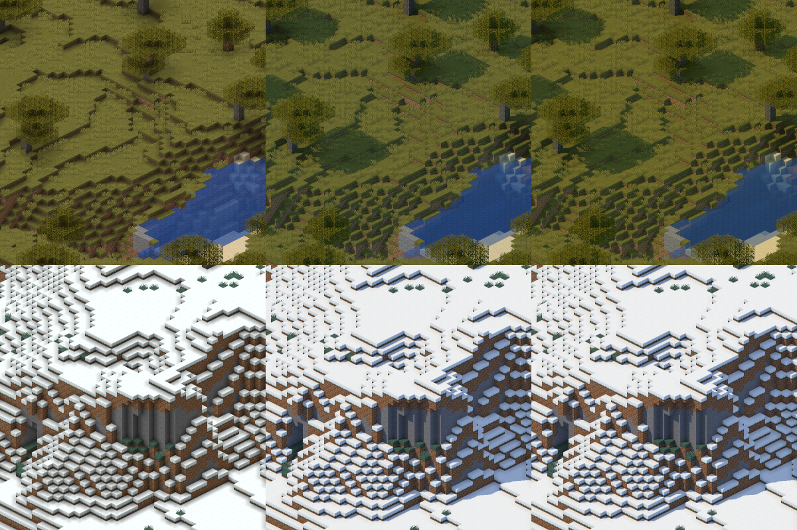

# Cinematic

`--cinematic` zeichnet mit `--tiles` oder `--render` dieselbe Karte im
Licht des Spiels in HDR, mit Weissabgleich, Belichtung und Kurve nach
[0058](../entscheidungen/0058-look-von-cinematic.md),
[0069](../entscheidungen/0069-ein-himmelslicht-und-kaelte.md) und
[0076](../entscheidungen/0076-waermer-in-cinematic.md). Kacheln landen in
einem eigenen Baum samt nativen Stufen und Pyramide, siehe
[`map.json`](../benutzung/map-json.md), „Liste der Bäume“. Cinematic nimmt
dieselben Kandidaten, dieselbe Deckungsmaske und dieselben Draws wie die
Karte, also dasselbe Pixelraster bei jeder Kamera, Richtung und jedem
scale; anders ist nur das Licht je Pixel, entschieden in
[0053](../entscheidungen/0053-cinematic-als-schalter-der-karte.md). Es
zeichnet immer die CPU. Phase 1 (#72) brachte das Licht des Spiels, Phase 2
(#73) Sonne, Schatten, Bodenpflanzen, Wasser, Leuchten, Wärme nach Biom und
Bloom.

## Werte des Looks

Alle Werte stehen benannt an einer Stelle, `LOOK` in
[`renderer/src/render/look.rs`](../../renderer/src/render/look.rs):

| Wert | in `Look` | genutzt |
|---|---|---|
| Stärke des Himmelslichts | `himmel`: 3 | ja |
| Anteil der Farbe des Himmels am Himmelslicht, der Rest ist Nebel | `himmel_anteil`: 0,75 | ja |
| Stärke des Blocklichts | `block`: 1,5 | ja |
| Leuchten: Stärke, ab und bis zu welcher Helligkeit eines Texels | `leuchten`: 2, `leuchten_ab`: 0,25, `leuchten_voll`: 0,75 | ja |
| Sonne: Stärke, Farbe linear, Höhe, waagrecht von links zur Kamera hin | `sonne`: 3, `sonne_farbe`: (1; 0,93; 0,83), `sonne_hoehe`: 48,47°, `sonne_seite`: 8,75° | ja |
| Wie weit ein Strahl zur Sonne reicht, in Blöcken entlang des Strahls | `sonne_weite`: 128 | ja |
| So viel Sonne lässt eine Bodenpflanze durch | `pflanzen`: 0,5 | ja |
| Wasser: F0 der Spiegelung, Anteil der Deckkraft seiner Textur, Dichte | `wasser_spiegel`: 0,04, `wasser_textur`: 0,6, `wasser_dichte`: 8 | ja |
| Wasser: bis zu welcher Höhe der gespiegelten Richtung nur Nebel, über wie viel Höhe weich zum Himmel | `wasser_horizont`: −0,1, `wasser_horizont_breite`: 0,7 | ja |
| Wasser: Mindestanteil eines Kanals am stärksten, Dichte jedes Kanals dazu | `wasser_anteil_min`: 0,02, `wasser_dichte_grund`: 0,35 | ja |
| Wärme: so stark wirkt der Weissabgleich zwischen Kälte und Wärme, so viel stärker darüber höchstens, ab und bis zu welcher Temperatur | `waerme_grund`: 1,05, `waerme`: 0,25, `waerme_von`: 0,5, `waerme_bis`: 1,0 | ja |
| Kälte: so viel schwächer wird der Weissabgleich darunter höchstens, unter und bis zu welcher Temperatur | `kaelte`: 0,15, `kaelte_von`: 0,15, `kaelte_bis`: 0 | ja |
| Belichtung | `belichtung`: 0,25 | ja |
| Kurve: gerade bis, flach ab | `knie`: 0,8, `flach`: 1,2 | ja |
| Bloom: Stärke, σ in Blöcken | `bloom`: 1, `bloom_breite`: 0,25 | ja |

- **Herkunft:** Wärme und Kälte aus 0076, alle anderen aus 0058, bis auf
  `sonne_weite`, `leuchten_ab`, `leuchten_voll` und die Werte des Wassers
  ausser `wasser_spiegel` und `wasser_dichte`. Die stehen im Prototyp aus
  #89, an dem 0058 abgestimmt
  ist; welche es dort sind, hält
  [Cinematic mit Sonne](../messungen/2026-10-03-cinematic-mit-sonne.md),
  „Aufbau“, fest. `sonne_weite` hat 0056 am Prototyp gemessen, siehe
  [Gang zur Sonne in Stufen](../messungen/2026-10-02-gang-zur-sonne-in-stufen.md).
- **Grenzen aus 0058:** Am Renderer halten sie 15 von 24 Ansichten der
  Testwelt, am Prototyp 20; Schatten sind heller. Für Schatten/Sonne gilt
  am Renderer 0,35 bis 0,75, siehe
  [0060](../entscheidungen/0060-grenze-schatten-sonne-am-renderer.md);
  damit halten 21. Zahlen, Ursache und der Test `kennzahlen_der_ansichten`
  dazu: [Look am Renderer](../messungen/2026-10-03-look-am-renderer.md).
- **Fingerabdruck:** Jeder Baum mit Cinematic hält die Werte und den Stand
  des Verfahrens als `lookHash` in `map.json`. Wie er gerechnet wird, wann
  er sich ändert und wann ein Lauf deshalb abbricht, steht in
  [`map.json`](../benutzung/map-json.md), „Look“.
- **Ändern:**
  - die Werte in `LOOK` ändern;
  - den Fingerabdruck im Test `fingerabdruck_der_werte` und in
    [`map.json`](../benutzung/map-json.md), „Look“, nachziehen;
  - das Goldbild `metatile-cinematic.png` erneuern, Skill
    [`goldbild-erneuern`](../../skills/goldbild-erneuern/SKILL.md);
  - die Bilder des Renderers unter „Wärme“ und „Bodenpflanzen“ neu
    rendern, Skill
    [`doku-bilder-rendern`](../../skills/doku-bilder-rendern/SKILL.md);
  - die Bäume mit Cinematic neu rendern.

  Die neuen Werte hält eine Entscheidung fest, die 0058 oder 0076 in
  diesen Werten ablöst.

## Sprites für Cinematic

Nur mit dem Schalter backt die Sprite-Tabelle eigene Sprites
(`SpriteSet::build_mit_licht` mit dem Look, `rastern` mit `kino`):

- **Ohne Schattierung nach Richtung:** jede Fläche mit dem Faktor 1, auch
  Flächen aus Blockentity-Modellen und die Seiten von Flüssigkeiten. Die
  Faktoren der Karte stehen in [Dimensionstypen](dimensionstypen.md),
  „Schattierung nach Richtung“.
- **Geometrie je Pixel** (`Sprite::geometrie`): vom vordersten Fragment
  die Tiefe entlang der Blickachse relativ zum Ursprung des Blocks, die
  Normale der Fläche im Blick und die Normale der Seite, die `shade`
  nennt, siehe [Modelle und Texturen](modelle-und-texturen.md),
  „Schattierung“. Die Sonne rechnet mit
  ihnen, siehe „Sonne“. Das prüft `geometrie_der_vorderen_flaeche` in
  `rasterizer.rs` an zwei Flächen eines Modells, die sich decken.
- **Sonst wie die Karte:** dieselben Fragmente, Füllregel, Alpha-Tests,
  AO-Karte und Tönungskarte. Ein Sprite deckt also genau die Pixel, die das
  der Karte deckt; das prüft `cinematic_ohne_schattierung_mit_geometrie`.

## Licht an den Ecken

Welches Licht ein Block bekommt und wie die weiche Beleuchtung an den
Ecken rechnet, bleibt wie bei der Karte, siehe
[Wasser und Licht](wasser-und-licht.md) und
[Weiche Beleuchtung](weiche-beleuchtung.md), „Licht an den Ecken“. Nur
legen `licht_fuer` und `ecken_at` in
[`renderer/src/render/metatile.rs`](../../renderer/src/render/metatile.rs)
statt der Helligkeit der Lightmap je Ecke drei Werte ab
(`kino_kanaele`):

- das Himmelslicht in Sechzehnteln einer Stufe, wie es `smooth_blend`
  liefert, 0 bis 240;
- das Blocklicht ebenso;
- den Schatten der weichen Beleuchtung in 255steln.

Durch die Lightmap gerechnet ergeben sie genau das Licht der Karte, an
jeder Ecke und für das Wasser. Das prüft
`cinematic_zeichnet_dieselben_draws_wie_die_karte` in
`renderer/tests/metatile.rs` bei jeder Kamera und Richtung der Invarianten,
zusammen mit denselben Draws.

## Licht in HDR

Aus den drei Werten rechnet Cinematic das Licht je Kanal (`Kino::licht` in
[`renderer/src/render/kino.rs`](../../renderer/src/render/kino.rs)), wie
das Spiel an jeder Ecke einer Seite, einmal je Draw (`EckenLicht` in
`metatile.rs`). Ein Pixel auf einem Platz der AO-Karte mischt das Licht
der vier Ecken seines Platzes mit denselben Anteilen wie die Karte,
ungerundet; ein Pixel ohne Platz bekommt das Licht des Blocks. Über eine Fläche verläuft so
das fertige Licht wie im Spiel, denn `terrain.vsh` liest die Lightmap je
Ecke (`sample_lightmap`). Das prüft `licht_zwischen_den_ecken_wie_im_spiel`
in `metatile.rs`.

`Licht = Schatten / 255 · (Umgebung + Himmelslicht · H(Himmel) + B(Block))`

- **Umgebung:** `ambient_light_color` des Dimensionstyps, die
  `lightmap.fsh` unter jedes Licht legt, roh wie dort und ohne Stärke aus
  dem Look. Im Nether und im Ende ist `sky_light_factor` 0; ohne Blocklicht
  ist sie dort das ganze Licht.
- **Himmelslicht:** die Farbe aus „Farbe des Himmels“, in jedem Biom
  dieselbe.
- **H:** je Stufe `getBrightness` mal `sky_light_factor` und
  `sky_light_color` der Dimension, mal `himmel`.
- **B:** je Stufe `getBrightness` mit `BlockFactor` in der Farbe
  `BlockLightColor`, mal `block`, beides wie in
  [Wasser und Licht](wasser-und-licht.md), „Blocklicht“. Die Farbe mischt
  Cinematic wie das Spiel aus den rohen Werten von `block_light_tint`;
  linear wird erst das Ergebnis.
- **Wie `lightmap.fsh`, nur getrennt:** dieselbe Kurve `getBrightness` wie
  die Lightmap der Karte, siehe [Wasser und Licht](wasser-und-licht.md),
  „Helligkeit wie im Spiel“. Ohne Begrenzung auf 1, denn die Kurve aus 0058
  fängt helles Licht auf. Ohne den Schritt zu `notGamma`: Er ist die
  Helligkeit aus den Optionen des Spiels (`BrightnessFactor`). Wie hell
  Cinematic zeichnet, legen Belichtung und Kurve fest, abgestimmt am
  Prototyp aus #89, der ihn nicht hat.
- **Zwischen zwei Stufen** linear gemischt, wie das Spiel die Lightmap
  gefiltert liest (`Lightmap::linear`).
- **Linear:** Die Farben des Lichts rechnet Cinematic aus sRGB in lineares
  Licht um, wie der Prototyp: `sky_light_color`, die Farben des Himmels
  und die fertig gemischte Farbe des Blocklichts. Nur die Umgebung bleibt
  roh, siehe „Was bleibt eine Näherung“.

## Farbe des Himmels

Das Himmelslicht hat in jedem Biom und jeder Dimension die Farbe aus
Himmel und Nebel der Oberwelt, wie in [0069](../entscheidungen/0069-ein-himmelslicht-und-kaelte.md): genau das Licht, auf
das der Weissabgleich gerechnet ist (`Kino::himmelslicht`). Die Farben des
Himmels je Biom nimmt Cinematic nur für das Wasser. Was das Spiel tut,
steht unter „Was bleibt eine Näherung“.

- **Himmelslicht:** `sky_color` #78a7ff und `fog_color` #c0d8ff der
  Oberwelt linear gemischt, der Himmel zum Anteil `himmel_anteil`, siehe
  „Werte des Looks“. Ein Test gibt Biomen mit eigener `sky_color` dasselbe
  Licht wie plains, auch an der Grenze, mit dem Radius 2 aus `nw`
  (`himmelslicht_der_oberwelt_in_jedem_biom`).
- **Für das Wasser je Biom** aus seinen `attributes`,
  `minecraft:visual/sky_color`, `fog_color` und `water_fog_color`, gelesen
  wie `EnvironmentAttributeMap.CODEC` in 26.2, belegt per javap. Wie ein
  Biom gelesen wird: [Biomfarben](biomfarben.md), „Biome lesen“. Wofür das
  Wasser sie nimmt, steht unter „Wasser“.
- **Ohne Angabe im Biom** gilt die des Dimensionstyps, ohne Angabe dort die
  Vorgabe aus `EnvironmentAttributes`; die Werte stehen in
  [Dimensionstypen](dimensionstypen.md), „Was der Renderer liest“.
- **Ein Modifikator** statt einer Farbe lässt die des Dimensionstyps. Ein
  Lauf mit `--cinematic` nennt das Biom beim Start.
- **Gemischt** wie die Biomfarben über die Blöcke im Quadrat mit dem Radius
  aus `--biome-blend`, auf der Höhe des Blocks (`ChunkCache::himmel_at`,
  `Himmelsfarben`), aber linear und ungerundet, zusammen mit der
  Temperatur für die Wärme. Kacheln bekommen so keine Nähte. Ein Test
  spiegelt im Wasser über der Grenze von plains zu einem Biom mit eigener
  `sky_color`, mit dem Radius 2 aus `nw`: mitten darin dessen Himmel, an
  der Grenze das Mittel der 25 Blöcke
  (`wasser_spiegelt_den_himmel_des_bioms`).

## Sonne

Die Sonne steht fest zur Kamera (`Look::sonne_im_blick`): `sonne_hoehe`
über dem Horizont, waagrecht von links um `sonne_seite` zur Kamera hin.
Links heisst im Blick
diagonal (−1, 0, 1)/√2, genordet (−1, 0, 0); zur Kamera hin (1, 0, 1)/√2
und (0, 0, 1). Aus jeder Richtung steht sie also gleich zum Bild.

- **Licht nach dem Winkel** (`Kino::sonnenlicht`): `sonne_farbe` mal
  `sonne` mal dem Kosinus zwischen Normale und Sonne, abgewandt nichts.
  Nennt das Element eine Seite (`shade`), bekommt die Fläche das Licht
  einer Fläche nach dieser Seite, wie das Spiel sie schattiert: bei
  `shade: false` aus 26.2 und `"up"` aus 26.3 nach oben, wie in 0058.
- **Wo:** nur, wo der Dimensionstyp Himmelslicht zeigt, `sky_light_factor`
  über 0; im Nether und im Ende scheint sie nicht.
- **Ohne Schatten der weichen Beleuchtung:** Der Schatten an den Ecken
  dunkelt das Licht des Spiels, nicht die Sonne.
- **So weit sie durchkommt:** mal dem, was der Strahl zur Sonne von ihr
  übrig lässt, siehe „Schatten“.

## Schatten

Je Pixel, auf den die Sonne scheint, geht ein Strahl zur Sonne, entschieden
in [0056](../entscheidungen/0056-exakter-strahl-zur-sonne.md). Er gibt 0
hinter einer deckenden Stelle, sonst 1, je Bodenpflanze auf dem Weg mal
`pflanzen` (`ChunkCache::sonne` in
[`renderer/src/render/metatile/strahl.rs`](../../renderer/src/render/metatile/strahl.rs)).
Der Schatten bleibt hart: Weiche Schatten über eine Sonnenscheibe sind
geprüft und verworfen, siehe
[0077](../entscheidungen/0077-weiche-sonnenschatten-verworfen.md).

- **Wo er beginnt** (`startpunkt` in
  [`renderer/src/render/metatile.rs`](../../renderer/src/render/metatile.rs)):
  am Punkt der vordersten Fläche im Pixel, aus dem Bildpunkt und der Tiefe
  des Sprites zurückgerechnet (die Matrix aus `Projection::umkehrung`,
  einmal je Bild), ein Tausendstel vor der Fläche. Auf einer achsparallelen
  Fläche liegt er in der Mitte seines Sechzehntels Block (`texel_mitte`):
  Alle Pixel auf einem Texel bekommen denselben Strahl. Gerechnet wird er
  einmal je Folge von Pixeln eines Draws mit demselben Punkt, also je
  Zeile des Texels; auf schrägen Flächen je Pixel.
- **Was deckt** (`Sonnenform` in
  [`renderer/src/render/sonne.rs`](../../renderer/src/render/sonne.rs)):
  je Alternative die Dreiecke ihres Modells im Blick, mit dem Alpha-Test
  ihrer Schicht. Ausgeschnitten deckt ein Texel ab der Schwelle des
  Alpha-Tests, gemischt nur mit Alpha 255 (`sonnenschwelle`). Laub deckt
  also nach seinen Löchern, Glas nur, wo seine Texel ganz decken.
- **Was durchlässt:** Flächen aus Wasser fehlen ganz, Wasser hält die
  Sonne nie auf. Ein Block ohne deckenden Texel ebenso.
- **Lava** reicht unter derselben bis zur Kante, und ihre Flächen entfallen
  zu derselben und vor einer vollen Seite, wie `FluidRenderer.tesselate`
  mit `shouldRenderFace` und `isFaceOccludedByNeighbor` (Client 26.2, per
  javap). Unter einem vollen Block zeichnet das Spiel die Oberseite auf
  Höhe 8/9; der Strahl lässt sie weg, das ändert nichts, denn steigend
  trifft er erst den Block darüber.
- **Modelle, die aus ihrem Würfel ragen,** prüft er in jedem Würfel, in den
  ihre Hülle reicht (`Sonnenform::zellen`), einmal je Strahl.
- **Wie weit:** bis `sonne_weite` entlang des Strahls.
- **Der Test einer Zelle:** erst gegen die Hülle des Modells, dann Dreieck
  für Dreieck, beidseitig; der erste deckende Treffer genügt. Gerechnet
  relativ zum Block, also gleich, in welcher Zelle er geprüft wird: die
  Hülle in f64 vom Anfang des Strahls aus, die Dreiecke in f32 ab dem
  Eintritt in die Hülle. So liegt ihr Anfang nah am Block, auch am Ende
  der Weite.
- **Vorab gerechnet (#118):** Was nur an der festen Richtung zur Sonne
  hängt, rechnet die Sonnenform beim Bauen: `1 / d` je Achse für die Hülle,
  je Dreieck `d × e2`, `det` und `1 / det` für Möller–Trumbore. Es sind
  dieselben Rechnungen in derselben Reihenfolge wie vorher je Strahl,
  also dieselben Bits. Gemessen in
  [2026-10-04, Cinematic schneller, Hebel 1 und 2](../messungen/2026-10-04-hebel-1-und-2.md).

### Der schnelle Gang

`ChunkCache::sonne` fragt zuerst die Bits „frei zur Sonne“, siehe unten.
Beantworten sie den Strahl nicht, geht `ChunkCache::sonne_im_gang` ihn
Zelle für Zelle durch das Gitter im Blick, springt aber über, was nichts
aufhält, und endet in der ersten Zelle, die frei zur Sonne ist:

- **Je Chunk eine Säule** (`Saeule`), sobald ein Strahl ihn betritt: ihre
  Decke, die oberste Zelle mit Block oder hineinragendem Modell. Darüber
  springt der Strahl zum Rand des Chunks. Dafür lädt der Chunk-Cache die
  Chunks rundum, aus denen Modelle hineinragen können; das Band wächst
  nicht im Voraus.
- **Der Horizont** (`ChunkCache::horizont`), je Säule einmal gerechnet:
  die höchste Decke der Chunks, die ein Strahl von dort bis zur Weite
  erreichen kann. In x kommt er um höchstens Weite mal |d_x| weiter, also
  von jedem Punkt im Chunk über höchstens ⌈Weite · |d_x| / 16⌉
  Chunkgrenzen zur Sonne hin; in z ebenso. Gezählt werden
  ⌊Weite · |d_x| / 16⌋ + 1: Ist der Quotient eine ganze Zahl, kann der Gang
  in f64 an einer Chunkgrenze sonst einen Chunk zu weit treten. Mit `LOOK`
  ist er es nicht, und es sind je Säule
  5 × 6 Chunks diagonal und 7 × 2 genordet, samt ihr selbst; jede lädt für
  ihre Decke dazu ihre Nachbarn. Liegt der Strahl über der Decke seines
  Chunks und über dem Horizont, ist er frei: Er steigt und trifft nichts
  mehr.
  - **Ein Fix gegen den Prototyp** aus #89: Dessen Horizont nahm nur die
    Chunks bis zwei weiter zur Sonne hin, 3 × 3. Der Strahl kommt mit
    `LOOK` diagonal bis vier Chunks weiter in x und fünf in z, genordet bis
    sechs in x. Ein Turm weiter draussen warf am Prototyp keinen Schatten.
    Das prüft `ferner_turm_wirft_seinen_schatten` mit einem Turm im
    fernsten Chunk, den der Strahl erreicht.
- **Je Section Bits** (`Bits`), sobald ein Strahl sie betritt, einmal je
  Section: die Zellen mit Arbeit, die vollen deckenden Würfel und die
  Zellen, in die ein Modell eines Nachbarn ragt; dazu je Würfel aus
  4 × 4 × 4 Zellen ein Bit. Durch eine Section und einen Würfel ohne Arbeit
  springt er hinaus.
- **Ein voller deckender Würfel** (`Sonnenform::wuerfel`: alle sechs Seiten
  ganz von einer deckenden Fläche belegt) hält ihn ohne Test auf, ausser er
  ist eine obere Hälfte: Die geht durch den Test, denn über ihrer
  Bodenpflanze bewirkt sie nichts (siehe „Bodenpflanzen“). So bleibt die
  Ausnahme aus der Schleife des Gangs.
- **Gleich dem Bezug:** `ChunkCache::sonne_bezug` prüft jede Zelle bis zur
  Weite mit jedem Block, dessen Modell hineinragen kann. Beide geben
  dasselbe, denn ein Block, den der Strahl nicht trifft, ändert nichts, ob
  er geprüft wird oder nicht. Das prüft `schneller_gang_gleicht_dem_bezug`
  in `renderer/tests/metatile.rs` Bit für Bit am HDR-Puffer, an Szenen mit
  Wasser, Lava, Laub, Glas und Modellen, die aus ihrem Würfel ragen.
  - **Ausser in einem Chunk, der fehlt:** Den überspringt der Gang ganz,
    seine Säule hat keine Decke. Der Bezug prüft dort Modelle, die aus
    einem geladenen Nachbarn hineinragen. Am Rand der erzeugten Welt können
    beide sich so unterscheiden; das Bild zeichnet der Gang.

Säule, Horizont, Bits und die Bits „frei zur Sonne“ merkt sich jeder Thread
in seinem Chunk-Cache, wie Chunks und Licht
([0025](../entscheidungen/0025-streifen-und-cache-je-thread.md)). Doppelt
gerechnet wird nur an den Grenzen der Streifen, siehe
[Doppelte Arbeit an Streifengrenzen](../messungen/2026-09-29-streifengrenzen.md);
ein Cache für alle Threads bleibt verworfen.

Getestet: einzelne Strahlen durch Würfel, Laub, Wasser, Glas, Pflanze und
Überhang (`strahlen_zur_sonne`), die Lage des Schattens eines Würfels im
Bild (`wuerfel_wirft_seinen_schatten`), ein Turm im fernsten Chunk, den
der Horizont noch sieht (`ferner_turm_wirft_seinen_schatten`), und sein
Schatten in einem Ausschnitt, der den Turm nicht zeigt
(`ausschnitt_sieht_den_schatten_von_draussen`); ein Modell, das aus dem
Chunk dahinter über dessen Decke ragt
(`ueberhang_aus_dem_chunk_dahinter_hebt_die_decke`); ein Strahl durch eine
leere Section zwischen belegten, ob sie fehlt oder nur Luft hält
(`strahl_durch_eine_leere_section`); 8000 fest gewürfelte
Strahlen in einer hohen Welt aus 8 × 8 Chunks, schnell und im Bezug gleich
(`zufaellige_strahlen_gleichen_dem_bezug`).

### Frei zur Sonne

Vor dem Gang sieht `ChunkCache::frei_zur_sonne` nach, ob von der
Startzelle aus überhaupt etwas im Weg liegen kann. Wenn nicht, kommt alles
an, ohne Gang. Die Regel kommt aus dem Vorschlag zu #73, eingebaut in #106;
am Prototyp gemessen in
[Bits „frei zur Sonne“](../messungen/2026-10-03-bits-frei-zur-sonne.md),
am Renderer in
[Bits „frei zur Sonne“ am Renderer](../messungen/2026-10-03-bits-am-renderer.md):
Jede Kachel bleibt gleich, ein Strahl kostet 5 bis 21 % weniger, der ganze
Lauf am Stand 5 %, im Fichtenwald liegt es in der Streuung.

- **Das Prisma einer Zelle:** alle Punkte `p + t·d` mit `p` in der Zelle
  und `t` von 0 bis zur Weite. In der Lage `k` über ihr liegt `t` zwischen
  `max(0, k − 1) / d_y` und `(k + 1) / d_y`. Je Achse berührt es dort die
  Zellen, deren geschlossener Würfel diese Spanne schneidet, nur zur Sonne
  hin wie der Gang. Jede Zelle, die der Gang von einem Punkt der Zelle aus
  betritt, liegt also darin; für die Rundung in f64 reicht es 10⁻⁶ weiter.
- **Die Versätze** (`versaetze` in
  [`renderer/src/render/metatile/strahl.rs`](../../renderer/src/render/metatile/strahl.rs)):
  je Spalte daneben die Lagen `k0` bis `k0 + n − 1`, die das Prisma dort
  berührt, bis zur Lage ⌊Weite · d_y⌋ + 1. Es ist ein Lauf, denn die
  Spannen wachsen mit `k` zur Sonne hin. Einmal je Look und Kamera
  gerechnet, in `Kino`. Mit `LOOK`: diagonal 350 Spalten bis 51 Blöcke
  gegen x und 70 in z, genordet 232 bis 85 gegen x und 14 in z; je bis Lage
  96.
- **Die Bits** (`Saeule::frei`): je Spalte ein `u128` für die 128 Lagen bis
  zum Horizont `H` der Säule. Ein Bit ist gesetzt, wenn keine Zelle im
  Prisma Arbeit für den Gang hat, also kein Bit `arbeit` aus `Bits`, samt
  den Zellen, in die Modelle ragen. Gerechnet je Versatz als
  `gesperrt |= (A | A >> 1 | … | A >> (n − 1)) >> k0`, mit `A` der Arbeit
  der Spalte daneben ab der untersten Lage.
- **Über dem Horizont** hat keine Zelle Arbeit, die der Strahl bis zur
  Weite erreicht. Das Prisma reicht über die Chunks des Horizonts hinaus,
  aber dort erst hinter der Weite; Arbeit über `H` zählt darum nicht. Unter
  den 128 Lagen fragt der Strahl den Gang.
- **Gemerkt** in der Säule, sobald ein Strahl in ihr beginnt oder sie
  durchquert, siehe „Der schnelle Gang“. Am Prototyp verteilten sich die Zeilen in jedem Durchgang
  anders auf die Threads, und jeder rechnete die Spalten neu.
- **Hinreichend, nicht nötig:** Ein Bit, das fehlt, heisst nur, dass ein
  Strahl aus der Zelle etwas treffen könnte. Dann entscheidet der Gang.
- **Gleich dem Gang:** Ein freier Strahl prüft im Gang keine Zelle und
  gibt 1.
  - Im Debug-Build schickt `ChunkCache::sonne` jeden Strahl, den die Bits
    beantworten, auch durch den vollen Gang und prüft, dass er 1 gibt. So
    prüft jeder Test mit Cinematic jeden solchen Strahl, das Goldbild
    eingeschlossen.
  - `frei_zur_sonne_trifft_nichts` schickt von jeder Zelle, die die Bits
    frei nennen, vom Punkt und von allen acht Ecken einen Strahl durch Gang
    und Bezug; die Ecken streifen die Ränder des Prismas. Jeder kommt ganz
    an.
  - `block_am_ende_der_weite_sperrt_die_bits` legt einen Block in die
    oberste Lage des Prismas, kurz vor der Weite;
    `bloecke_an_den_raendern_des_prismas_sperren_die_bits` je einen an den
    fernen und den nahen Rand einer Lage, den nur ein Strahl aus einer
    Ecke trifft.
- **Unterwegs (#118):** Der Gang fragt die Bits auch in jeder Zelle nach
  dem Start. Ist sie frei, endet er mit dem Licht, das er bis dahin hat,
  samt der Dämpfung durch Bodenpflanzen davor. Das Bild bleibt gleich: Der
  Rest des Strahls beginnt in der Zelle, liegt also in ihrem Prisma, und
  dort hat keine Zelle Arbeit.
  - Im Debug-Build geht jeder Strahl, der so endet, auch durch den vollen
    Gang bis zur Weite, und beide müssen dasselbe Licht geben.
  - Gilt in einer Mutation jede Zelle nach dem Start als frei, fallen
    unter anderem das Goldbild, `schneller_gang_gleicht_dem_bezug` und
    `frei_zur_sonne_trifft_nichts`.
  - Gemessen in [2026-10-04, Cinematic schneller, Hebel 1 und 2](../messungen/2026-10-04-hebel-1-und-2.md).

### Der Vorlauf

Mit einem Ausschnitt liest der Vorlauf (`Reach::mit_sonne` in
[`renderer/src/render/tiles.rs`](../../renderer/src/render/tiles.rs))
auch die Chunks, aus denen ein Strahl Blöcke liest. Sonst fehlten deren
Blockstates in der Sprite-Tabelle, und der Strahl sähe dort Luft: Ein
Ausschnitt zeigte weniger Schatten als dasselbe Stück im ganzen Bild.

- **Welche:** von jedem Chunk, den der Vorlauf ohnehin liest, so viele
  Chunks zur Sonne hin, wie der Strahl Chunkgrenzen kreuzt (siehe „Der
  Horizont“), und zwei rundum: Ein Modell am Rand beginnt den Strahl im
  Chunk daneben, und in jeden Chunk auf dem Weg ragen Modelle aus seinen
  Nachbarn. Mit `LOOK` im Raster in 2:1 sind das je Chunk 9 × 10 Chunks.
- **Nur die Blockstates:** Kacheln und Höhen bleiben die des Ausschnitts.
- **Ohne Ausschnitt** liest der Vorlauf ohnehin alle Chunks.

## Wasser

Ein Pixel, dessen vorderstes Fragment Wasser ist (`Geometrie::wasser`, sein
Alpha), mischt sich wie im Prototyp aus #89 von vorn nach hinten
(`mische_wasser` in
[`renderer/src/render/metatile.rs`](../../renderer/src/render/metatile.rs)):

1. **Spiegelung:** der Anteil nach Fresnel (Schlick, F0 `wasser_spiegel`)
   aus Blick und Normale, mit dem Himmel in der gespiegelten Richtung, zum
   Horizont hin in der Farbe des Nebels (`Kino::spiegel`, ab
   `wasser_horizont` über `wasser_horizont_breite` weich). Aus 2:1 sind das
   von oben rund 5 %.
2. **Textur:** Vom Rest deckt die Textur des Wassers mit `wasser_textur`
   ihres Alphas, im Licht des Wassers und der Sonne.
3. **Im selben Sprite dahinter,** etwa ein gefluteter Block an der
   Oberfläche, folgt ohne Strecke in seinem Licht.
4. **Darunter** dämpft das Wasser den Pixel darunter je Kanal nach der
   Strecke bis zu ihm, `exp(−σ · Strecke)`, und füllt mit `water_fog_color`
   im Himmelslicht. σ kommt aus der Farbe des Wassers: je Kanal
   `−ln(max(Anteil am stärksten, wasser_anteil_min)) + wasser_dichte_grund`,
   geteilt durch `wasser_dichte` (`Kino::wasser_dichte`). Kanäle, die sie
   schwächer trägt, dämpft es so stärker; tieferes Wasser ist dunkler und
   blauer.

- **Die Strecke** kommt aus der Tiefe je Pixel (`Hdr::tiefe`): die des
  Wassers weniger die des vordersten Pixels darunter, geteilt durch die
  Länge der Blickachse.
- **Wasser und Rest** trennt die Tönungskarte, wie für das Licht des
  Wassers unter „Zeichnen in HDR“.
- **Spiegelung und Streulicht** liegen im Himmelslicht des Wassers: In
  einer Höhle spiegelt Wasser keinen hellen Himmel.
- **Im Licht des Blocks,** ohne die Ecken der weichen Beleuchtung: Wasser
  hat keine Seite in der AO-Karte, denn das Spiel zeichnet Flüssigkeiten
  ohne sie, siehe [Weiche Beleuchtung](weiche-beleuchtung.md).
- **Alpha** wie bei der Karte; das Streulicht füllt nur, wo darunter etwas
  deckt. Über leerem Grund, etwa am Rand der geladenen Chunks, gibt es
  keine Strecke: Dort mischt Wasser wie jede andere Fläche.
- **Gemerkt (#118):** In einem Draw hängt der Spiegel nur an der Normale,
  die Dichte nur an der Farbe des Wassers; Blick und Himmel sind fest.
  `Wassergedaechtnis` in `metatile.rs` merkt beide je Draw nach den Bits
  dieser Eingaben: den Spiegel der letzten Normale, die Dichte in 16
  Plätzen. Gemerkt ist dasselbe Ergebnis wie gerechnet; der Debug-Build
  rechnet jedes nach. Gemessen in
  [2026-10-04, Cinematic schneller, Hebel 3 und 4 und zusammen](../messungen/2026-10-04-hebel-3-und-4.md).
- Getestet: `tieferes_wasser_ist_dunkler` in `renderer/tests/metatile.rs`,
  `wasser_spiegelt_und_dampft` in `renderer/src/render/kino.rs`,
  `gemerktes_wasser_wie_gerechnet` in `metatile.rs`.

## Bodenpflanzen

Eine Bodenpflanze dämpft den Strahl zur Sonne auf `pflanzen`, einmal je
Block, statt ihn zu decken, wie in 0058:

- **Welche:** wessen Modelle jeder Alternative über ihre `parent`-Kette von
  einer Vorlage des Spiels erben (`Assets::bodenpflanze` in
  [`renderer/src/assets/mod.rs`](../../renderer/src/assets/mod.rs)): dem
  Kreuz (`block/cross`, `block/tinted_cross`, `block/cross_emissive`), den
  Ebenen der Feldfrüchte (`block/crop`), den Blütenteppichen
  (`block/flowerbed_*`), dem Laub am Boden (`block/template_leaf_litter_*`)
  und der Vorlage des Seegrases (`block/template_seagrass`). In 26.2 sind
  das 85 Blöcke, gezählt an den Modellen des Client: 84 ganz, dazu die
  untere Hälfte der Sonnenblume; ihre Blüte oben hat ein eigenes Modell.
  In 26.3 kommen der Setzling der Pappel und der rote Strauch über
  `block/cross` dazu (#98).
- **Gegen die Liste des Prototyps** zu #89: Mangrovenkeimling,
  Kannenpflanze und ihre Feldfrucht haben eigene Modelle ohne Vorlage und
  bleiben hart. Spinnennetz und die Amethystknospen erben vom Kreuz und
  dämpfen.
- **Nichts bewirken** die Bodenpflanze, auf der der Strahl beginnt, und
  der Block darüber, wenn er ihre obere Hälfte ist
  (`Family::obere_haelfte`), auch wenn die selbst keine Bodenpflanze ist:
  So wirft die Blüte der Sonnenblume keinen Schatten auf ihren Stiel. Über
  einem Block, der keine Bodenpflanze ist, deckt eine obere Hälfte wie
  jeder Block.
- **Licht:** Flächen mit `shade: false` oder `"up"` bekommen das Licht
  einer Fläche nach oben, siehe „Sonne“.
- **Am Renderer:** dieselbe Wiese der Savanne wie das Bild des Prototyps
  unter 0058.

  

  Zweifach vergrössert; Bodenpflanzen mit `pflanzen` 0, mit `LOOK` und
  mit 1. Gerendert vom Test `bilder_zu_cinematic`.
- Getestet: `bodenpflanze_nach_der_vorlage` in `renderer/tests/assets.rs`,
  je Vorlage ein Block aus dem Test-Assetbaum, und Pflanze, Sonnenblume und
  obere Hälften in `strahlen_zur_sonne`; eine Pflanze, die in ihre Nachbarn
  ragt, dämpft je Strahl einmal (`zufaellige_strahlen_gleichen_dem_bezug`).

## Leuchten

Ein Block, der selbst leuchtet, bringt sein Leuchten zu jedem Pixel, wie im
Prototyp aus #89 (`mische_hdr` in
[`renderer/src/render/metatile.rs`](../../renderer/src/render/metatile.rs)):

- **Wie viel:** die Farbe linear mal `leuchten`, mal seiner Stufe
  `getLightEmission` / 15 (`leuchten.txt`, siehe
  [Erzeugte Tabellen](../entwicklung/tabellen.md)), mal wie stark der Texel
  leuchtet. Es kommt zum Licht dazu, wie Sonne und Himmel.
- **Nur helle Texel** (`Look::leuchtet`): nach dem hellsten Kanal der
  Farbe, linear, 0 bis `leuchten_ab`, dann weich bis 1 bei `leuchten_voll`.
  Eine Laterne leuchtet so in ihrem Licht, nicht in ihrem Gestell.
- **Unter Wasser** leuchtet ein gefluteter Block im selben Sprite ebenso.
- **Nur nach der Stufe des Blocks:** Elemente mit `light_emission` im Modell
  leuchten nicht, siehe [Wasser und Licht](wasser-und-licht.md), „Was
  bleibt eine Näherung“. Das Auge der offenen Augenblüte hat deshalb keinen
  Bloom, der Glühwürmchenbusch leuchtet nur mit seiner Stufe 2/15.
- Getestet: `leuchten_nach_der_helligkeit` in `look.rs`,
  `nur_helle_texel_leuchten` in `renderer/tests/metatile.rs` an einem Block
  mit halb heller, halb dunkler Textur.

## Wärme

Der Weissabgleich wird je Pixel nach der Temperatur des Bioms stärker oder
schwächer, wie in [0076](../entscheidungen/0076-waermer-in-cinematic.md) (`Look::waerme`, `Kino::ton`):

- **Je Kanal** `1 + (v − 1) · w`, mit `v` aus „Zeichnen in HDR“. `w` ist
  `waerme_grund` zwischen `kaelte_von` und `waerme_von`; darüber gerade um
  bis zu `waerme` mehr bei `waerme_bis`, darunter gerade um bis zu
  `kaelte` weniger bei `kaelte_bis`; jenseits gleich. Was das je Biom
  heisst, steht in 0076, „Entscheidung“.
- **Kühler unter 1:** Mit `w` unter 1 nimmt der Abgleich dem Himmelslicht
  weniger Blau, das Bild wird kühler.
- **Die Temperatur** ist `temperature` des Bioms roh
  (`BiomeColors::temperatur`), wie bei den Biomfarben: ohne die Abnahme mit
  der Höhe und ohne `temperature_modifier` `frozen`, die das Spiel für
  Schnee rechnet (`Biome.getHeightAdjustedTemperature`, Client 26.2, per
  javap). Ohne Definition gilt die von `plains`, siehe
  [Assets](../benutzung/assets.md). Gemischt wird sie wie die Farben des
  Himmels (`Himmelsfarben`), erst aus dem Mittel kommt `w`.
- **Je Pixel** gilt die Wärme des vordersten gezeichneten Pixels, aus dem
  Biom seines Blocks (`Hdr::waerme`).
- **Am Renderer:** dieselben Ausschnitte wie die Bilder des Prototyps
  unter 0058, „Weissabgleich im Einzelnen“.

  

  Savanne (obere Reihe) und Schnee (untere Reihe), 2:1 bei scale 32 aus
  `se`, auf die Hälfte verkleinert; je Reihe die Karte, Cinematic mit
  `waerme_grund` 1, `waerme` und `kaelte` 0 und mit `LOOK`. Gerendert vom Test
  `bilder_zu_cinematic` in
  [`renderer/tests/kennzahlen.rs`](../../renderer/tests/kennzahlen.rs).
- **Kein Überlaufen:** Eine Fläche, die voll zur Sonne zeigt, im vollen
  Himmelslicht, erreicht in Weiss mit keiner Wärme und keiner Kälte aus
  0076 255, mit der vollen Wärme 1,3 [254, 252, 239]. Mit 1,35 erreicht
  Rot 255 [255, 252, 237], mit 1,5 aus 0058
  erreichte Rot bei fast weissen Texeln 255, in Wüste, Savanne und Badlands
  und auf den steinigen Gipfeln (`stony_peaks`, Temperatur 1,0).
- Getestet: `waerme_nach_der_temperatur` in `look.rs`, `ton_mit_waerme` und
  `weisse_flaeche_in_voller_sonne` in `kino.rs` und die Wärme je Pixel in
  `himmelslicht_der_oberwelt_in_jedem_biom`, an der Grenze aus dem Mittel
  der Temperatur.

## Bloom

Aus dem Leuchten kommt ein Schein, wie in 0058 (`Kino::bloom`, `Hdr::bild`
in [`renderer/src/render/metatile.rs`](../../renderer/src/render/metatile.rs)):

- **Die Quelle** ist das Leuchten je Pixel (`Hdr::leuchten`), linear,
  vormultipliziert und gemischt wie die Farbe. Wasser dämpft es wie die
  Farbe darunter. Je Pixel abgeglichen mit dessen Wärme, mal `bloom`.
- **Unscharf** mit drei Kastenfiltern je Achse, erst senkrecht, dann
  waagrecht, nahe an einer Gaussglocke mit σ = `bloom_breite` · scale, wie
  im Prototyp aus #89 (`unscharf` in `kino.rs`): Breite √(4σ² + 1),
  gerundet und ungerade, Radius r die Hälfte davon, abgerundet. Bei scale
  32 ist r = 8; die drei Kästen der Breite 2r + 1 = 17 geben zusammen
  σ = √(3 · (17² − 1) / 12) ≈ 8,49 Pixel statt 8, wie im Prototyp.
- **Dazu** vor Belichtung und Kurve, so abgeglichen wie die Farbe. Auf
  einen Pixel ohne Block fällt kein Schein, er bleibt durchsichtig.
- **Ohne Nähte:** `render_area_with` rendert um jede Kachel einen Rand von
  3r Pixeln mit, so weit reichen die drei Filter; bei scale 32 sind das 24
  Pixel. Im Rand rechnet er keine Strahlen zur Sonne, dort zählt nur das
  Leuchten. Leuchtet im Band des grossen Rechtecks kein Block, ob zu
  sehen oder nicht (`ChunkCache::leuchtet_im_band`), rendert er die Kachel
  ohne Rand: Das Leuchten bliebe überall 0, der Bloom leer, und innen ist
  jeder Pixel derselbe. Die Filter rechnen in Festkomma mit 24 Bit nach dem Komma: Die
  gleitende Summe ist exakt, und ein Ausschnitt gibt dieselben Bits wie das
  grosse Bild.
- Getestet: `unscharf_wie_im_prototyp` mit Sollwerten aus der
  Nachbearbeitung des Prototyps zu #89, `unscharf_im_ausschnitt_gleich` und
  `bloom_radius_nach_dem_scale` und `bloom_mit_der_waerme_der_quelle` in
  `kino.rs`; `bloom_um_das_leuchten` und
  `wasser_daempft_das_leuchten` in `renderer/tests/metatile.rs`, dazu
  `kleine_ausschnitte_gleichen_dem_grossen_bild`.

## Zeichnen in HDR

Der dritte Durchgang von `render_area_with` zeichnet mit dem Look in HDR
(`render_hdr` mit dem Rand für den Bloom, `blit_hdr`; ohne Rand und ohne
Ton für Tests `render_hdr_with`), dieselben sichtbaren Pixel wie für die
Karte, siehe [Der Weg einer Kachel](renderpfad.md), „Blit“:

- **Farbe:** erst in den Farben des Bioms wie bei der Karte (`tinted`),
  dann linear mal ihr Licht, dem des Spiels und der Sonne. Liegt das Wasser
  eines Blocks in einem anderen Licht als der Block, bekommt der Anteil des
  Wassers an der Farbe dessen Licht, wie bei der Karte (`tinted_im_licht`).
- **Mischen:** vormultipliziert über den Pixel darunter, wie `over`.
- **Tiefe je Pixel** (`Hdr::tiefe`): die des vordersten gezeichneten Pixels,
  aus der Tiefe des Blockursprungs (`Projection::depth_block`) und der
  Geometrie des Sprites, ohne Pixel −∞; für das Wasser. In f64, denn in f32
  wäre sie eine Million Blöcke draussen nur auf rund 0,06 genau. Das prüfen
  `hdr_haelt_die_tiefe_der_vordersten_flaeche`, mit zwei Draws auf einem
  Pixel `hdr_haelt_die_tiefe_des_vorderen_draws` und
  `wasser_weit_draussen_wie_am_ursprung`.
- **Ton am Ende** (`Hdr::bild`, `Kino::ton`): die Farbe mal Weissabgleich,
  dazu der Bloom, mal Belichtung, dann je Kanal die Kurve aus 0058, dann
  sRGB. Ein Pixel ohne Block bleibt durchsichtig.
- **Weissabgleich:** je Kanal `v` aus `Look::weissabgleich`; er macht eine
  weisse Fläche nach oben in Sonne und Himmel der Oberwelt farblos, in
  jedem Biom und jeder Dimension. Je Pixel verstärkt ihn die Wärme oder
  schwächt ihn die Kälte, siehe „Wärme“.
- **Alpha:** Cinematic rundet erst am Ende, die Karte nach jeder Schicht.
  Über Durchscheinendem weicht Alpha deshalb um höchstens eins ab; ein Pixel
  ist genau da, wo die Karte einen hat.
- **Speicher:** Die Daten je Draw für Cinematic (`Kinodaten`, mit den
  Farben des Himmels für das Wasser) legt der zweite Durchgang nur mit Cinematic an, neben
  den Draws. Die Leinwand in HDR und die Puffer des Bloom behält der
  Chunk-Cache über die Kacheln eines Threads; das Licht des Wassers
  rechnet `Wasserlicht` einmal je Draw.
- **Native Stufen und Pyramide** laufen wie bei der Karte, ohne eigenen
  Code. Die Pyramide mittelt die fertigen Kacheln, bei `top-north` nimmt
  sie den nächsten Pixel, siehe [Zoomstufen](../benutzung/zoomstufen.md),
  „Verkleinern“.

Getestet: das Goldbild `metatile-cinematic.png`; jeder Ausschnitt gleicht
dem grossen Bild, zweimal gleich; Pyramide und native Stufen über einem Baum
mit Cinematic in `renderer/tests/cli.rs`. Was ein Baum mit Cinematic
kostet, steht in [Was ein Lauf kostet](../benutzung/kosten.md),
„Cinematic“.

## Was bleibt eine Näherung

- **Die Farbe des Himmels:** Das Spiel beleuchtet Blöcke nie in ihr. Die
  Lightmap nimmt `sky_light_color`; `sky_color` und `fog_color` nimmt das
  Spiel nur für die Kuppel des Himmels und den Nebel, gemischt um die
  Kamera. Cinematic färbt das Himmelslicht mit denen der Oberwelt, eine
  Wahl aus 0053, 0058 und 0069. Das Wasser spiegelt die des Bioms am
  Block, denn eine Karte hat keine Kamera in der Welt.
- **Die Umgebung roh:** Jede andere Farbe des Lichts rechnet Cinematic
  linear, `ambient_light_color` nimmt es roh, wie `lightmap.fsh` sie
  addiert. Linear wäre sie im Nether rund ein Siebtel so hell, und Nether
  und Ende lägen ohne Blocklicht fast schwarz. Gerechnet für eine weisse
  Textur ohne Himmels- und Blocklicht zeigt Cinematic in der Oberwelt 0,08
  bis 0,11 von ihr, das Spiel 0,09. Im Nether sind es 0,16 bis 0,26 und
  im Ende 0,23 bis 0,29, im Spiel mit der Helligkeit 0,5 dort 0,26 bis 0,38
  und 0,45 bis 0,50.
- **Ohne Begrenzung und `notGamma`:** Die Lightmap des Spiels begrenzt
  jedes Licht auf höchstens 1 und hebt es nach der Helligkeit aus den
  Optionen. Cinematic lässt beides weg, siehe „Licht in HDR“.
- **`getBrightness` auf linearem Licht:** Das Spiel multipliziert die
  Lightmap mit der Textur in sRGB, Cinematic mit der Farbe in linearem
  Licht, wie der Prototyp. Unterschiede im Licht wirken so flacher: Halbes
  Licht zeigt Cinematic mit rund 0,7 der Helligkeit, das Spiel mit 0,5.
- **Wasser im eigenen Licht nach seinem Anteil an der Farbe:** Der Anteil
  kommt aus der Tönungskarte in sRGB, wie bei der Karte. Das Spiel mischt
  das Wasser als eigene Fläche über das Modell.
- **Wasser nur bis zum nächsten Pixel:** Die Strecke reicht bis zum
  vordersten Pixel darunter, auch wenn dazwischen Luft liegt, etwa hinter
  einer Wassersäule. Der Prototyp verliess das Wasser an seiner Rückseite;
  die zeichnet der Rasterizer nicht.
- **Kein Schein über leerem Grund:** Auf Pixel ohne Block, etwa am Rand
  der Welt, fällt kein Bloom; sie bleiben durchsichtig, wie bei der Karte.
- **Schatten bis `sonne_weite`:** Ein Block, der weiter entlang des Strahls
  steht, also gut 95 Blöcke höher, wirft keinen Schatten mehr. Das Spiel
  hat keine Schatten der Sonne; der Prototyp, an dem 0056 den Preis
  gemessen hat, reichte so weit.
