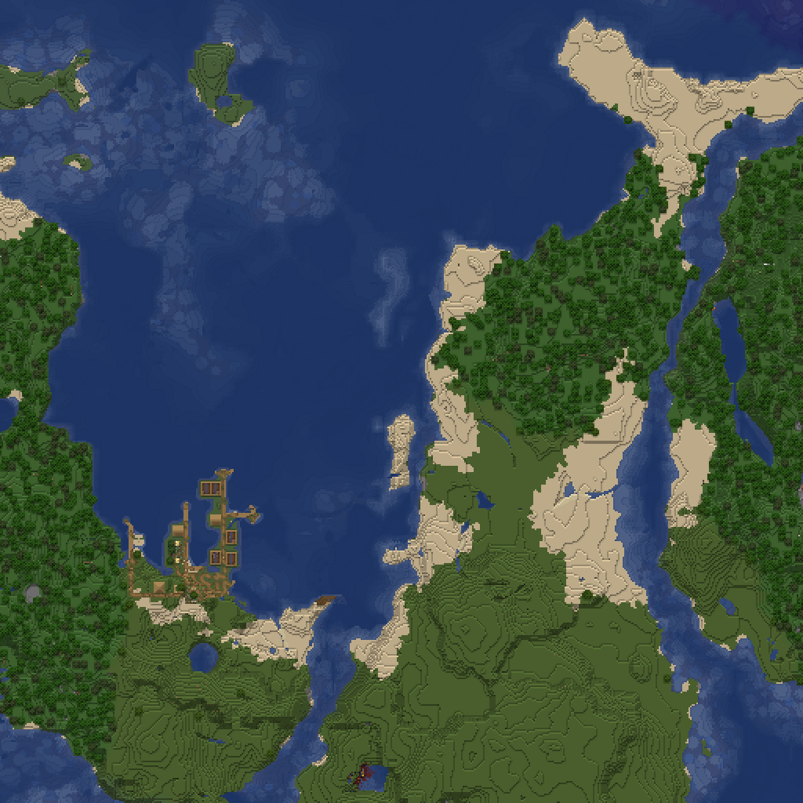

# Die einfarbige Ansicht

`--flat` zeichnet die Welt von oben, genordet, mit einem Pixel je Block:
`top-north` bei scale 1. Jeder Block bekommt eine Farbe statt seiner
Textur, Hänge zeigt ein Relief wie auf der Karte des Spiels. Die Ansicht ist
eine leichte Ergänzung für grosse Welten, kein Ersatz für die Karte mit
Texturen. Entschieden in
[0099](../entscheidungen/0099-einfarbige-ansicht.md).

*Testwelt, `--flat` um (−224, 496), 512 × 512 Blöcke, ein Pixel je Block,
zweifach vergrössert. Stand von #247, vor dem Licht je Spalte.*

## Schalter und Baum

- **`--flat`** geht mit `--render` oder `--tiles`. Kamera und scale setzt
  der Schalter selbst; er geht nicht mit `--scale`, `--camera`,
  `--direction`, `--cinematic` oder `--native-levels`
  (`flat_ist_ein_eigener_baum` in
  [`renderer/tests/cli.rs`](../../renderer/tests/cli.rs)).
- **scale 1 gibt es nur so.** `--scale` nimmt weiter erst ab 4, und
  `Projection::mit_kamera` hebt jede andere Kamera auf mindestens 2; nur
  `top-north` geht bis 1 (`Projection::flach` in
  [`renderer/src/render/projection.rs`](../../renderer/src/render/projection.rs)).
- **Ein eigener Baum:** `top-north-s-flat`, in `map.json` und `trees.json`
  mit `look` `"flat"`, siehe [map.json](../benutzung/map-json.md), „Look“.
  Der scale gehört zum Baum wie bei jeder Ansicht.
- **Die CPU zeichnet,** auch mit `--gpu on`; das Log sagt
  `GPU:        aus, die einfarbige Ansicht zeichnet die CPU`.
- **Keine nativen Stufen:** Die hören bei scale 4 auf. Die Pyramide nimmt
  je 2 × 2 den nächsten Pixel wie jeder Baum aus `top-north`, siehe
  [Zoomstufen](../benutzung/zoomstufen.md), „Verkleinern“.

## Farbe je Zustand

Der Pfad ist derselbe wie für die Karte mit Texturen, siehe
[Der Weg einer Kachel](renderpfad.md). Von oben stehen senkrechte Flächen
auf der Kante und fallen weg, siehe [Die Kamera](kamera.md), „Von oben“.
Bei scale 1 deckt die Oberseite eines Würfels genau einen Pixel.

- **Das Mittel:** Der Rasterizer mittelt die Textur über den Pixel in
  linearem Licht, gewichtet mit Alpha. Das gibt je Blockzustand das Mittel
  seiner Oberseite (`flach_ist_das_mittel_der_oberseite` in
  [`renderer/tests/metatile.rs`](../../renderer/tests/metatile.rs)).
- **Jedes Texel:** Bei scale 1 tastet er so dicht ab, wie der Frame der
  Textur Texel je Kante hat, mindestens 16 und höchstens 64
  (`MAX_PROBEN_JE_KANTE` in
  [`renderer/src/render/rasterizer.rs`](../../renderer/src/render/rasterizer.rs)).
  Eine Textur von 32 × 32 zählt so jedes Texel einmal
  (`flach_proben_bis_zum_frame`); bei jedem anderen scale bleibt es bei
  `texture_samples`.
- **Ausgeschnittene Flächen** decken nach dem Alphatest den Pixel ganz
  oder gar nicht. Eine Oberseite, die weniger als halb deckt, verschwindet
  bei scale 1 und setzt keine Höhe, etwa klares Glas, Schienen oder
  Spinnweben, wenn ihre Textur weniger als halb deckt
  (`flach_spaerliche_oberseite_verschwindet`). Deckt sie mindestens die
  Hälfte wie dichtes Laub, hat der Pixel Alpha 255 und das lineare Mittel
  der Texel, die bleiben (`flach_dichter_ausschnitt_ist_das_mittel_der_behaltenen`).

## Biomfarbe und Wasser

Beides wie in der Karte mit Texturen:

- **Biomfarbe** je Block beim Zeichnen, siehe
  [Biomfarben](biomfarben.md), „Tönung beim Zeichnen“
  (`flach_toent_nach_dem_biom`).
- **Wasser** mit seiner Oberfläche über dem Grund, die Tiefe im Licht,
  siehe [Wasser und Licht](wasser-und-licht.md). Die Karte des Spiels
  schattiert Wasser nach seiner Tiefe; diese zweite Regel gibt es hier
  nicht.

## Licht je Spalte

Von oben sieht man nur den obersten Block. Die einfarbige Ansicht breitet
darum kein Licht aus, wie es die Karte mit Texturen tut (siehe
[Wasser und Licht](wasser-und-licht.md), „Licht ausbreiten“). Sie rechnet
es je Chunk aus seinen eigenen Spalten (`ChunkLicht::spalten` in
[`renderer/src/render/licht.rs`](../../renderer/src/render/licht.rs)):

- **Himmelslicht:** 15 bis zum ersten Block, der dämpft, ab dort eine
  Stufe weniger je Zelle, in einem dichten Block und darunter keines. Der
  oberste Block liegt so im Licht 15, der Grund unter offenem Wasser im
  Licht 15 − Tiefe, wie mit Ausbreitung
  (`spalten_wie_ausbreitung_im_offenen_wasser`).
- **Blocklicht:** nur das eigene einer Quelle
  (`spalten_blocklicht_nur_das_eigene`).
- **Geschlossene Kanten** zählen nicht.
- **Ohne Nachbarn:** Für sein Licht braucht ein Chunk keinen Nachbarn; der
  Rand von 14 Blöcken der Ausbreitung fällt weg. Das Relief nimmt weiter
  die Zeile im Norden.
- **Was anders aussieht:** Leuchtendes unter Wasser hellt den Grund daneben
  nicht mehr auf, und wo Wasser in Stufen fällt, fehlt das Licht von der
  Seite.

## Relief

Nach dem Zeichnen setzt `relief` in
[`renderer/src/render/metatile.rs`](../../renderer/src/render/metatile.rs)
jeden Pixel in eine von drei Helligkeiten der Karte des Spiels.

- **Die Höhe** eines Pixels ist das y des Blocks, der dort von oben als
  erster etwas zeichnet: der erste Draw an dem Pixel von vorn nach hinten
  (`merke_oben`). Durchscheinendes zählt, gefärbtes Glas oder Eis über
  Stein hat die Höhe des Glases oder Eises
  (`flach_durchscheinendes_hat_seine_hoehe`). Stufen und Teppiche haben die
  y ihres Blocks.
- **Der Nachbar im Norden** ist der Pixel eine Zeile darüber. Jedes Stück
  rendert dafür eine Zeile mehr nach Norden und schneidet sie danach ab
  (`render_flach`). So hat auch die erste Zeile einer Kachel ihren
  Nachbarn. Fehlt dort ein Block, gilt der Nachbar als gleich hoch.
- **Die Regel der Karte:** d = Unterschied · 4/(1 + 4) + (Feld − 0,5) ·
  0,4, das Feld 1, wenn x + z ungerade ist, sonst 0. Über 0,6 hell (255),
  unter −0,6 dunkel (180), sonst eben (220), je in 255steln auf Rot, Grün
  und Blau.
- **Bei ganzen Blöcken nur das Vorzeichen:** Schon ein Block ergibt
  0,8 ± 0,2, in f64 auch 1 · 0,8 − 0,2 = 0,6000000000000001 > 0,6. Ein
  Schachbrett gibt es also nicht: hinauf hell, hinab dunkel, gleich hoch
  eben (`helligkeit`, gegen den Ausdruck der Karte geprüft in
  `helligkeit_wie_der_ausdruck_der_karte`; im Bild
  `flach_relief_nach_norden` und, über ein zufälliges Höhenfeld und den
  Rand der Stücke hinweg, `flach_relief_ueber_ein_hoehenfeld`).
- **Wasser** bleibt eben (`flach_wasser_ueber_grund_ohne_relief`). Land
  südlich von Wasser vergleicht mit dem Wasserspiegel.
- **Über den Rand einer Kachel:** `--flat --update` zeichnet die Kachel
  südlich eines geänderten Chunks mit, ihr Relief hängt an seiner letzten
  Reihe (`flat_update_ueber_den_kachelrand` in
  [`renderer/tests/cli.rs`](../../renderer/tests/cli.rs)).

### Die Karte des Spiels

Belegt per `javap` am Client von 26.2 in `MapItem.update`,
`MapColor.calculateARGBColor`, `ARGB.scaleRGB` und `MapColor$Brightness`:

- **Die Höhe:** ab `WORLD_SURFACE` abwärts der erste Block, dessen
  `getMapColor` nicht `MapColor.NONE` ist; im Massstab 1:1 je Pixel ein
  Block.
- **Der Ausdruck:** in double
  `(h − h_vorher) · 4,0 / (i + 4) + (((x + z) & 1) − 0,5) · 0,4`, mit
  `i = 1 << scale` aus dem Feld `scale` der Karte, bei 1:1 also 0 und
  `i` = 1. `h_vorher` kommt vom Pixel davor in z, also im Norden; die Zeile
  davor rechnet nur als Nachbar mit. Über 0,6 HIGH, unter −0,6 LOW, sonst
  NORMAL.
- **Die Parität** rechnet mit den Pixeln der Karte (`k1 + l1`), nicht mit
  Blöcken. Bei 1:1 ist sie dieselbe wie die von x + z, und für Land spielt
  sie keine Rolle mehr, siehe „Bei ganzen Blöcken nur das Vorzeichen“.
- **Die Helligkeiten:** LOW 180, NORMAL 220, HIGH 255. LOWEST 135 braucht
  diese Rechnung nicht.
- **Die Farbe:** `ARGB.scaleRGB`, je Kanal `c · m / 255` ganzzahlig, auf
  0 bis 255 begrenzt, Alpha bleibt. So rechnet `relief` auch.
- **Wasser:** Ein Block mit Flüssigkeit zählt seine Tiefe nach unten. Ist
  `MapColor.WATER` die häufigste Farbe des Pixels, gilt
  `Tiefe · 0,1 + ((x + z) & 1) · 0,2`: unter 0,5 HIGH, über 0,9 LOW. Das
  übernimmt die einfarbige Ansicht nicht, siehe „Biomfarbe und Wasser“.
  Die Höhe bleibt die des Wasserspiegels; danach vergleicht das Land
  südlich davon mit ihm.

## Kosten

Über die ganze Testwelt gegen `top-north` bei scale 4, gemessen in
[2026-10-10, Einfarbige Ansicht](../messungen/2026-10-10-einfarbige-ansicht.md):

- **Zeit:** 35 % weniger. Die −35 % sind ohne Bänder gemessen; mit Bändern lässt sich kein Unterschied zeigen. Lesen und Licht hängen an den
  Chunks, nicht an den Pixeln, und sind 61 % der CPU.
- **Platz:** ×0,087.
- **Arbeitsspeicher:** an der Spitze 1,55 GiB, rund 1,3-mal die Karte. Eine
  Kachel deckt 16 × 16 Chunks; gezeichnet wird sie in Bändern, siehe
  [Der Weg einer Kachel](renderpfad.md), „Speicher“.

## Was bleibt eine Näherung

- **Texturen über 64 Texel** je Kante mittelt der Rasterizer mit 64 × 64
  Proben, nicht mit jedem Texel.
- **Kleine Modelle** wie Fackeln, Zaunpfosten, Ketten und Laternen füllen
  den Pixel mit ihrer Farbe und setzen die Höhe, sobald sie seine Mitte
  treffen. Die Karte des Spiels überspringt Blöcke mit `MapColor.NONE`,
  siehe „Die Karte des Spiels“.
- **Ausgeschnittene Flächen** zählen ganz oder gar nicht, siehe „Farbe je
  Zustand“.
- **Pflanzen aus Kreuzen** fehlen von oben, wie in `top-north` bei jedem
  scale. Die Karte des Spiels nimmt jeden Block, dessen Farbe auf der
  Karte nicht `MapColor.NONE` ist.
- **Nur die Richtung `s`:** Das Relief nimmt den Nachbarn im Norden als
  Zeile darüber, und Norden liegt oben.
