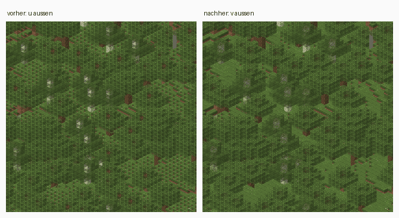

# Die Kamera

Die Kamera ist fest und orthographisch, alle Faktoren stehen in
[`renderer/src/render/projection.rs`](../../renderer/src/render/projection.rs).
Sichtbar sind immer dieselben drei Seiten: oben, Süden und Osten. Daraus
folgt eine Zeichenreihenfolge nach Höhe und Tiefe, die jeden Tiefenpuffer
über die Kachel überflüssig macht. `scale` ist die Pixelbreite eines
Würfels, Vorgabe 32.

## Projektion

```text
screen_x = (x - z) * scale/2
screen_y = (x + z) * scale/4 - y * scale/2
```

Damit belegt ein voller Würfel genau `scale` mal `scale` Pixel. Sichtbar
sind immer dieselben drei Seiten: oben, Süden (links im Bild) und Osten
(rechts). Die Blickachse ist (1, 1, 1): Punkte, die sich um ein Vielfaches
davon unterscheiden, landen auf demselben Pixel.

`Projection::project_block` bildet die Ecke (x, y, z) eines Blocks ab, die
mit den kleinsten Koordinaten. Für die Koordinatenanzeige rechnet das
Frontend dieselbe Formel rückwärts, siehe
[Frontend](../frontend.md), „Koordinaten“. Damit beide gleich rechnen,
stehen je scale einige Blöcke samt Bildpunkt in
[`renderer/tests/fixtures/projektion.json`](../../renderer/tests/fixtures/projektion.json),
auch negative und welche bei 2²⁴. Ein Test des Renderers schlägt an, wenn
die Datei veraltet ist, und schreibt sie mit
`UPDATE_GOLDEN=1 cargo test --test heights` neu. Das Frontend prüft sein
Modell an ihr.

## scale

`scale` ist die Breite des ganzen Würfels; eine Seitenfläche ist halb so
breit. Bei scale 16 hat sie acht Pixel für sechzehn Texel, bei scale 32
sechzehn: erst dann ist die Textur vollständig zu sehen. Deshalb ist 32 der
Standard, siehe [0013](../entscheidungen/0013-scale-32-als-standard.md). Der
Preis: viermal so viele Kacheln, für die Testwelt rund 300 000 statt 74 000
bei scale 16. Wer die Hälfte der Texturzeilen verschmerzen kann, gibt
`--scale 16` an.

`--scale` nimmt nur Vielfache von 4: Die Projektion setzt Blöcke in
Schritten von scale/4 Pixeln, und nur dann liegt jeder Block auf ganzen
Pixeln. Sonst läge jede zweite Blockreihe auf einem halben Pixel, und
benachbarte Reihen überdeckten sich.

## Zeichenreihenfolge

Der Metatile-Renderer sortiert erst nach Höhe `y`, innerhalb einer Höhe
nach Tiefe `v = x + z`. Beides ist nötig:

- Verdeckt B den Block A, dann liegt B nie tiefer. Sonst wäre der
  senkrechte Abstand im Bild mindestens eine Blockhöhe, und die Umrisse
  berührten sich höchstens.
- Auf gleicher Höhe verdecken Blöcke einander sehr wohl: der Südnachbar
  `(x, y, z+1)` verdeckt die Südfläche von `(x, y, z)`, der Ostnachbar
  `(x+1, y, z)` die Ostfläche. Dort heisst "verdeckt" genau `v_B > v_A`,
  denn `depth = x + y + z = v + y`.

Zusammen ergibt das eine gültige Reihenfolge, und ein globaler Tiefenpuffer
wird unnötig, siehe
[0001](../entscheidungen/0001-zeichenreihenfolge-statt-tiefenpuffer.md). Die
zweite Regel wegzulassen sieht nicht nach einem Sortierfehler aus, sondern
nach Textur; links läuft `u` aussen, rechts `v`:



Das Muster links sind die Süd- und Ostflächen jedes Blattblocks, die durch
den Block davor schlagen.

## Sortiert wird nach Würfeln

Sortiert wird nach Blockwürfeln und nicht nach Blöcken. Der Unterschied
zählt für Modelle, die ihren Würfel verlassen: Feuer ist höher als ein
Block. Solche Sprites zerfallen beim Bauen der Sprite-Tabelle in einen Teil
je Würfel, und jeder Teil wird zu dem Zeitpunkt gezeichnet, der zu seinem
eigenen Würfel gehört. Sonst käme ein zwei Blöcke hohes Modell zu früh, und
ein Block dahinter mit höherem Ursprung übermalte seine obere Hälfte.

Zugeordnet wird über den Bildschirm: die Umrisse benachbarter Würfel
kacheln die Ebene lückenlos, ein Pixel liegt also in genau einem, bis auf
die Blickachse, wo Würfel im Abstand (1, 1, 1) aufeinanderfallen. Dort
gewinnt der vordere, und genau dessen Geometrie hat auch der Tiefenpuffer
des Rasterizers stehen lassen. Ein Modell, das zwei Würfel entlang der
Blickachse ausfüllt, wäre so nicht auflösbar; in Vanilla gibt es keines.

Die Kandidaten kommen sortiert nach `(y, v, u)` aus den Bitmasken, siehe
[Der Weg einer Kachel](renderpfad.md), „Bitmasken“.

## Stufen, die von der Kamera wegzeigen

Eine Geländestufe, die nach Norden oder Westen zeigt, ist in der Projektion
unsichtbar: Die Oberseite eine Stufe höher liegt auf der Blickachse genau
auf dem Boden dahinter. Was hinter der Stufe steht, verdeckt sie bis auf
die Ränder, die über ihre hintere Ecke ragen. Über einer scheinbar ebenen
Wiese stehen deshalb einzelne Pixel, von einem roten Pilz etwa zwei. Das
ist kein Fehler. Nachzustellen in der Testwelt am Pilz bei
(−155, 72, −4359):

```bash
cargo run --release --manifest-path renderer/Cargo.toml -- --world ./world --assets ./vanilla-assets --assets ./assets --data ./vanilla-data --render stufe.png --center -227 -4431 --size 128 --scale 32
```

## Weltkoordinaten in f64

Weltkoordinaten werden in `f64` projiziert. Minecraft erlaubt knapp 30
Millionen Blöcke in jede Richtung; ab 2²⁴ kann `f32` benachbarte
ganzzahlige Blöcke nicht mehr auseinanderhalten, und zwei Nachbarn landen
auf demselben Pixel.

## Was bleibt eine Näherung

- **Ein Modell, das zwei Würfel entlang der Blickachse ausfüllt**, liesse
  sich nicht zuordnen; in Vanilla gibt es keines.
