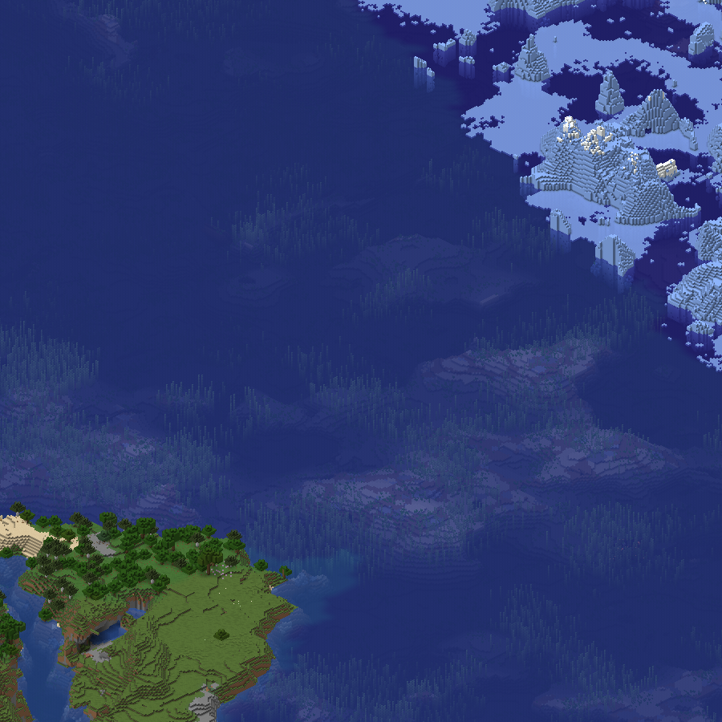

# Wasser und Licht

Flüssigkeiten haben kein Blockmodell; der Renderer baut sie wie das Spiel im
Code (`renderer/src/assets/fluid.rs`), lässt Flächen zu gleichem Wasser weg
und zeichnet an Stufen einen Streifen. Tiefe wirkt wie im Spiel nur über das
Licht: Man sieht durch genau eine Oberfläche, und darunter liegt jeder Block
in seinem Himmelslicht, das je Block Wasser eine Stufe verliert, und in
seinem Blocklicht. Welches Licht ein Block bekommt, bestimmt `licht_fuer` in
[`renderer/src/render/metatile.rs`](../../renderer/src/render/metatile.rs),
die Helligkeit `brightness_rgb` in `renderer/src/render/rasterizer.rs`.
Belegt gegen 26.2.

## Flüssigkeiten als Würfel

`water`, `lava`, `bubble_column`, Seegras und Kelp sowie jede Blockstate mit
`waterlogged=true` bekommen einen Würfel mit der Flüssigkeitstextur,
fliessendes Wasser (`level` 1 bis 7) einen flacheren. Wie im Spiel endet
eine Quelle bei 8/9 der Blockhöhe, knapp zwei Texturpixel unter der Kante
(`FlowingFluid.getHeight`), und die Oberseiten gefluteter oberer Platten,
Treppen und Zaunpfosten bleiben trocken. Liegt dieselbe Flüssigkeit
darüber, reicht der Würfel bis oben, sonst hätte jede Schicht eines Ozeans
eine Fuge. `water.json` und `lava.json` nennen nur eine Partikeltextur; ohne
den Nachbau von `FluidRenderer` blieben Ozeane nackter Meeresboden, im
Frontend war das der auffälligste Fehlbestand.

Auch die Seiten gefluteter Blöcke bleiben trocken: Minecraft rückt jede
Flüssigkeitsfläche ein Tausendstel ins Blockinnere, der Renderer legt sie
dafür in der Tiefe knapp hinter die Blockfläche an derselben Stelle. Bei
gleicher Tiefe gewann das Wasser: ein Film auf jeder gefluteten Platte,
Treppe und Falltür.

Um den Ursprung, `--center 0 0 --size 900 --scale 4`, sonst wie das Bild in
[Schalter und Beispiele](../benutzung/schalter.md), „Einen Ausschnitt
rendern“. Stand `326b30e`, mit dem Licht des Spiels, den Übergängen
zwischen Biomen und den Tabellen aus 26.3.

## Flächen zu gleichem Wasser

Die Wassertextur ist grau und durchscheinend. Ihre Farbe kommt aus
`water_color` des Bioms, siehe [Biomfarben](biomfarben.md). Flächen zwischen
zwei Wasserblöcken werden nicht gezeichnet, wie im Spiel: ein Sprite kennt
seine Nachbarn zwar nicht, aber der Renderer, und er wählt je Block die
Fassung ohne die Flächen zu gleichem Wasser daneben und darüber. Sonst läge
in jedem Becken Wasser über Wasser, die Deckkraft stiege an jeder
Blockgrenze, und der Grund schimmerte durch ein Raster. Ein Wasserblock
mitten im Ozean hat danach keine Fläche mehr und kostet nichts. Siehe
[0009](../entscheidungen/0009-wasserflaechen-je-block.md).

## Streifen an Stufen

Steht das Wasser daneben tiefer, am Fuss eines Wasserfalls oder an jeder
Stufe fliessenden Wassers, fehlte über dessen Oberfläche ein Streifen der
eigenen Seite. Minecraft hebt dort die Ecken der Oberfläche an; der
Renderer zeichnet stattdessen genau diesen Streifen, als eigenes Sprite je
Paar aus eigener Höhe und Nachbarhöhe in Neunteln.

## Tiefe über das Licht

Man sieht durch genau eine Oberfläche, die Wassertextur hat überall
Alpha 180, und darunter zeichnet der Renderer jeden Block in seinem
Himmelslicht. Jeder Block Wasser nimmt eine Stufe, denn
`LiquidBlock.propagatesSkylightDown` ist falsch und `getLightDampening`
gibt damit 1: Der oberste Block Wasser liegt im Licht 14, der Grund n
Blöcke tief im Licht 15 − n, ab 15 Blöcken im Licht 0. Über dem Grund D
ergibt die Oberfläche W damit α · W + (1 − α) · b · D, b die Helligkeit im
Licht dort unten:

| Tiefe des Grunds | 1 | 2 | 3 | 5 | 10 | ab 15 |
|---|---|---|---|---|---|---|
| Licht | 14 | 13 | 12 | 10 | 5 | 0 |
| vom Grund sichtbar | 27 % | 24 % | 22 % | 18 % | 9 % | 3 % |
| vorher, eine Schicht je Block | 29 % | 8,6 % | 2,5 % | 0,7 % | 0,7 % | 0,7 % |

Vorher trug die Oberfläche die Deckkraft aller Schichten dahinter, so als
läge je Block Wasser eine weitere Oberfläche darüber. Was einen Block tief
lag, stand hell und blass neben fast deckendem Wasser, Pfosten und Wracks in
eckigen Flecken. Siehe [0030](../entscheidungen/0030-licht-je-block.md), die
abgelöste [0010](../entscheidungen/0010-tiefe-entlang-des-blickstrahls.md)
und die Messung
[2026-09-27, Wasser im Licht](../messungen/2026-09-27-wasser-im-licht.md).

## Helligkeit wie im Spiel

Die Helligkeit b rechnet `brightness_rgb` in
`renderer/src/render/rasterizer.rs` je Farbkanal wie
`shaders/core/lightmap.fsh` in 26.2: `get_brightness(l) = l / (4 − 3·l)`
für die Stufe l / 15, mal `SkyFactor` und `SkyLightColor`, dazu die
Umgebungsfarbe und das Blocklicht, siehe „Blocklicht“, auf 0 bis 1
begrenzt; das Ergebnis liegt zwischen diesem Wert und `notGamma`, das alle
Kanäle mit dem hellsten hebt, `1 − (1 − max)⁴`, gewichtet mit
`BrightnessFactor` 0,5, denn das ist `options.gamma` in der Voreinstellung
(`LightmapRenderStateExtractor`, `Options`). Einmal je Lauf entsteht
daraus die Tabelle je Stufe, `Lightmap`.

Umgebungsfarbe, `SkyFactor`, `SkyLightColor` und `BlockLightTint` kommen
aus dem Typ der Dimension, siehe [Dimensionstypen](dimensionstypen.md),
„Was der Renderer liest“. In der Oberwelt setzt `timeline/day.json` am Tag
`SkyFactor` 1 und `SkyLightColor` weiss wie der Typ; Licht 15 gibt dort 1,
so hell liegt eine Fläche unter freiem Himmel. Das gilt bei klarem Wetter,
und das zeichnet der Renderer: Bei Regen mischt `WeatherAttributes`
`SkyFactor` mit 0,3125 zu 0,24, auf 0,7625, und `SkyLightColor` ebenso zur
Farbe der Nacht, bei Gewitter mit 0,527 auf 0,599; im Ende hebt
`EndFlashState` ihn zeitweise (`LightmapRenderStateExtractor`). Im Nether
und im Ende ist `SkyFactor` 0: Himmelslicht ändert dort nichts, ohne
Blocklicht liegt alles in der Umgebungsfarbe. Hat eine Dimension kein
Himmelslicht (`has_skylight`), wie der Nether, breitet der Renderer auch
keines aus.

Nebel zeichnet der Renderer keinen. Das Spiel mischt ihn in jede Fläche
(`apply_fog` in `terrain.fsh`), nach ihrer Entfernung zur Kamera zwischen
`visual/fog_start_distance` und `fog_end_distance`
(`AtmosphericFogEnvironment`), im Nether von 10 bis 96 Blöcken. Eine
Karte hat keine Kamera, von der aus sich eine Entfernung messen liesse.

## Blocklicht

Mit Blocklicht rechnet `brightness_rgb` weiter wie der Shader. Die Stufe
geht mit `BlockFactor` 1,4 in `get_brightness`; das Flackern, das das Spiel
um 0 laufen lässt, fehlt. Ihre Farbe `BlockLightColor`
liegt zwischen `BlockLightTint` und Weiss, gemischt mit 0,9 · (2l − 1)², und
`BlockLightTint` ist `#FFD88C`, der Standard aus `EnvironmentAttributes`,
den keine Dimension des Spiels ändert. Die Summe mit dem Himmelslicht wird
auf 1 begrenzt, und `notGamma` hebt alle Kanäle mit dem hellsten. Schwaches
Blocklicht färbt so warm, bei Stufe 15 ist alles hell.

Was selbst leuchtet, bringt sein Blocklicht mit, wie in
`LightCoordsUtil.getLightCoords`: Seelaterne, Glowstone und Konduit 15, eine
geflutete Meeresgurke 6 bis 15, je nach Anzahl. Mit `emissiveRendering`,
beim Magmablock etwa, ist der Block voll hell. Wie hell ein Block leuchtet,
steht in `renderer/src/assets/leuchten.txt`, siehe
[Erzeugte Tabellen](../entwicklung/tabellen.md).

## Licht ausbreiten

Wie hell jede Zelle ist, rechnet der Renderer selbst aus, wie
`SkyLightEngine` und `BlockLightEngine` in 26.2, in
`renderer/src/render/licht.rs`. Das gespeicherte Licht der Welt liest er
nicht, es fehlt in vielen Chunks, siehe
[0040](../entscheidungen/0040-licht-selbst-ausbreiten.md). Die einfarbige
Ansicht breitet nicht aus, siehe [Die einfarbige Ansicht](einfarbig.md),
„Licht je Spalte“. Die Regeln, belegt per javap:

- **Schritte.** Jeder Schritt zur Nachbarzelle kostet eine Stufe
  (`LightEngine.propagateIncrease`: `max(1, getLightDampening)`). In einen
  Block, der um 15 dämpft, Stein etwa, kommt kein Licht; Luft, Glas,
  Wasser und Laub kosten gleich viel.
- **Kanten.** Eine Kante schliesst, wenn die Flächen der beiden Blöcke an
  ihr zusammen die ganze Seite decken (`LightEngine.shapeOccludes`): die
  Unterseite einer unteren Platte allein, eine obere neben einer unteren
  Platte zusammen, zwei untere nebeneinander nicht.
- **Himmel.** In jeder Spalte ist jede Zelle 15, die über dem obersten
  Block liegt, der dämpft oder dessen Kante nach oben schliesst
  (`ChunkSkyLightSources`); von dort breitet es sich aus. Unter Wasser
  und unter Laub verliert es so eine Stufe je Block, unter einem Überhang
  eine je Block Abstand zur offenen Spalte. Eine geschlossene Höhle bleibt
  bei 0.
- **Block.** Was leuchtet, beginnt mit seiner Stufe aus `leuchten.txt`,
  auch ein dichter Block wie die Seelaterne oder der Magmablock.
- **Rand.** Gerechnet wird je Chunk in einem Fenster, das 14 Blöcke in
  die Nachbarn reicht, so weit wie Licht kommt. Ein Chunk, der fehlt oder
  nicht fertig ist, lässt kein Licht herein. In der Höhe reicht es wie im
  Spiel eine Section unter und über die Sections mit Blöcken
  (`LevelLightEngine.getMinLightSection`).

Welche Blöcke wie stark dämpfen und mit welchen Flächen sie Kanten
schliessen, steht in `renderer/src/assets/licht.txt`, siehe
[Erzeugte Tabellen](../entwicklung/tabellen.md). Gerechnet wird skalar,
mit einem Eimer je Stufe von 15 abwärts, wenn ein Chunk zum ersten Mal
Licht braucht; es bleibt im Cache des Threads, solange der Chunk dort
liegt. Gegen einen Lauf von Vanilla 26.2 stimmt jede Zelle, siehe
[Tests](../entwicklung/tests.md), „Fixtures“.

## Welches Licht ein Block bekommt

Beim Zeichnen nimmt `licht_fuer` das Licht aus der Ausbreitung, wie das
Spiel in 26.2 (`LightCoordsUtil.getLightCoords`), belegt per javap:

- **Flächen auf dem Rand des Blocks** bekommen das Licht an den Ecken
  ihrer Seite, aus der Schicht vor ihr, siehe
  [Weiche Beleuchtung](weiche-beleuchtung.md), „Licht an den Ecken“: die
  Seiten eines Steins wie die Oberseite einer oberen Platte, die Enden der
  Arme eines Zauns oder die Fächer einer Chiseled Bookshelf. Hat der Block
  volle Kollisionsform, gilt das für jede ebene Fläche seines Modells
  (`faceCubic` in `BlockModelLighter.prepareQuadShape`). Die Oberseite des
  Grunds liegt so im Licht des Wassers über ihr, die Ostseite einer Klippe
  unter Wasser im Licht des Wassers davor, ein Dach aus oberen Platten unter
  freiem Himmel voll hell, obwohl in seine Zellen Licht nur von der Seite
  kommt.
- **Flächen im Innern des Blocks** bekommen das Licht an ihren Ecken
  ebenso, gezählt ab der eigenen Zelle, die Mitte aus der Zelle davor,
  ausser deren Block ist `isSolidRender`, siehe
  [Weiche Beleuchtung](weiche-beleuchtung.md), „Licht an den Ecken“: die
  Oberseite einer unteren Platte, eines Trampelpfads oder einer
  Schneedecke, die Seiten eines Zaunpfostens.
- **Flüssigkeiten** liegen im helleren Licht ihrer Zelle und der darüber,
  je Licht für sich (`FluidRenderer`, `LightCoordsUtil.max`): Der oberste
  Block Wasser zeigt das Licht der Luft über ihm, unter freiem Himmel 15,
  jeder darunter meist das des Wassers über ihm, am Fuss eines Wasserfalls
  neben Luft das Licht, das von der Seite hereinkommt.
- **Ein Block mit eigenem Wasser**, ein gefluteter Zaun etwa, liegt wie
  jedes Modell (`ModelBlockRenderer`), sein Wasser im helleren Licht wie
  jede Flüssigkeit. Das gilt auch unter Wasser:
  `FluidRenderer.tesselate` fragt für Oberseite und Seiten dasselbe Licht,
  gleich was über der Zelle steht. Ein Bild aus dem Blockentity liegt im
  Licht der Zelle (`BlockEntityRenderState.extractBase`).
- **Alles andere** liegt im Licht seiner Zelle: ohne weiche Beleuchtung
  jede Fläche, die nicht auf dem Rand liegt, die gekreuzten einer Blume
  etwa (`prepareQuadFlat`), und Flächen, deren Seite der Blick nicht zeigt,
  siehe [Weiche Beleuchtung](weiche-beleuchtung.md), „Was bleibt eine
  Näherung“. Das eigene Blocklicht steckt darin, denn als Quelle beginnt
  die Zelle mit ihm.
- **Eine Doppelkiste** liegt mit ihrem Bild aus dem Blockentity in beiden
  Hälften im helleren Licht ihrer zwei Zellen (`ChestRenderer` mit
  `BrightnessCombiner`, `LightCoordsUtil.max`), jeder `ChestBlock`, also
  auch Falle und Kupfer. Die andere Hälfte liegt in der Richtung aus
  `ChestBlock.getConnectedDirection`: bei `type=left` im Uhrzeigersinn
  neben `facing`, bei `right` dagegen.
- **Voll hell** ist, was das Spiel mit `emissiveRendering` zeichnet.

Der Blit multipliziert jeden Pixel je Kanal mit b, ganzzahlig wie das
Mischen, auf der CPU wie im Shader der Karte. Ein gefluteter Block trägt
Modell und Wasser in einem Sprite; das Wasser steht in seiner
Tönungskarte als eigener Anteil, siehe [Biomfarben](biomfarben.md),
„Tönung beim Zeichnen“. Hat es ein anderes Licht als das Modell, rechnet
der Blit beide in einem Schritt, jeden Anteil mit seinem b
(`tinted_im_licht`). Eine geflutete Laterne bleibt so auch unter ihrer
Oberfläche hell, in ihrem eigenen Blocklicht.

## Was bleibt eine Näherung

- **Teilflächen** verlaufen über die ganze Seite und Flächen, deren Seite
  der Blick nicht zeigt, liegen flach, siehe
  [Weiche Beleuchtung](weiche-beleuchtung.md), „Was bleibt eine
  Näherung“.
- **Zustände ohne alle Eigenschaften.** Fehlen einem Blockzustand
  Eigenschaften, findet er in `licht.txt` und `leuchten.txt` keinen Platz
  und bekommt ihre Vorgaben: keine Dämpfung, keine Flächen, kein Leuchten.
  Das Spiel füllt die fehlenden aus dem Standardzustand des Blocks
  (`StateDefinition.appendPropertyCodec`, ebenso
  `NbtUtils.readBlockState`). Es speichert aber jeden Zustand mit allen
  Eigenschaften; unvollständige kommen nur in Welten vor, die von Hand
  gebaut sind.
- **Leuchtende Flächen im Modell.** Ein Element mit `light_emission` hebt
  im Spiel Himmels- und Blocklicht seiner Flächen auf mindestens diesen
  Wert (`UnbakedCuboidGeometry`, `MaterialInfo.lightEmission`,
  `LightCoordsUtil.lightCoordsWithEmission`). Der Renderer liest den Wert
  und verwirft ihn. In 26.2 setzen ihn nur `cross_emissive` und
  `flower_pot_cross_emissive`, für `firefly_bush`, `open_eyeblossom` und
  `potted_open_eyeblossom`, und zu sehen ist es nur im Schatten. Nachbauen
  hiesse eine eigene Kennung je Pixel in der AO-Karte und einen Weg mehr
  im Shader, für drei Blöcke.
- **Die andere Hälfte einer Doppelkiste** prüft der Renderer nicht. Das
  Spiel nimmt ihr Licht nur, wenn dort die passende Hälfte steht
  (`ChestBlock.combine`). Es hält beide Hälften über `updateShape`
  stimmig; eine Hälfte ohne die andere gibt es nur in einer Welt, die von
  Hand gebaut ist.
- **Blöcke, die `blocks.txt` nicht kennt,** fehlen in `licht.txt`. Deckt ihr Modell
  den ganzen Umriss, lassen sie wie ein Block mit voller Form kein Licht
  hinein, sonst lassen sie es durch, ohne Flächen und ohne Leuchten
  (`lichtweg` in `metatile.rs`). Ihr Modell kennt der Renderer aber nur für
  Zustände, die der Vorlauf gesehen hat, also im Ausschnitt: Ausserhalb
  eines `--size`, im Rand der Ausbreitung, lässt ein solcher Block das
  Licht immer durch. Ob das Modell den Umriss deckt, entscheidet sein
  Sprite im Raster der Basis (`SpriteSet::deckt_fuer_licht`). Die nativen
  Stufen nehmen die Antwort von dort, sonst hätte dieselbe Welt auf jeder
  Stufe anderes Licht: Ein Block mit 15/16 Höhe deckt bei scale 32 seinen
  Umriss nicht, bei scale 4 schliesst das Raster die Lücke.
  - **In 2:1, bei jeder Kamera:** Das Raster ist immer das von 2:1 aus
    der Vorgabe-Richtung beim scale der Basis, auch wenn der Lauf eine
    andere Kamera oder Richtung hat (`SpriteSet::build_mit_licht`). Von
    oben deckt schon eine flache Seerose ihren ganzen Umriss, ihr Würfel
    bliebe dunkel, und dieselbe Welt hätte je Kamera anderes Licht.
  - **Bei einem scale, den 2:1 nicht nimmt,** lägen die Ecken von 2:1
    zwischen den Pixeln, etwa bei 5:3 und scale 30 mit a = 7,5, bei scale 6
    mit a = 1,5 und bei jedem ungeraden scale genordet. Dann rastert 2:1
    beim nächsten Vielfachen von 4 darüber: bei 30 wie bei 32, bei 5 bis 7
    wie bei 8. Das ist eine Näherung, entschieden wird bei einem anderen
    scale als dem der Basis. Der Block mit 15/16 Höhe etwa deckte auf den
    halben Pixeln von scale 6 seinen Umriss, bei 8 deckt er ihn nicht
    (`licht_unbekannter_bloecke_haengt_nicht_an_der_kamera` in
    `renderer/src/render/sprites.rs`).
- **Kein Flackern.** Das Spiel lässt `BlockFactor` zufällig um 1,4
  flackern; der Renderer nimmt 1,4.
- **Die Oberfläche bleibt eben.** Minecraft gleicht die Eckhöhen an die
  Nachbarn an; hier endet jeder Block auf seiner eigenen Höhe. Wo das eine
  Lücke liesse, zeichnet der Renderer einen Streifen.
